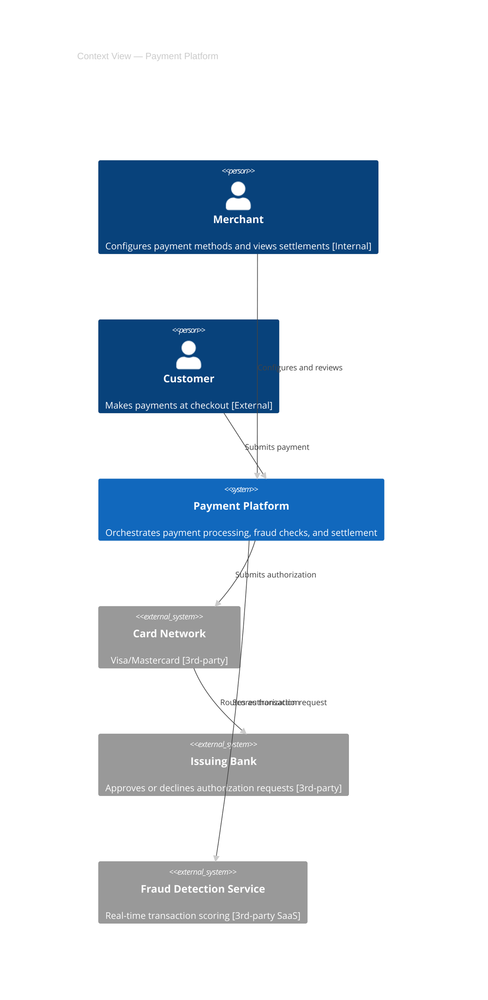
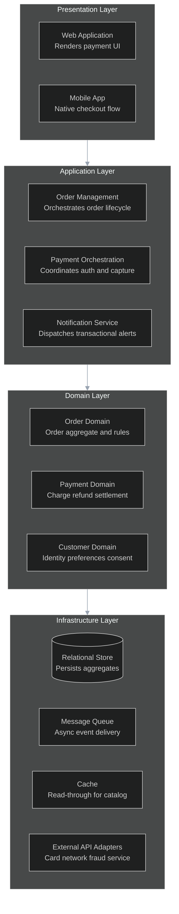
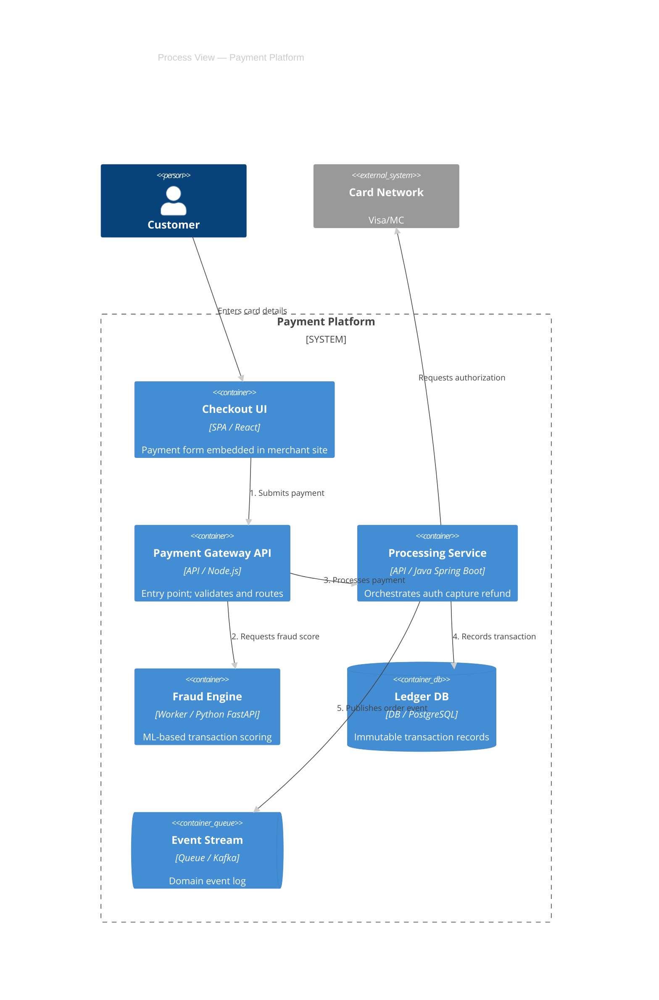
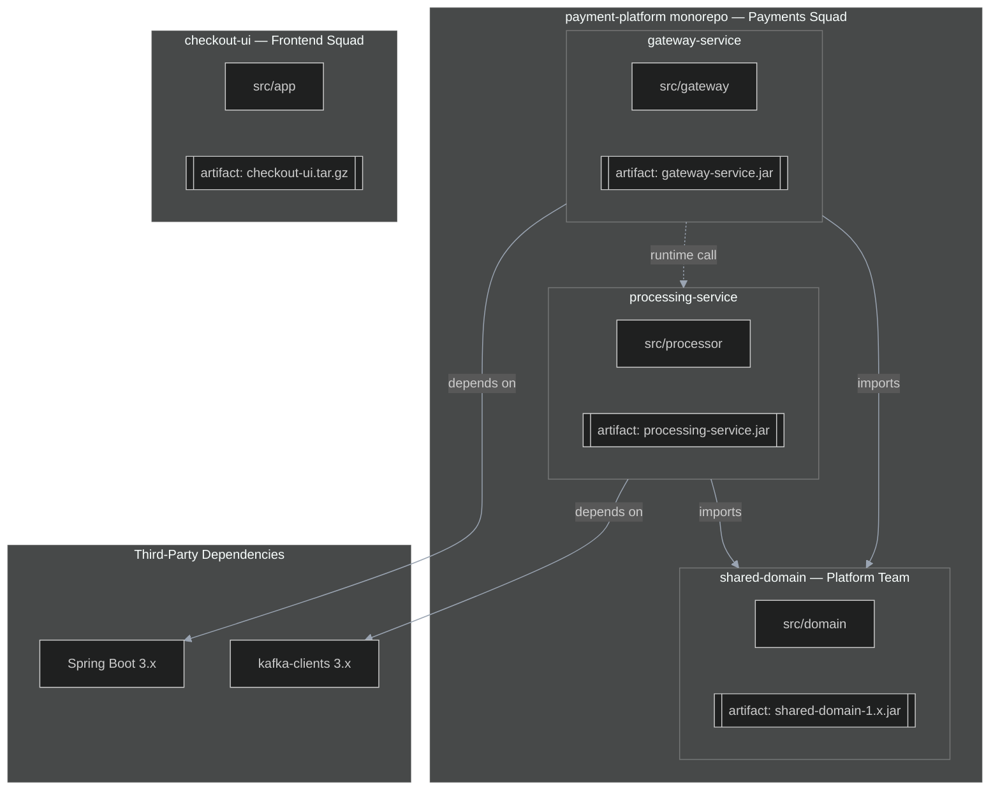
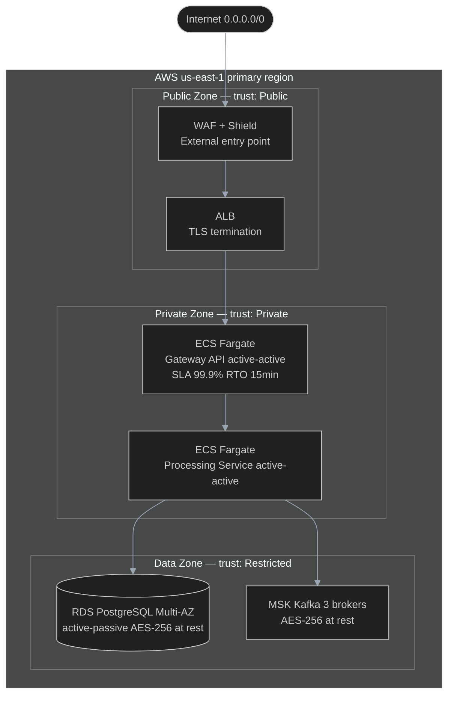
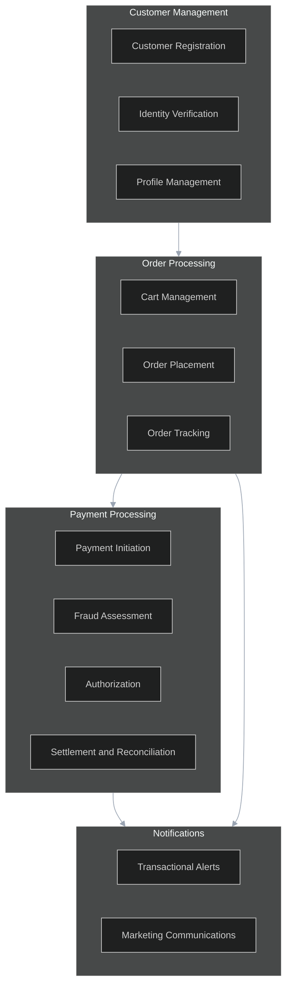
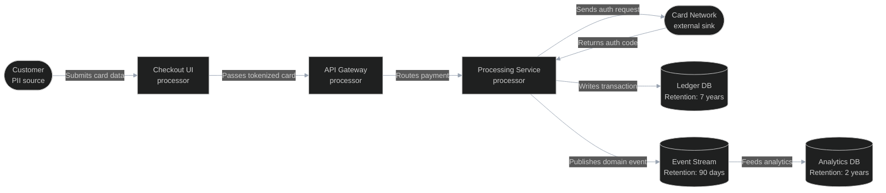
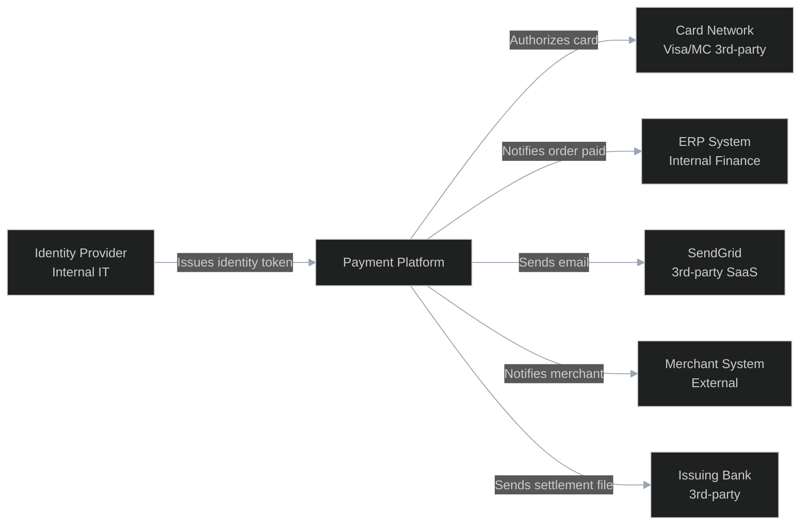

# HLD Diagram Checklist

Primary meta-standards: TOGAF ADM, 4+1 View Model / RUP, ISO/IEC/IEEE 42010.
Notation standards (per diagram): C4 L1/L2, UML Package, Mermaid `journey`, OpenAPI 3.x, AsyncAPI.

Every diagram must also satisfy `shared/readability-rules.md` (density, one-concept, node labels, arrow labels, renderer selection, subgraph syntax, artifact nodes, legend).
Every diagram must use the style directives from `shared/house-style.md`.

A diagram is compliant when **every item** in its Mandatory Elements list is satisfied.
This file is the compliance source-of-truth for `diag-hlad`.

---

# Part 1: Core Views (always include)

---

## Context View

**4+1 mapping:** wrapper (frames all other views)
**Notation:** C4 L1
**Purpose:** Establish the system boundary, all human actors, and all external systems. The single most important orientation diagram.

### Mandatory Elements

- [ ] Exactly one "system-in-scope" box, labeled with the system's name
- [ ] Every human actor/persona shown as a distinct `Person` element with a role label (not just "User")
- [ ] Every external system shown as a separate `System_Ext` box with ownership annotated (internal dept / external org / 3rd-party SaaS)
- [ ] Every relationship arrow labeled with a 3–5 word purpose only; protocol/sync in legend table (see readability-rules.md Rule 4)
- [ ] No internal containers, components, or modules shown (abstraction hygiene — no L2/L3 content)
- [ ] A title on the diagram
- [ ] A legend table below the diagram listing all arrow types, protocols, and element types
- [ ] If >8 external systems: split into (a) Actors diagram and (b) System-boundary diagram per readability-rules.md Rule 9

**Worked Example:**



Legend:

| Arrow label | Protocol | Mode | Notes |
|-------------|----------|------|-------|
| Submits payment | HTTPS/REST | sync | JWT |
| Configures and reviews | HTTPS/REST | sync | JWT |
| Submits authorization | ISO 8583 / HTTPS | sync | mTLS |
| Routes authorization request | ISO 8583 | sync | — |
| Scores transaction | HTTPS/REST | sync | API key |

---

## Logical View

**4+1 mapping:** Logical
**Notation:** C4 L2 logical subset or UML Package diagram
**Purpose:** Static decomposition into domains, layers, and logical components with their dependencies. No deployment or infrastructure content.

### Mandatory Elements

- [ ] Layers or bounded contexts explicitly grouped using subgraph or package notation (not flat nodes)
- [ ] Every logical component labeled with its one-line responsibility (what it does, not what it is)
- [ ] All dependency arrows directed (A depends on B, not just "connected")
- [ ] Any cyclic dependencies explicitly flagged with a note, or absent
- [ ] Layer boundary violations (any arrow that skips a layer) documented with a rationale note, or absent
- [ ] No deployment or infrastructure content (no cloud regions, no nodes, no VPCs)
- [ ] A title on the diagram
- [ ] A legend table below the diagram

**Worked Example:**



Legend:

| Arrow | Meaning |
|-------|---------|
| --> | Depends on (compile-time dependency) |

---

## Process View

**4+1 mapping:** Process (4+1 terminology — do NOT rename to "Runtime View")
**Notation:** C4 Container with runtime annotations
**Purpose:** Runtime collaboration between containers — what talks to what, over which protocol, synchronously or asynchronously. At least one runtime scenario annotated with a numbered message flow.

### Mandatory Elements

- [ ] Every container labeled with: name, type (SPA / API / DB / queue / worker / cache), and tech stack
- [ ] Every relationship arrow labeled with a 3–5 word purpose only; protocol/sync/async in legend table
- [ ] Data stores visually distinguished from compute containers (cylinder / `ContainerDb` vs rectangle)
- [ ] Queues and event streams visually distinguished (pipe / `ContainerQueue`)
- [ ] At least one runtime scenario annotated with numbered steps on the diagram, OR a separate Mermaid `sequenceDiagram` provided for the primary flow
- [ ] No code-level detail (no class names, no method signatures)
- [ ] A title on the diagram
- [ ] A legend table below the diagram

**Worked Example:**



Legend:

| Arrow label | Protocol | Mode | Notes |
|-------------|----------|------|-------|
| Enters card details | HTTPS | sync | TLS 1.3 |
| Submits payment | HTTPS/REST | sync | JWT |
| Requests fraud score | HTTPS/REST | sync | API key |
| Processes payment | gRPC | sync | mTLS |
| Records transaction | JDBC | sync | — |
| Publishes order event | Kafka | async | at-least-once |
| Requests authorization | HTTPS/ISO8583 | sync | mTLS |

---

## Development View

**4+1 mapping:** Development
**Notation:** UML Package or Mermaid flowchart
**Purpose:** Code organization — repositories, modules, build artifacts, packaging, and inter-module dependencies. Bridges source code to runtime containers.

### Mandatory Elements

- [ ] Every repository or top-level module shown as a named node
- [ ] Build artifacts (JAR / container image / npm package / Lambda ZIP) shown as distinct nodes using double-bracket syntax `[[artifact-name]]`
- [ ] All dependency arrows between modules directed (who depends on whom)
- [ ] Ownership (team or squad) labeled per repository or module where known
- [ ] Third-party / external dependencies called out separately from internal modules
- [ ] No runtime infrastructure content (no regions, no nodes, no VPCs)
- [ ] A title on the diagram
- [ ] Subgraph titles use plain IDs with bracketed display names — never embedded quotes (readability-rules.md Rule 7)
- [ ] Artifact nodes use closed double-bracket syntax (readability-rules.md Rule 8)
- [ ] If >6 repos: split by team ownership per readability-rules.md Rule 9
- [ ] A legend table below the diagram

**Worked Example:**



Legend:

| Arrow | Meaning |
|-------|---------|
| --> | Compile-time dependency |
| -.-> | Runtime call (not compile-time) |

---

## Physical View

**4+1 mapping:** Physical
**Notation:** C4 Deployment + cloud region/zone annotations
**Purpose:** Deployment topology including trust zones, network boundaries, availability configuration, and SLA overlay. The physical where and how resilient.

### Mandatory Elements

- [ ] Cloud provider(s) or on-premises explicitly labeled on every top-level boundary
- [ ] Regions shown where the system spans multiple regions; availability zones shown where HA depends on them
- [ ] Network boundaries (VPC / subnet / DMZ) shown with CIDR range or descriptive name
- [ ] Trust zones / security boundaries overlaid with explicit labels (Public / Private / Restricted / CDE)
- [ ] Every data store annotated with: persistence type (relational / document / object / cache) AND encryption-at-rest status (enabled/disabled + algorithm where known)
- [ ] High-availability configuration annotated per critical node: active-active / active-passive / single-instance
- [ ] SLA or RTO/RPO annotated per critical node inline, or referenced to an accompanying table in the document
- [ ] All external touch points (public endpoints, integration egress) explicitly marked
- [ ] Accompanying prose sections required in the document: (a) threat model summary, (b) availability strategy, (c) data classification matrix
- [ ] A legend table below the diagram

**Worked Example:**



Legend:

| Element | Type | Notes |
|---------|------|-------|
| RDS PostgreSQL | relational store | Multi-AZ active-passive, AES-256 |
| MSK Kafka | event stream | 3 brokers, AES-256 |
| ECS Fargate (Gateway) | compute | active-active, min 2 tasks |
| --> | network traffic | TLS 1.3 in transit |

---

## Scenarios View

**4+1 mapping:** +1 (Scenarios)
**Notation:** Mermaid `journey`
**Purpose:** End-to-end user journeys that validate and cross-reference all other views. Ties together the containers from Process View with real user experience stages.

### Mandatory Elements

- [ ] Minimum 2 top-priority user journeys covered (at least the primary happy-path journey and one failure/recovery journey)
- [ ] Every journey has: a named actor, defined stages, and touchpoints mapped to container names from Process View
- [ ] Every stage task has a satisfaction score (1–5 scale)
- [ ] Cross-references to Process View containers are annotated (actor label includes container name where the system acts)
- [ ] Score guide included as a note or legend (5 = delightful, 3 = neutral, 1 = painful)

**Worked Example:**

```mermaid
journey
    title Customer Payment Journey — Payment Platform
    section Browse and Cart
      Browse product catalog: 5: Customer
      Add item to cart: 5: Customer
    section Checkout
      Enter shipping address: 3: Customer
      Enter card details: 2: Customer
      Review order summary: 4: Customer
    section Payment (touches: Payment Gateway API, Fraud Engine, Card Network)
      Submit order: 5: Customer
      Fraud check invisible to user: 5: Fraud Engine
      Card authorization: 4: Customer, Card Network
    section Confirmation (touches: Notification Service)
      View order confirmation: 5: Customer
      Receive confirmation email: 5: Customer, Notification Service
    section Fulfillment
      Receive shipping notification: 4: Customer, Fulfillment Service
      Track delivery in portal: 4: Customer
      Receive package: 5: Customer
```

---

# Part 2: Supporting Views (include when relevant)

---

## Business Capability View

**TOGAF mapping:** Business Architecture
**Include when:** Business-IT alignment is a primary concern, TOGAF Business Architecture is required, or stakeholders need a technology-free capability overview.
**Notation:** Capability flowchart (Mermaid flowchart with capability groups)

### Mandatory Elements

- [ ] Capability groups labeled as business domains (not technical layers)
- [ ] Level-1 capabilities (groups) and level-2 capabilities (items within groups) visually distinguished (subgraph vs node)
- [ ] Dependencies between capability groups shown with directed arrows
- [ ] No technology references anywhere in the diagram (no service names, cloud services, frameworks)
- [ ] Subgraph titles use plain IDs with bracketed display names — no embedded quotes
- [ ] A legend table below the diagram

**Worked Example:**



---

## Data Flow View

**TOGAF mapping:** Data Architecture slice
**Include when:** The system is data-centric, or PII / PCI / GDPR / data-residency compliance is in scope.
**Notation:** DFD-style labeled flowchart

### Mandatory Elements

- [ ] Sources, processors, and sinks visually distinguished (e.g., rounded for actors, rectangle for processors, cylinder for stores)
- [ ] Every data flow arrow labeled with a 3–5 word purpose; data type and classification in legend table
- [ ] Every trust boundary crossed is explicitly marked on the diagram
- [ ] Retention period or retention policy noted for each data sink
- [ ] PII fields or regulated data fields called out inline or via a note
- [ ] A legend table below the diagram listing data classification per flow

**Worked Example:**



Legend:

| Flow | Data type | Classification | Notes |
|------|-----------|---------------|-------|
| Submits card data | Card number + CVV | Restricted / PII | Tokenized at Checkout UI |
| Passes tokenized card | Token + amount | Confidential | Trust boundary: DMZ to Private |
| Sends auth request | Token + amount | Confidential | External trust boundary |
| Writes transaction | Transaction record | Confidential | AES-256 at rest |
| Publishes domain event | Domain event | Internal | at-least-once |

---

## Integration Map

**TOGAF mapping:** Application Architecture slice
**Include when:** The system has more than 2 external integrations or a heavy API surface requiring an explicit integration inventory.
**Notation:** Labeled flowchart

### Mandatory Elements

- [ ] Every integration labeled with: protocol (REST / gRPC / Kafka / SFTP / SOAP / Webhook)
- [ ] Every integration labeled with: sync/async indicator (in legend, not on arrow)
- [ ] Owning team or vendor name noted per integration
- [ ] SLA or criticality tier noted per integration (e.g., "Critical 99.9% SLA" or "Batch best-effort")
- [ ] Data volume order-of-magnitude noted where known (e.g., "~10k req/day", "daily batch ~50k records")
- [ ] Authentication mechanism noted per integration (JWT / API key / mTLS / OAuth2 / basic)
- [ ] Arrow labels are 3–5 word purposes only; details in legend table
- [ ] A legend table below the diagram with protocol, mode, SLA, auth, volume columns

**Worked Example:**



Legend:

| Integration | Protocol | Mode | Owner | SLA | Auth | Volume |
|-------------|----------|------|-------|-----|------|--------|
| Authorizes card | REST / ISO 8583 | sync | Visa/MC | 99.95% | mTLS | ~500k req/day |
| Notifies order paid | Kafka | async | Internal ERP | best-effort | SASL/SCRAM | ~100k events/day |
| Sends email | REST | sync | SendGrid | 99.9% | API key | ~50k emails/day |
| Notifies merchant | Webhook POST | async | Merchant | best-effort | HMAC-SHA256 | variable |
| Issues identity token | OIDC | sync | Internal IAM | 99.99% | JWKS | per request |
| Sends settlement file | SFTP | async batch | Bank | daily 06:00 | SSH key | ~5k records/day |
