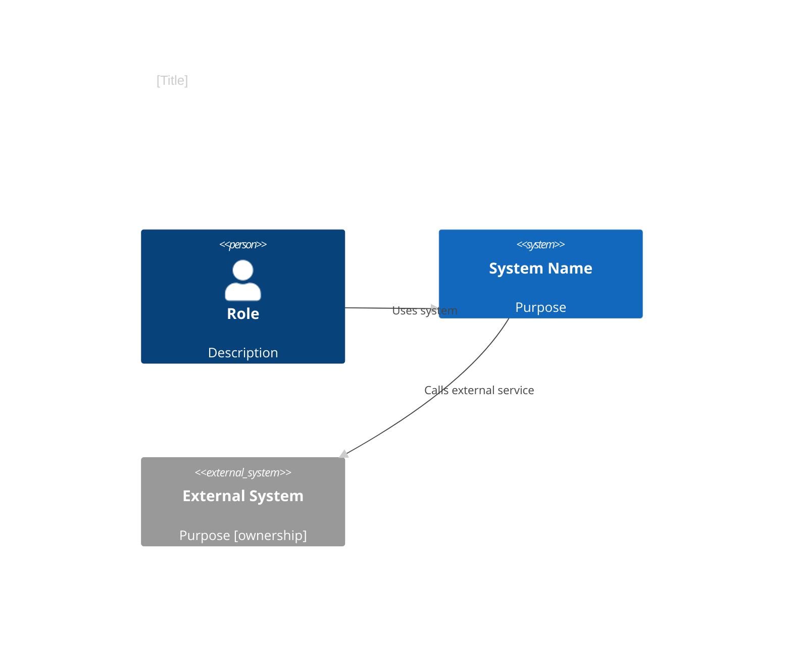
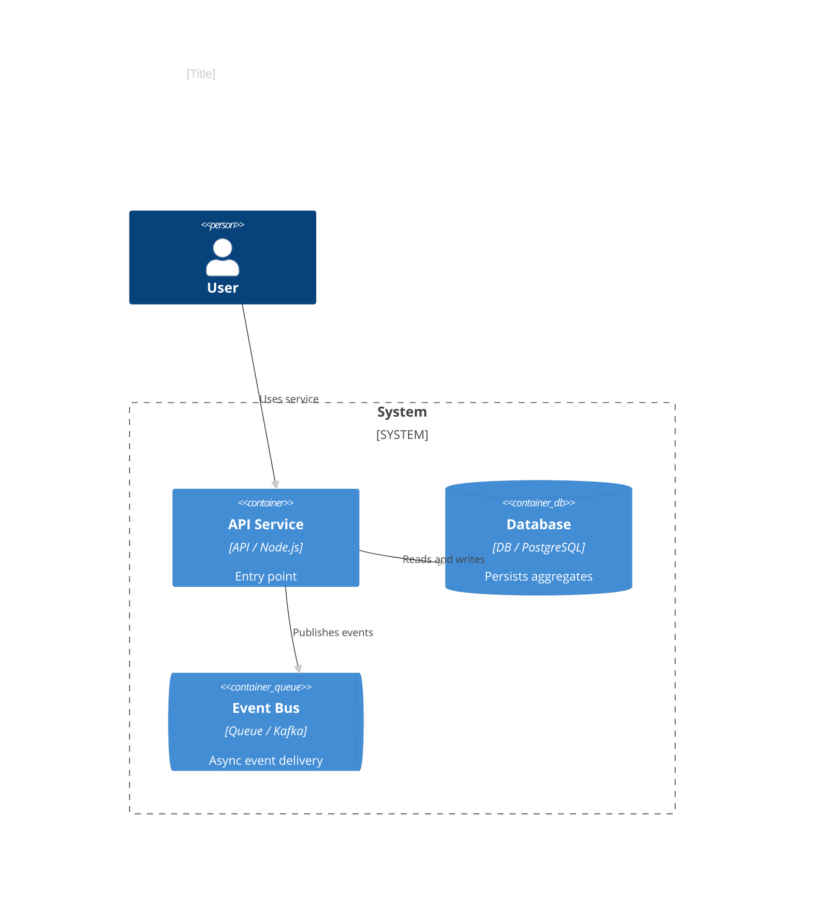
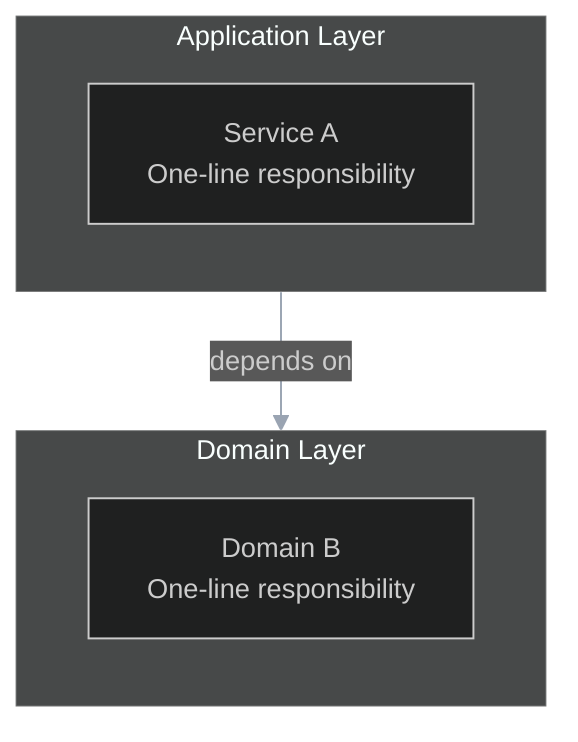
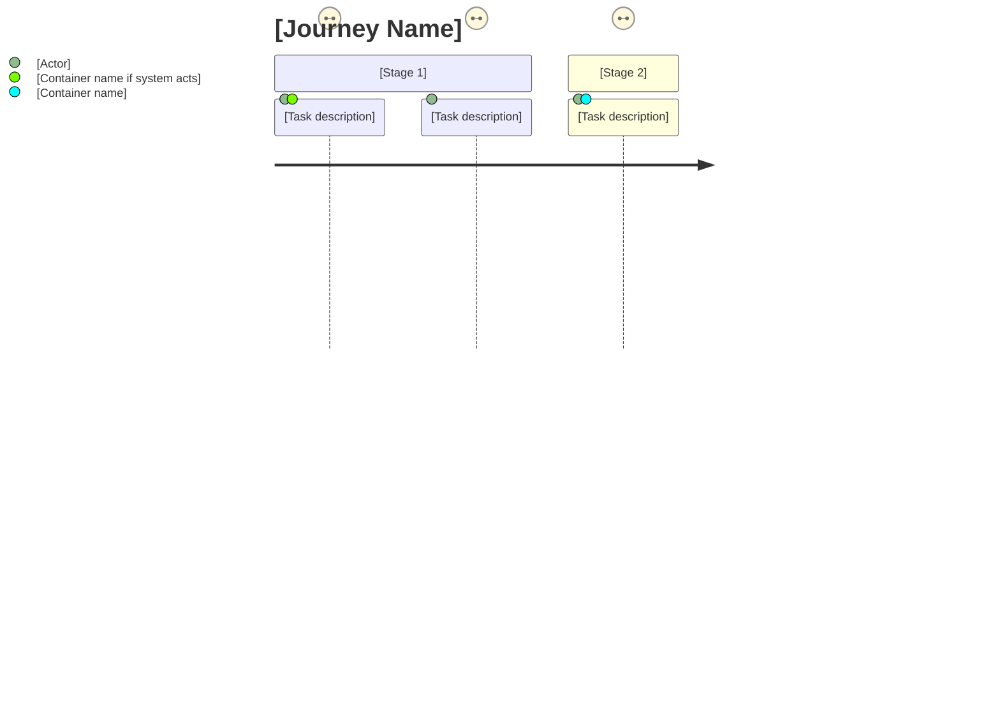

# HLD Notation Cheatsheet

Primary notations: C4 L1/L2, UML Package, Mermaid `journey`.
Optional notations: ArchiMate, BPMN, R&W viewpoints (see appendix).

Apply `shared/house-style.md` theme directives to every diagram.
Follow `shared/readability-rules.md` for subgraph syntax and artifact nodes.

---

## C4 Level 1 — System Context Symbols

| Symbol | Meaning | Mermaid Keyword | PlantUML Keyword |
|--------|---------|----------------|-----------------|
| Person (stick figure box) | Human user/actor | `Person(id, "name", "desc")` | `Person(id, name, desc)` |
| Rounded rectangle (bold border) | Your system | `System(id, "name", "desc")` | `System(id, name, desc)` |
| Rounded rectangle (grey) | External system | `System_Ext(id, "name", "desc")` | `System_Ext(id, name, desc)` |
| Directional arrow with label | Relationship (3–5 word purpose only) | `Rel(from, to, "label")` | `Rel(from, to, label)` |

### Mermaid C4Context quick template



Legend:

| Arrow label | Protocol | Mode | Notes |
|-------------|----------|------|-------|
| Uses system | HTTPS/REST | sync | JWT |
| Calls external service | HTTPS/REST | sync | API key |

---

## C4 Level 2 — Container Symbols

| Symbol | Meaning | Mermaid Keyword | PlantUML Keyword |
|--------|---------|----------------|-----------------|
| Rectangle with tech label | Container (service/app) | `Container(id, "name", "tech", "desc")` | `Container(id, name, tech, desc)` |
| Cylinder | Database container | `ContainerDb(id, "name", "tech", "desc")` | `ContainerDb(id, name, tech, desc)` |
| Pipe | Queue/message bus | `ContainerQueue(id, "name", "tech", "desc")` | `ContainerQueue(id, name, tech, desc)` |
| Dashed rectangle | System boundary | `System_Boundary(id, "name") { }` | `System_Boundary(id, name) { }` |

### Mermaid C4Container quick template



Legend:

| Arrow label | Protocol | Mode | Notes |
|-------------|----------|------|-------|
| Uses service | HTTPS | sync | JWT |
| Reads and writes | JDBC | sync | — |
| Publishes events | Kafka | async | at-least-once |

---

## UML Package Notation (for Logical and Development Views)

| Notation | Meaning |
|---------|---------|
| Folder-tabbed rectangle | Package or namespace |
| Dashed arrow `..>` | Dependency (A depends on B) |
| Solid arrow `-->` | Association / directed dependency |
| Dotted box | Optional or external boundary |

In Mermaid, use `subgraph` blocks with plain IDs and bracketed display names:



**Development View — Artifact node syntax:**

```mermaid
subgraph TeamFE[Frontend Team]
    spa[src SPA modules]
    spa_art[[artifact: frontend-spa]]
    spa --> spa_art
end
```

Double-bracket `[[name]]` = artifact/subsystem shape. Always closed — never `"[artefact`.

---

## Mermaid Journey Diagram (Scenarios View)

Mermaid `journey` models a user journey as stages with tasks, actors, and satisfaction scores (1–5).
Score guide: 5 = delightful, 3 = neutral/acceptable, 1 = painful.
Multiple actors on a task indicate which containers support that touchpoint.



**Worked snippet:**

```mermaid
journey
    title Customer Checkout Journey
    section Browse
      Browse catalog: 5: Customer
      Add to cart: 5: Customer
    section Payment (touches: Payment Gateway API, Fraud Engine)
      Enter payment details: 2: Customer
      Submit order: 5: Customer
      Fraud check: 5: Fraud Engine
    section Confirmation (touches: Notification Service)
      View order confirmation: 5: Customer
      Receive confirmation email: 5: Customer, Notification Service
```

---

## AWS Architecture Icons

**Official source:** https://aws.amazon.com/architecture/icons/

| Service | Category | Common Use |
|---------|----------|-----------|
| EC2 | Compute | Virtual machine nodes |
| ECS / Fargate | Containers | Container workloads |
| Lambda | Serverless | Event-driven functions |
| RDS | Database | Relational databases |
| ElastiCache | Database | Redis/Memcached cache |
| S3 | Storage | Object storage |
| ALB / NLB | Networking | Load balancers |
| CloudFront | Networking | CDN |
| VPC | Networking | Network boundary |
| API Gateway | Integration | REST/HTTP API front door |
| SQS | Integration | Message queue |
| MSK | Integration | Managed Kafka |
| WAF | Security | Web application firewall |
| KMS | Security | Key management |

**Usage in draw.io:** Extras > Edit Diagram, or View > Shapes > Networking > AWS.
**Usage in PlantUML:** `!include <awslib/AWSCommon>` — see https://github.com/awslabs/aws-icons-for-plantuml

---

## Azure Architecture Icons

**Official source:** https://learn.microsoft.com/en-us/azure/architecture/icons/

| Service | Category |
|---------|---------|
| App Service | Compute |
| AKS | Containers |
| Azure Functions | Serverless |
| Azure SQL / Cosmos DB | Database |
| Blob Storage | Storage |
| Application Gateway | Networking |
| Virtual Network | Networking |
| API Management | Integration |
| Service Bus | Integration |
| Azure AD / Entra ID | Security |
| Key Vault | Security |

**Usage in draw.io:** View > Shapes > Networking > Azure.

---

## GCP Architecture Icons

**Official source:** https://cloud.google.com/icons

| Service | Category |
|---------|---------|
| Compute Engine | Compute |
| GKE | Containers |
| Cloud Run | Serverless |
| Cloud SQL / Spanner | Database |
| Cloud Storage | Storage |
| Cloud Load Balancing | Networking |
| VPC | Networking |
| Pub/Sub | Integration |
| Cloud IAM | Security |
| Cloud KMS | Security |

**Usage in draw.io:** View > Shapes > Networking > GCP.

---

## Appendix — Optional Notations

The following notations are useful in specific contexts but are not required for standard HLD work.

### ArchiMate 3.x (three-layer model)

Use when TOGAF ADM is the explicit governance framework. Render with Archi (free) or BiZZdesign. See `shared/standards-map.md §ArchiMate` for element reference.

### BPMN 2.0

Use when a process spans organizational boundaries or will be consumed by a BPM engine (Camunda, Flowable). Mermaid does not support BPMN; use Camunda Modeler or draw.io BPMN library. See `shared/standards-map.md §BPMN` for element reference.

### Rozanski & Woods Viewpoints

Use when an explicit stakeholder-driven viewpoint selection process is required. R&W viewpoints (Functional, Information, Concurrency, Development, Deployment, Operational) map to the 4+1 Core 6 views. See `shared/standards-map.md §Rozanski & Woods` for the mapping table.
