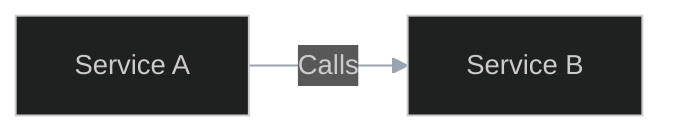
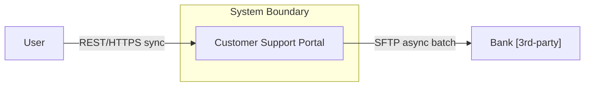
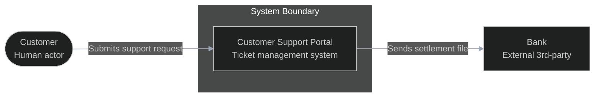
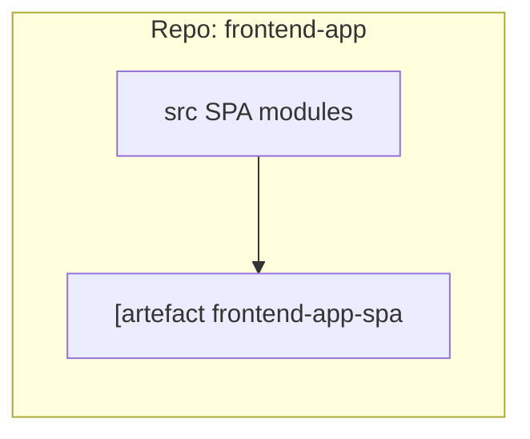
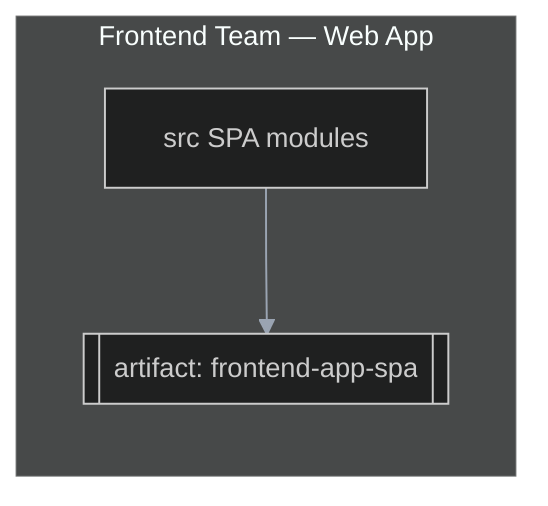

# Architecture Diagram House Style

This file defines visual style conventions for all architecture diagrams. It is usable by any agent producing architecture diagram output — not only the arch-diagrams-* skills. Reference this file from any context where architecture diagrams are being generated.

---

## Mermaid Theme Directive

Place this at the top of every Mermaid diagram block:

```
%%{init: {'theme':'dark', 'themeVariables': { 'primaryColor':'#2b3a55', 'primaryTextColor':'#ffffff', 'primaryBorderColor':'#7a9cc6', 'lineColor':'#9aa4b2', 'fontSize':'14px'}}}%%
```

Example usage:



---

## PlantUML Skinparam Block

Place this after the `@startuml` line in every PlantUML diagram:

```plantuml
skinparam backgroundColor #0d1117
skinparam defaultFontColor #e6edf3
skinparam ArrowColor #9aa4b2
skinparam shadowing false
skinparam roundCorner 8
```

Full PlantUML header template:

```plantuml
@startuml
skinparam backgroundColor #0d1117
skinparam defaultFontColor #e6edf3
skinparam ArrowColor #9aa4b2
skinparam shadowing false
skinparam roundCorner 8

' diagram content here
@enduml
```

---

## Node Labeling Convention

Every node label follows a three-line structure:

| Line | Content | Style |
|------|---------|-------|
| Line 1 | Node name | Bold (use `**Name**` in Mermaid markdown labels, or `<b>` in PlantUML) |
| Line 2 | `[tech-stack]` | Italic (use `_[stack]_` or `<i>` in PlantUML) |
| Line 3 | Responsibility | Normal weight, ≤ 40 chars |

Hard limits: 3 lines maximum, 40 characters per line maximum.

Example Mermaid node:

```
api["**API Gateway**\n_[Node.js / Express]_\nRoutes and validates requests"]
```

Example PlantUML component:

```plantuml
Component(api, "API Gateway", "Node.js / Express", "Routes and validates requests")
```

---

## Element Visual Conventions

| Element type | Shape / Style |
|-------------|--------------|
| External systems | Grey fill, dashed border |
| Data stores | Cylinder shape (`ContainerDb` in C4, `database` in PlantUML, `[( )]` in Mermaid) |
| Queues / event streams | Pipe shape (`ContainerQueue` in C4, or `queue` in PlantUML) |
| Actors / persons | Stick figure (`Person` in C4) |
| System boundary | Dashed rectangle with title |
| Trust zone boundary | Thick dashed border with zone label |

In Mermaid flowcharts:
- Data stores: `DB[(Store Name)]`
- External: use `style nodeId fill:#555,stroke:#888,stroke-dasharray:5 5`
- Artifact nodes: double-bracket `[[artifact-name]]` (closed — never leave open)

---

## Legend Table Convention

Every diagram must end with a legend table. Format:

```markdown
| Element / Arrow | Type | Protocol | Mode | Notes |
|----------------|------|----------|------|-------|
| Submits payment | sync call | HTTPS/REST | sync | JWT bearer auth |
| Publishes order event | async event | Kafka | async | at-least-once |
| Orders DB | data store | PostgreSQL | — | AES-256 at rest |
```

---

## Light Theme for Print / PDF

For printed or PDF documents, replace the Mermaid init directive with:

```
%%{init: {'theme':'default', 'themeVariables': { 'primaryColor':'#dbe9ff', 'primaryTextColor':'#0d1117', 'primaryBorderColor':'#3b6ea5', 'lineColor':'#555', 'fontSize':'14px'}}}%%
```

PlantUML light theme:

```plantuml
skinparam backgroundColor #ffffff
skinparam defaultFontColor #0d1117
skinparam ArrowColor #555555
skinparam shadowing false
skinparam roundCorner 8
```

Provide both dark and light variants when the document will be printed or exported to PDF.

---

## Worked Examples

### Example 1 — Context View (Before vs After)

**Before (ugly — violations: inline protocol on arrows, no legend, literal-quoted subgraph):**



**After (clean — follows house-style):**



Legend:

| Arrow label | Protocol | Mode | Notes |
|-------------|----------|------|-------|
| Submits support request | HTTPS/REST | sync | OIDC JWT |
| Sends settlement file | SFTP | async batch | Daily at 06:00 |

---

### Example 2 — Development View (Before vs After)

**Before (ugly — violations: open bracket artifact, quoted subgraph title):**



**After (clean — closed bracket artifact, plain subgraph ID with display name):**



Legend:

| Arrow label | Protocol | Mode | Notes |
|-------------|----------|------|-------|
| (build output) | npm build | — | Produces CDN-deployable bundle |
