# Mermaid Primer — Copy-Paste Snippets

## 1. Flowchart (Top-Down)

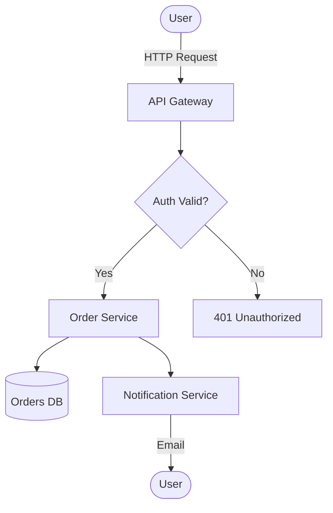

---

## 2. Flowchart (Left-Right) with Subgraphs

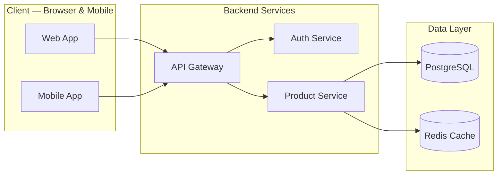

---

## 3. Sequence Diagram with alt/opt/loop

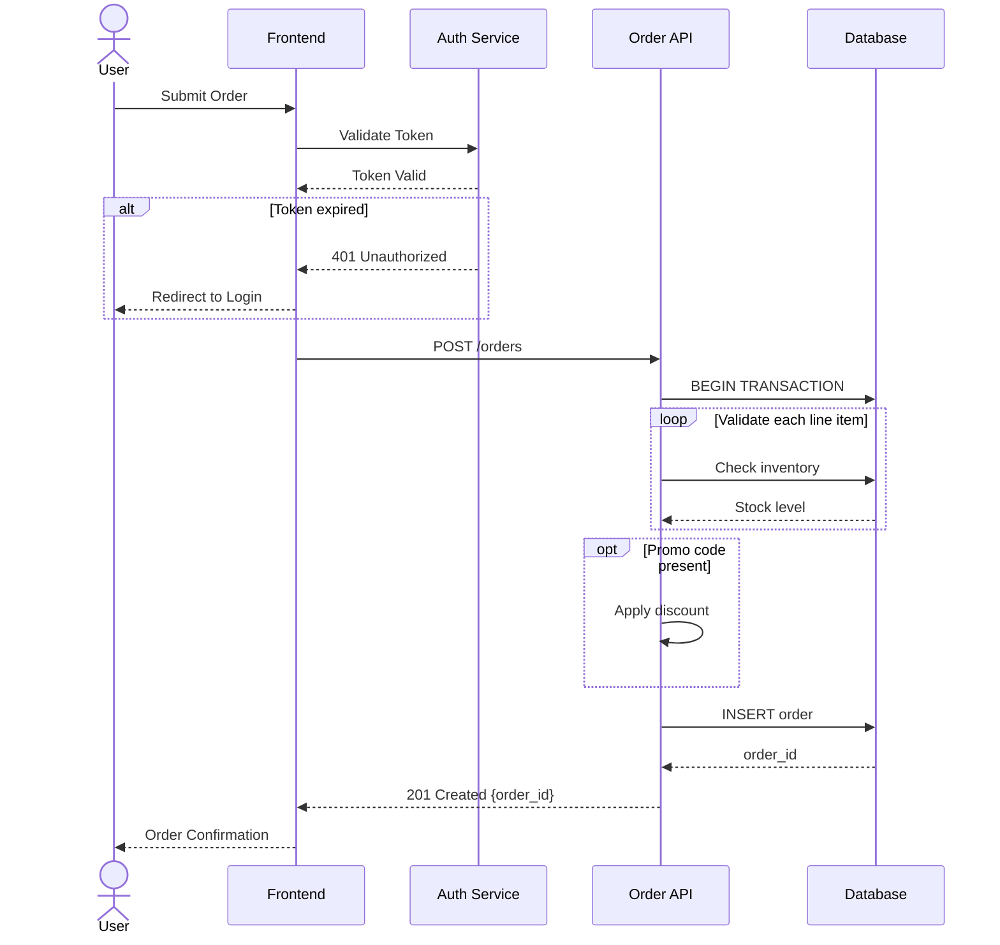

---

## 4. State Diagram (v2)

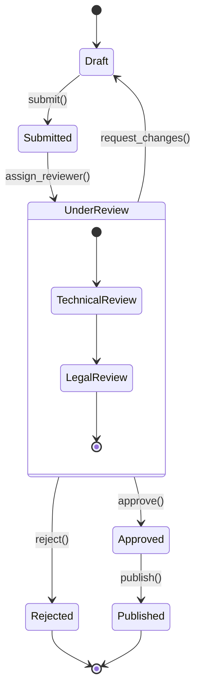

---

## 5. Entity Relationship Diagram

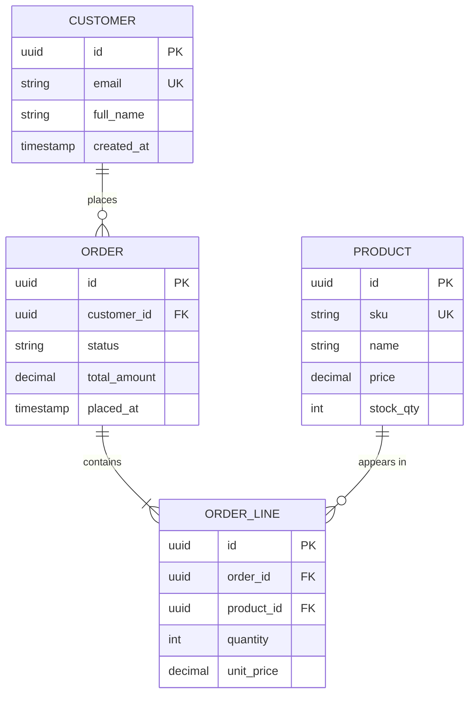

---

## 6. Class Diagram

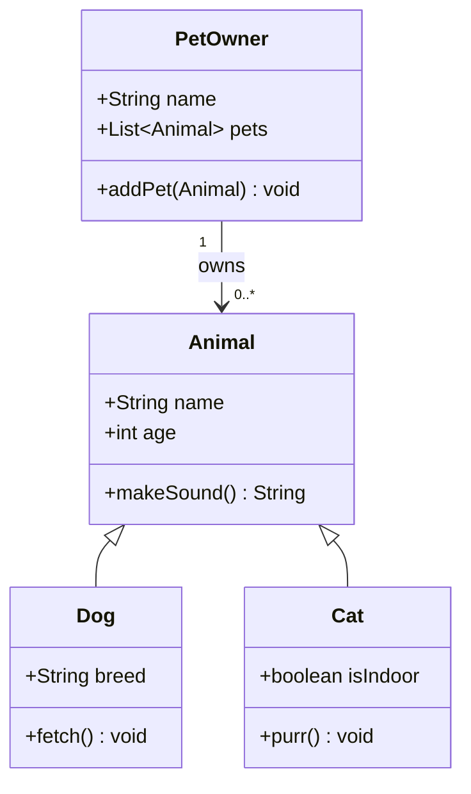

---

## 7. C4 Context Diagram (L1)

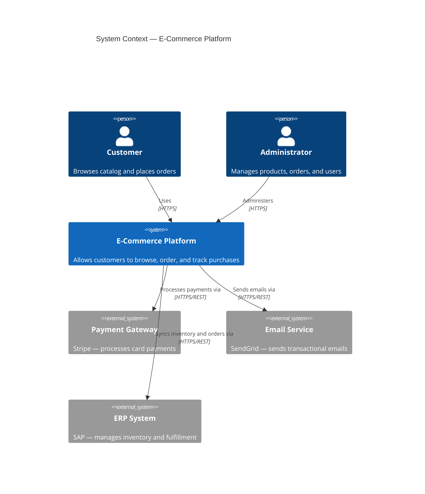

---

## 8. C4 Container Diagram (L2)

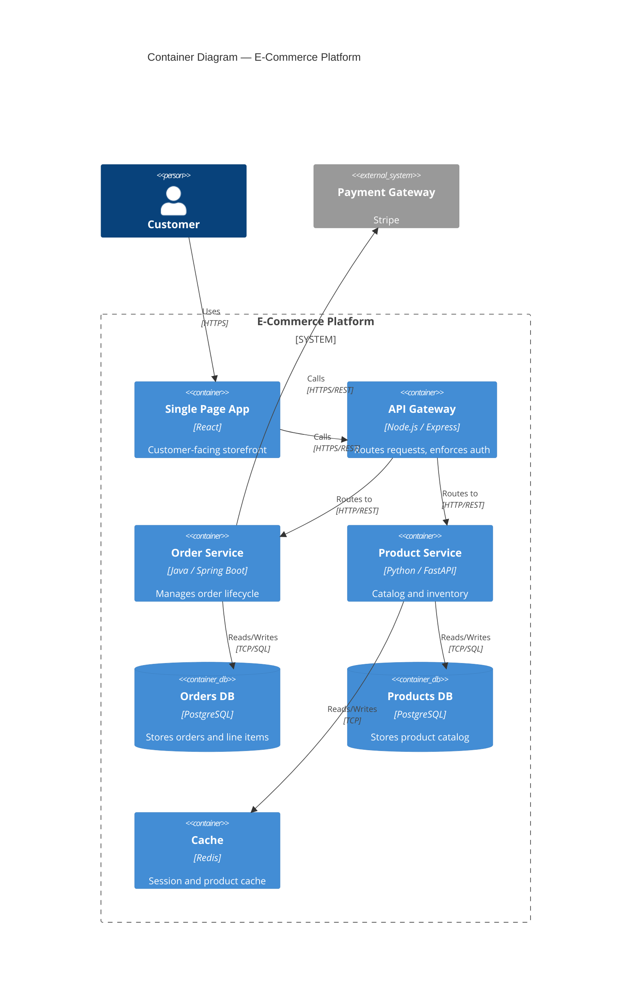

---

## 9. Gantt Chart

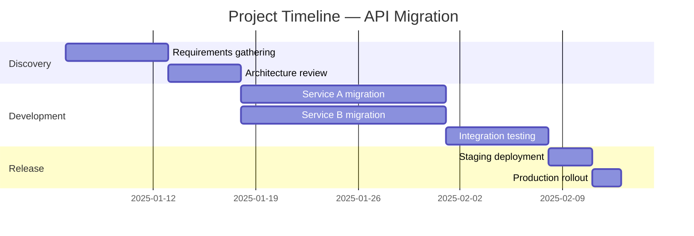

---

## 10. Pie Chart

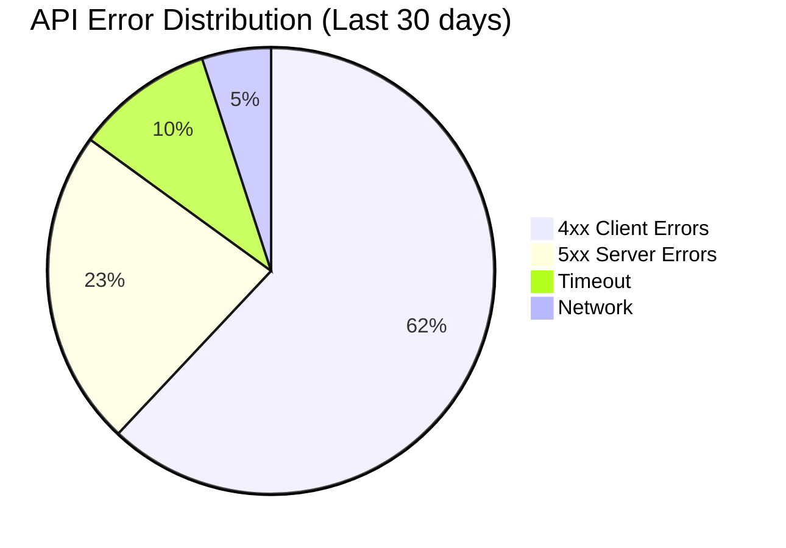

---

## 11. Quadrant Chart

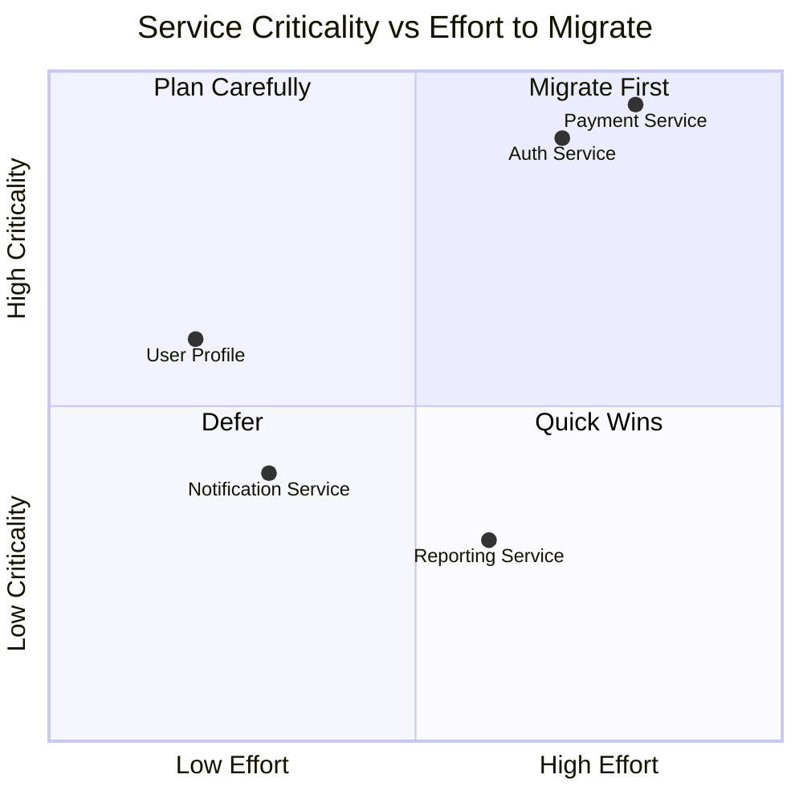
