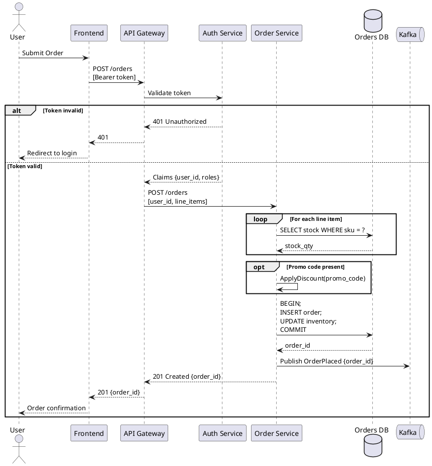
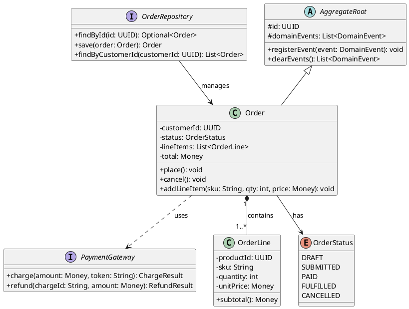
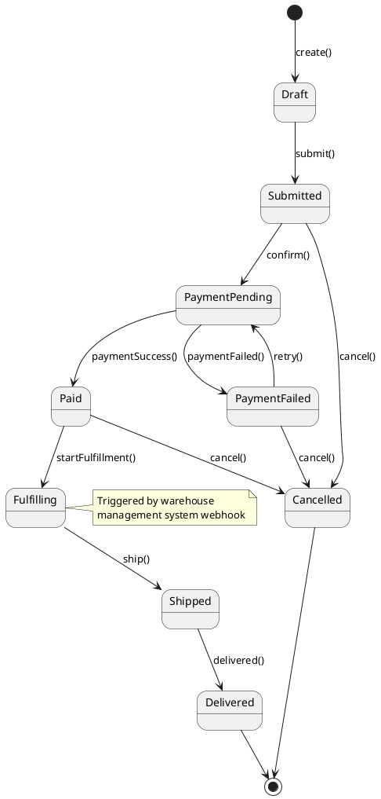
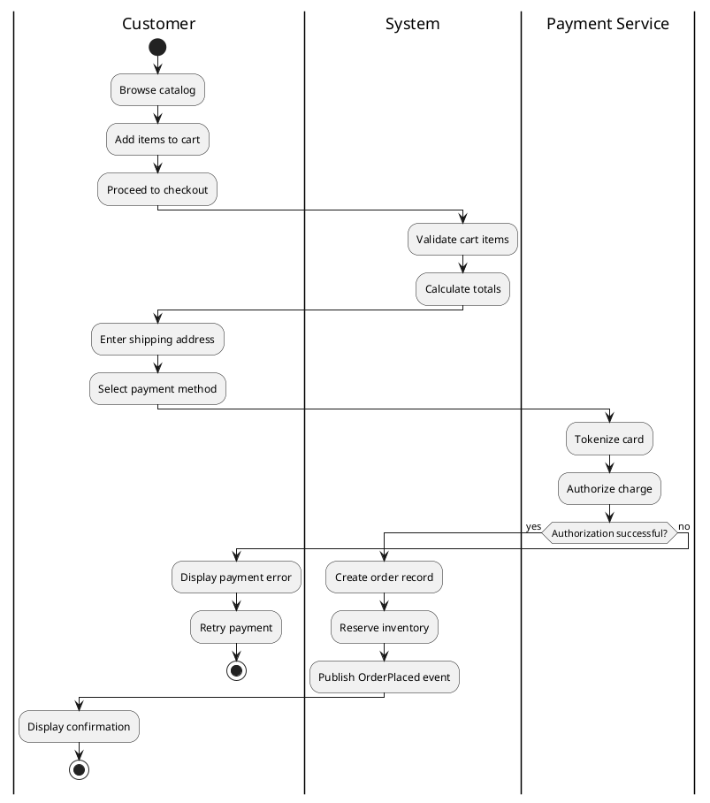

# PlantUML Primer — Copy-Paste Snippets

## 1. C4 Context Diagram (L1) with C4-PlantUML stdlib

```plantuml
@startuml C4_Context
!include https://raw.githubusercontent.com/plantuml-stdlib/C4-PlantUML/master/C4_Context.puml

LAYOUT_WITH_LEGEND()

title System Context — E-Commerce Platform

Person(customer, "Customer", "Browses catalog and places orders")
Person(admin, "Administrator", "Manages products and orders")

System(ecommerce, "E-Commerce Platform", "Allows customers to browse, order, and track purchases")

System_Ext(payment, "Payment Gateway", "Stripe — processes card payments")
System_Ext(email, "Email Service", "SendGrid — sends transactional emails")
System_Ext(erp, "ERP System", "SAP — manages inventory and fulfillment")

Rel(customer, ecommerce, "Uses", "HTTPS")
Rel(admin, ecommerce, "Administers", "HTTPS")
Rel(ecommerce, payment, "Processes payments", "HTTPS/REST")
Rel(ecommerce, email, "Sends emails", "HTTPS/REST")
Rel(ecommerce, erp, "Syncs inventory", "HTTPS/REST")

@enduml
```

---

## 2. C4 Container Diagram (L2)

```plantuml
@startuml C4_Container
!include https://raw.githubusercontent.com/plantuml-stdlib/C4-PlantUML/master/C4_Container.puml

LAYOUT_LEFT_RIGHT()
LAYOUT_WITH_LEGEND()

title Container Diagram — E-Commerce Platform

Person(customer, "Customer")

System_Boundary(c1, "E-Commerce Platform") {
    Container(spa, "Single Page App", "React", "Customer-facing storefront")
    Container(api, "API Gateway", "Node.js", "Routes and authenticates requests")
    Container(order_svc, "Order Service", "Java/Spring Boot", "Order lifecycle management")
    Container(product_svc, "Product Service", "Python/FastAPI", "Catalog and inventory")
    ContainerDb(orders_db, "Orders DB", "PostgreSQL", "Orders and line items")
    ContainerDb(products_db, "Products DB", "PostgreSQL", "Product catalog")
    ContainerQueue(event_bus, "Event Bus", "Apache Kafka", "Async domain events")
}

System_Ext(payment, "Stripe", "Payment processing")

Rel(customer, spa, "Uses", "HTTPS")
Rel(spa, api, "Calls", "HTTPS/REST")
Rel(api, order_svc, "Forwards to", "HTTP/REST")
Rel(api, product_svc, "Forwards to", "HTTP/REST")
Rel(order_svc, orders_db, "Reads/Writes", "JDBC")
Rel(product_svc, products_db, "Reads/Writes", "SQLAlchemy")
Rel(order_svc, event_bus, "Publishes events", "Kafka protocol")
Rel(product_svc, event_bus, "Consumes events", "Kafka protocol")
Rel(order_svc, payment, "Charges card", "HTTPS/REST")

@enduml
```

---

## 3. C4 Component Diagram (L3)

```plantuml
@startuml C4_Component
!include https://raw.githubusercontent.com/plantuml-stdlib/C4-PlantUML/master/C4_Component.puml

LAYOUT_WITH_LEGEND()

title Component Diagram — Order Service

Container_Ext(api_gateway, "API Gateway", "Node.js")
ContainerDb_Ext(orders_db, "Orders DB", "PostgreSQL")
ContainerQueue_Ext(kafka, "Event Bus", "Kafka")
Container_Ext(payment, "Stripe", "External")

Container_Boundary(order_svc, "Order Service") {
    Component(order_controller, "OrderController", "Spring MVC", "Handles HTTP requests for orders")
    Component(order_service, "OrderService", "Spring Service", "Orchestrates order business logic")
    Component(payment_client, "PaymentClient", "Feign Client", "Calls Stripe API")
    Component(order_repo, "OrderRepository", "Spring Data JPA", "Reads/writes order records")
    Component(event_publisher, "EventPublisher", "Kafka Producer", "Publishes domain events")
}

Rel(api_gateway, order_controller, "Calls", "HTTP/REST")
Rel(order_controller, order_service, "Delegates to")
Rel(order_service, payment_client, "Charges via")
Rel(order_service, order_repo, "Persists via")
Rel(order_service, event_publisher, "Emits events via")
Rel(order_repo, orders_db, "SQL", "JDBC")
Rel(payment_client, payment, "HTTPS", "REST/JSON")
Rel(event_publisher, kafka, "Publishes", "Kafka")

@enduml
```

---

## 4. Sequence Diagram with alt/opt/loop



---

## 5. Class Diagram with Stereotypes and Interfaces



---

## 6. State Machine Diagram



---

## 7. Deployment Diagram

```plantuml
@startuml deployment
!include https://raw.githubusercontent.com/plantuml-stdlib/C4-PlantUML/master/C4_Deployment.puml

LAYOUT_WITH_LEGEND()

Deployment_Node(aws, "AWS us-east-1") {
    Deployment_Node(vpc, "VPC 10.0.0.0/16") {
        Deployment_Node(public_subnet, "Public Subnet") {
            Deployment_Node(alb, "Application Load Balancer") {
                Container(alb_inst, "ALB", "AWS ALB", "TLS termination, routing")
            }
        }
        Deployment_Node(private_subnet, "Private Subnet") {
            Deployment_Node(ecs, "ECS Cluster") {
                Container(api_task, "API Gateway", "Docker/ECS Fargate", "2 tasks, 0.5 vCPU each")
                Container(order_task, "Order Service", "Docker/ECS Fargate", "2 tasks, 1 vCPU each")
            }
            Deployment_Node(rds, "RDS Subnet Group") {
                ContainerDb(postgres, "Orders DB", "PostgreSQL 15", "db.r6g.large, Multi-AZ")
            }
        }
    }
}

Rel(alb_inst, api_task, "Routes to", "HTTP:8080")
Rel(api_task, order_task, "Calls", "HTTP:8081")
Rel(order_task, postgres, "Queries", "TCP:5432")

@enduml
```

---

## 8. Activity Diagram (BPMN-style)


