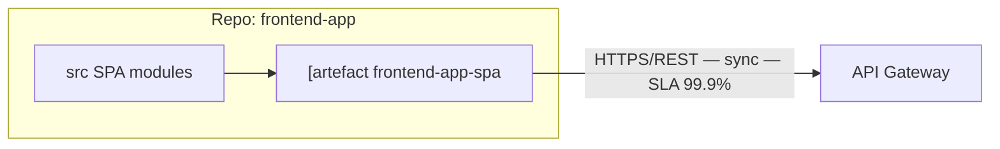
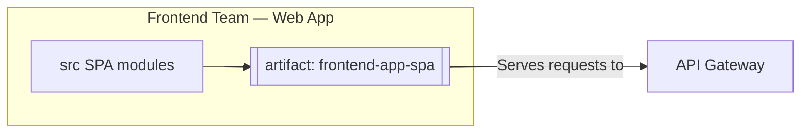
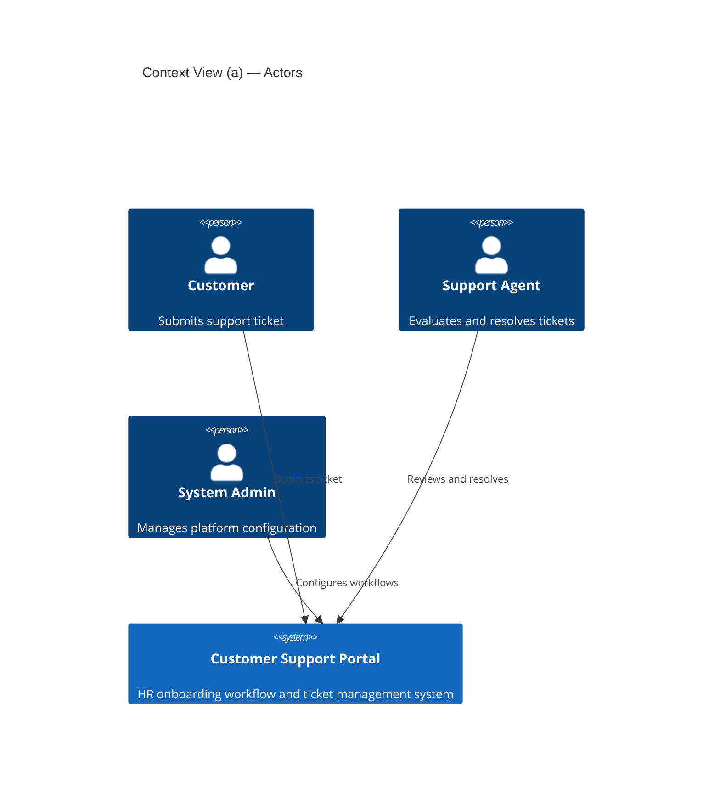
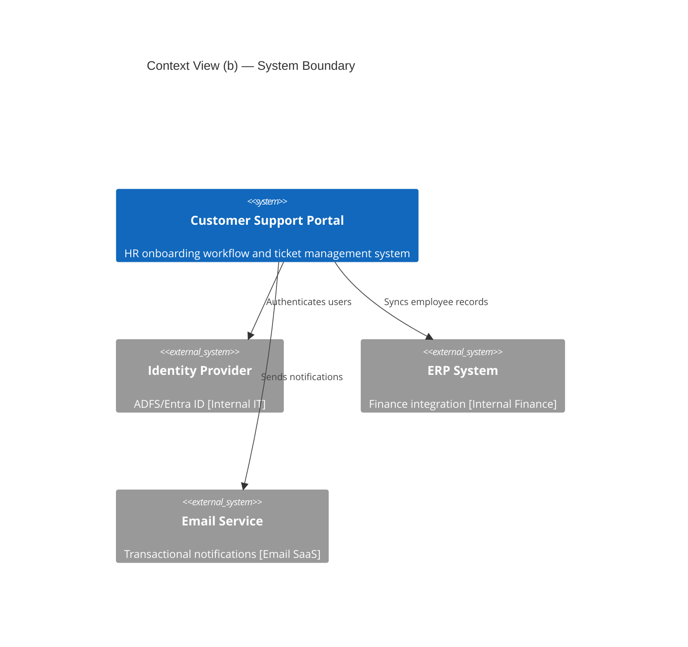

# Architecture Diagram Readability Rules

Every diagram produced by any arch-diagrams-* skill must satisfy all rules in this file before it is considered complete. These rules apply regardless of renderer (Mermaid, PlantUML, Structurizr DSL).

---

## Rule 1 — Density

**Max 12 nodes and 15 edges per diagram.** When either limit is exceeded, split the diagram.

Split strategies:
- Context View with >8 external systems: produce (a) an Actors diagram and (b) a System-boundary diagram.
- Development View with >6 repos: split by team ownership, one diagram per team cluster.
- Process View with >10 containers: separate sync and async flows into two diagrams.

---

## Rule 2 — One concept per diagram

Do NOT mix synchronous calls, asynchronous events, and telemetry flows on the same frame. Separate them into distinct diagrams. If a sequence diagram covers both sync and async, use a clear dividing note between sections.

---

## Rule 3 — Node labels

Every node label must follow this three-line convention:

- **Line 1:** Name (bold where renderer supports it)
- **Line 2:** `[tech-stack]` in italic where renderer supports it
- **Line 3:** One-line responsibility (what it does, ≤ 40 chars)

Hard limits: **≤ 3 lines** and **≤ 40 characters per line**. Abbreviate if needed; never wrap inside a node box.

---

## Rule 4 — Arrow labels

Arrow labels must state a **3–5 word purpose only** (e.g., "Submits payment", "Publishes order event").

**Never** inline protocol, sync/async indicator, or SLA on the arrow in a format like `[HTTPS/REST — sync]` — this causes label overlap and cluttered diagrams.

Protocol, sync/async mode, and SLAs belong in a **legend table below the diagram**, not on the arrows.

**Legend table format (required below every diagram):**

| Arrow label | Protocol | Mode | SLA / Notes |
|-------------|----------|------|-------------|
| Submits payment | HTTPS/REST | sync | 99.9% |
| Publishes order event | Kafka | async | best-effort |

---

## Rule 5 — Grouping

Group related nodes in subgraphs or C4 boundaries to reduce edge crossings. Every boundary must have a plain-text title (no embedded quotes — see Rule 7).

---

## Rule 6 — Renderer selection

| Use case | Renderer |
|----------|---------|
| Context, Container, Component, Deployment with **>6 nodes** | **PlantUML C4 stdlib** (better auto-layout) |
| Sequences, ERDs, state machines, journeys, simple flows | **Mermaid** |
| Multiple C4 levels of the same system in one workspace | **Structurizr DSL** |

Default is Mermaid for ≤6-node diagrams. Switch to PlantUML when node count exceeds the threshold.

---

## Rule 7 — Subgraph titles

Use **plain text subgraph IDs with bracketed display names**, never embedded quotes inside the subgraph keyword.

**Correct:**
```mermaid
subgraph FrontendTeam[Frontend Team — Web App]
```

**Wrong (Mermaid parses embedded quotes as string literals):**
```mermaid
subgraph "Actors"
subgraph "Repo: frontend-app"
```

---

## Rule 8 — Closed brackets for artifact nodes

Artifact nodes must use **double-bracket closed syntax** `[[artifact-name]]`, never leave open bracket fragments.

**Correct:**
```mermaid
spa_art[[artifact: frontend-app-spa]]
```

**Wrong:**
```mermaid
"[artefact frontend-app-spa"
```

---

## Rule 9 — Split rules for specific views

| View | Trigger | Split strategy |
|------|---------|---------------|
| Context View | >8 external systems | (a) Actors diagram; (b) System-boundary diagram |
| Development View | >6 repos | One diagram per team ownership cluster |
| Process View | >10 containers | Separate sync-flow diagram and async-flow diagram |
| Physical View | >3 cloud regions | One diagram per region, with a topology summary map |

---

## Rule 10 — Legend required

Every diagram must include a legend table immediately below the diagram block. The legend must list:

- Element types used (Person, Container, System_Ext, etc.)
- Arrow types used (sync call, async event, data read, depends-on, etc.)
- Protocol abbreviations used in the legend table (see Rule 4)

---

## Worked Examples

### Before (violates Rules 7, 8, 4)



### After (complies with all rules)



Legend:

| Arrow label | Protocol | Mode | Notes |
|-------------|----------|------|-------|
| Serves requests to | HTTPS/REST | sync | SLA 99.9% |

---

### Context View — Actors split example

When a Context View exceeds 8 external systems, produce two diagrams:

**Diagram (a) — Actors:**


**Diagram (b) — System boundary:**


Legend:

| Arrow label | Protocol | Mode | Notes |
|-------------|----------|------|-------|
| Authenticates users | OIDC/HTTPS | sync | JWT |
| Syncs employee records | REST/HTTPS | sync | batch on approval |
| Sends notifications | HTTPS | async | fire-and-forget |
