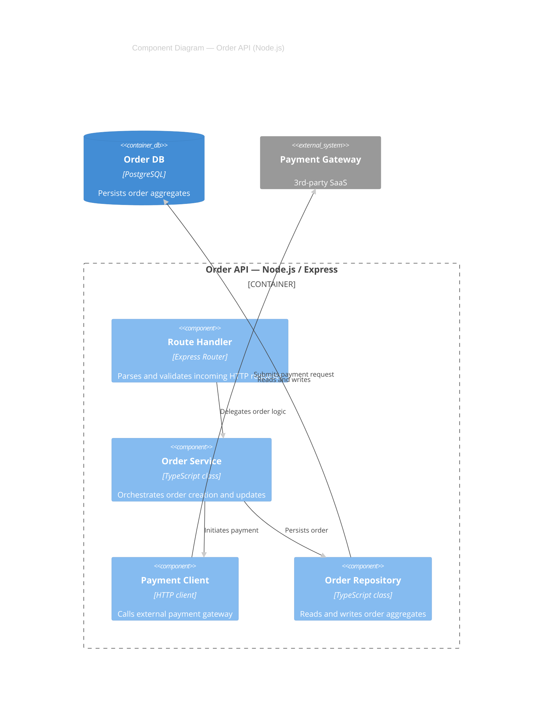
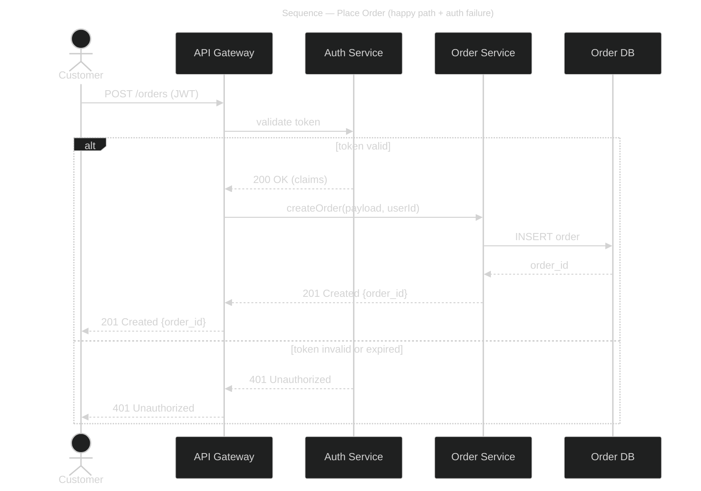
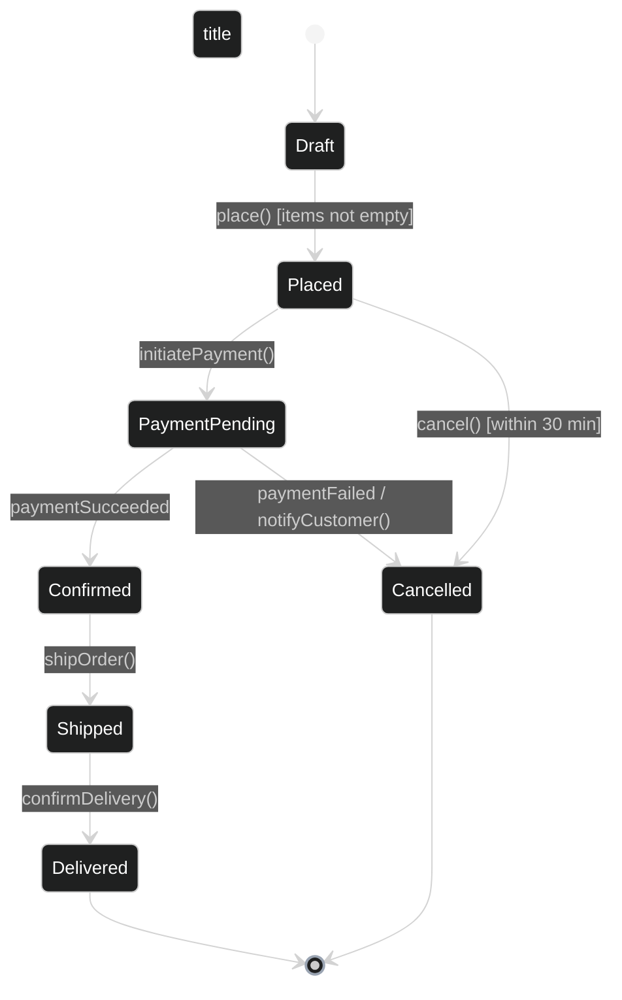

# LLD Diagram Checklist

Primary meta-standards: UML 2.5, C4 Model (L3 Component), ISO/IEC/IEEE 42010.
Notation standards (per diagram): C4 L3, UML Sequence, UML Class, UML State Machine.

Every diagram must also satisfy `shared/readability-rules.md` (density, one-concept, node labels, arrow labels, renderer selection, subgraph syntax, artifact nodes, legend).
Every diagram must use the style directives from `shared/house-style.md`.

A diagram is compliant when **every item** in its Mandatory Elements list is satisfied.
This file is the compliance source-of-truth for `diag-llad`.

---

## C4 L3 — Component Diagram

**Standard:** C4 Model Level 3
**Purpose:** Show the internal components of a single container — how responsibility is divided and how components collaborate.

### Mandatory Elements

- [ ] Exactly one parent container boundary shown with the container name and tech stack labeled
- [ ] Every component labeled with: name, technology, and one-line responsibility
- [ ] All relationships between components show a 3–5 word purpose label
- [ ] External containers or systems referenced from outside the boundary are shown as external elements (not invented internal components)
- [ ] No code-level detail (no method signatures, no field names)
- [ ] No deployment topology content (no nodes, no regions)
- [ ] A title on the diagram
- [ ] A legend table below the diagram listing arrow types and protocols

**Worked Example:**



Legend:

| Arrow label | Protocol | Mode | Notes |
|-------------|----------|------|-------|
| Delegates order logic | In-process | sync | — |
| Initiates payment | In-process | sync | — |
| Persists order | In-process | sync | — |
| Reads and writes | JDBC / pg driver | sync | — |
| Submits payment request | HTTPS/REST | sync | API key |

---

## UML Sequence Diagram

**Standard:** UML 2.5 Interaction Diagram
**Purpose:** Show the time-ordered message flow between participants for a specific scenario or use case.

### Mandatory Elements

- [ ] Every participant labeled with its role and container/component name (not just "Service")
- [ ] Messages labeled with a verb-object phrase (e.g., "POST /orders", "validate token")
- [ ] Activation bars shown for synchronous messages (or equivalent rendering hint)
- [ ] Return messages shown for synchronous calls where a response is meaningful
- [ ] Alternative (`alt`), optional (`opt`), or loop (`loop`) fragments used where branching logic is relevant
- [ ] At least one negative/failure path shown (e.g., auth failure, validation error)
- [ ] A title on the diagram
- [ ] A note or legend identifying async messages (dashed arrows) vs synchronous (solid)

**Worked Example:**



Legend:

| Arrow style | Meaning |
|-------------|---------|
| Solid (`->>`) | Synchronous request |
| Dashed (`-->>`) | Synchronous response |

---

## UML Class Diagram

**Standard:** UML 2.5 Structural Diagram
**Purpose:** Show domain entities, value objects, their attributes, operations, and relationships for a bounded context or module.

### Mandatory Elements

- [ ] Every class labeled with its stereotype where applicable (`<<entity>>`, `<<value object>>`, `<<service>>`, `<<repository>>`, `<<interface>>`)
- [ ] Attributes include name and type (e.g., `orderId: UUID`)
- [ ] Operations include name, parameters (types), and return type
- [ ] Relationships use correct UML notation (association, aggregation, composition, dependency, realization)
- [ ] Cardinality shown on association ends (e.g., `1`, `0..*`, `1..*`)
- [ ] Abstract classes and interfaces distinguished (italic or `<<interface>>` stereotype)
- [ ] No infrastructure or deployment content (no cloud services, no configs)
- [ ] A title on the diagram
- [ ] A legend table for relationship types used

**Worked Example:**

```mermaid
%%{init: {'theme':'dark', 'themeVariables': { 'primaryColor':'#2b3a55', 'primaryTextColor':'#ffffff', 'primaryBorderColor':'#7a9cc6', 'lineColor':'#9aa4b2', 'fontSize':'14px'}}}%%
classDiagram
    title Class Diagram — Order Bounded Context

    class Order {
        <<entity>>
        +orderId: UUID
        +status: OrderStatus
        +createdAt: DateTime
        +totalAmount: Money
        +place() void
        +cancel() void
    }

    class OrderLine {
        <<value object>>
        +productId: UUID
        +quantity: int
        +unitPrice: Money
    }

    class OrderRepository {
        <<interface>>
        +findById(id: UUID) Order
        +save(order: Order) void
    }

    class OrderService {
        <<service>>
        +createOrder(cmd: CreateOrderCmd) Order
        +cancelOrder(orderId: UUID) void
    }

    Order "1" *-- "1..*" OrderLine : contains
    OrderService --> OrderRepository : uses
    OrderService --> Order : creates
```

Legend:

| Relationship | UML notation | Meaning |
|---|---|---|
| `*--` | Composition | Child cannot exist without parent |
| `-->` | Dependency | Uses at runtime or compile time |

---

## State Machine Diagram

**Standard:** UML 2.5 State Machine Diagram
**Purpose:** Show the lifecycle of a domain entity — its states, valid transitions, guards, and entry/exit actions.

### Mandatory Elements

- [ ] Initial pseudo-state (`[*]`) and terminal state (`[*]` or named final state) explicitly shown
- [ ] Every state labeled with a meaningful domain name (not a technical flag name)
- [ ] Every transition labeled with: trigger event and guard condition where applicable (`event [guard] / action`)
- [ ] Entry and exit actions shown inline where relevant (`entry /`, `exit /`)
- [ ] Concurrent (orthogonal) regions shown if the entity has parallel state tracks
- [ ] At least one error/exception transition shown
- [ ] A title on the diagram
- [ ] A legend table listing all trigger events and their sources

**Worked Example:**



Legend:

| Trigger | Source |
|---------|--------|
| place() | Customer action |
| initiatePayment() | Order Service |
| paymentSucceeded | Payment Gateway event |
| paymentFailed | Payment Gateway event |
| shipOrder() | Warehouse Service |
| confirmDelivery() | Logistics event |
| cancel() | Customer action |
