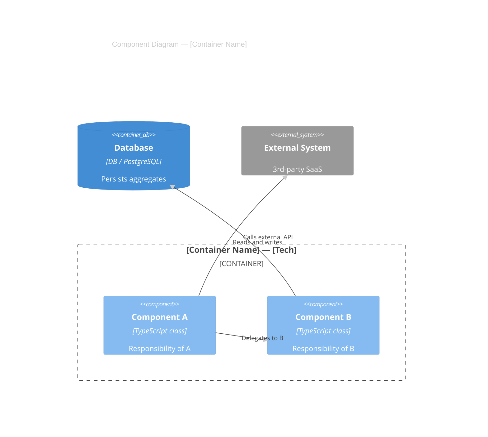
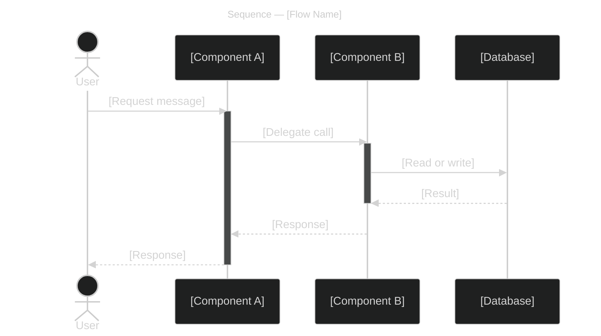
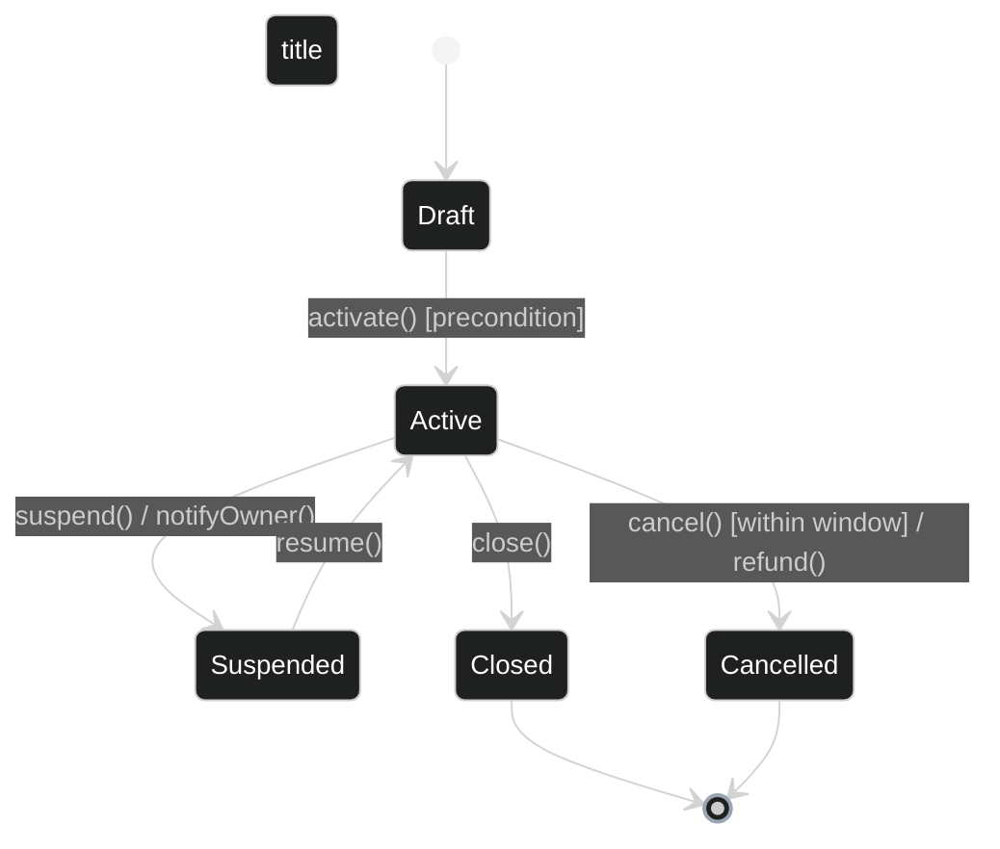

# LLD Notation Cheatsheet

Primary notations: C4 L3 Component, UML Sequence, UML Class, UML State Machine.
Renderers: Mermaid (preferred for text-based output), PlantUML (richer UML support), Structurizr DSL (for C4 L3 only).

Apply `shared/house-style.md` theme directives to every diagram.
Follow `shared/readability-rules.md` for subgraph syntax and layout rules.

---

## C4 Level 3 — Component Symbols

| Symbol | Meaning | Mermaid Keyword | PlantUML Keyword |
|--------|---------|----------------|-----------------|
| Dashed boundary | Container being decomposed | `Container_Boundary(id, "name") { }` | `Container_Boundary(id, name) { }` |
| Rectangle with tech label | Internal component | `Component(id, "name", "tech", "desc")` | `Component(id, name, tech, desc)` |
| Cylinder | Database referenced from outside | `ContainerDb(id, "name", "tech", "desc")` | `ContainerDb(id, name, tech, desc)` |
| External box | External system or container | `System_Ext(id, "name", "desc")` | `System_Ext(id, name, desc)` |

### Mermaid C4Component quick template



Legend:

| Arrow label | Protocol | Mode | Notes |
|-------------|----------|------|-------|
| Delegates to B | In-process | sync | — |
| Reads and writes | JDBC | sync | — |
| Calls external API | HTTPS/REST | sync | API key |

---

## UML Sequence Diagram Symbols

| Symbol | Meaning | Mermaid syntax |
|--------|---------|----------------|
| Solid arrow `-->>` | Synchronous message | `->>` |
| Dashed arrow `-->>` | Synchronous return / response | `-->>` |
| Open arrow `-)` | Asynchronous message (fire-and-forget) | `-)` |
| `activate` / `deactivate` | Execution / activation bar | `activate Participant` |
| `alt` / `else` / `end` | Alternative fragment | `alt condition` ... `else` ... `end` |
| `opt` / `end` | Optional fragment | `opt condition` ... `end` |
| `loop` / `end` | Loop fragment | `loop condition` ... `end` |
| `Note over` | Annotation | `Note over A,B: text` |

### Mermaid sequenceDiagram quick template



---

## UML Class Diagram Symbols

| Symbol | Meaning | Mermaid syntax |
|--------|---------|----------------|
| `+` prefix | Public visibility | `+fieldName: Type` |
| `-` prefix | Private visibility | `-fieldName: Type` |
| `#` prefix | Protected visibility | `#fieldName: Type` |
| `<<stereotype>>` | Classifier stereotype | `<<entity>>`, `<<service>>`, `<<interface>>` |
| Solid line with filled diamond | Composition (child owned by parent) | `ClassA *-- ClassB` |
| Solid line with open diamond | Aggregation (child exists independently) | `ClassA o-- ClassB` |
| Solid arrow | Association / directed dependency | `ClassA --> ClassB` |
| Dashed arrow | Dependency (uses, creates) | `ClassA ..> ClassB` |
| Dashed arrow with open triangle | Realization (implements interface) | `ClassA ..|> InterfaceB` |
| Solid line with open triangle | Inheritance (extends) | `ClassA --|> ClassB` |

### Mermaid classDiagram quick template

```mermaid
%%{init: {'theme':'dark', 'themeVariables': { 'primaryColor':'#2b3a55', 'primaryTextColor':'#ffffff', 'primaryBorderColor':'#7a9cc6', 'lineColor':'#9aa4b2', 'fontSize':'14px'}}}%%
classDiagram
    title Class Diagram — [Bounded Context]

    class AggregateRoot {
        <<entity>>
        +id: UUID
        +status: StatusEnum
        +createdAt: DateTime
        +doSomething() void
    }

    class ValueObject {
        <<value object>>
        +field1: string
        +field2: int
    }

    class IRepository {
        <<interface>>
        +findById(id: UUID) AggregateRoot
        +save(root: AggregateRoot) void
    }

    class DomainService {
        <<service>>
        +execute(cmd: CommandType) AggregateRoot
    }

    AggregateRoot "1" *-- "1..*" ValueObject : contains
    DomainService --> IRepository : uses
    DomainService --> AggregateRoot : creates
```

Legend:

| Notation | Relationship | Meaning |
|---|---|---|
| `*--` | Composition | Child cannot exist without parent |
| `-->` | Dependency / association | Uses at compile or runtime |
| `..|>` | Realization | Implements the interface |

---

## UML State Machine Symbols

| Symbol | Meaning | Mermaid syntax |
|--------|---------|----------------|
| Filled circle `[*]` | Initial pseudo-state | `[*] --> StateName` |
| Circle within circle `[*]` | Terminal state | `StateName --> [*]` |
| Rounded rectangle | State | `StateName` |
| Arrow with label | Transition | `StateA --> StateB : event [guard] / action` |
| `state "label" as name` | State alias (long display name) | `state "Long Name" as shortName` |
| `state { }` composite | Composite / nested state | `state StateName { ... }` |

### Mermaid stateDiagram-v2 quick template



Legend:

| Trigger | Source |
|---------|--------|
| activate() | [Actor or service] |
| suspend() | [Actor or service] |
| resume() | [Actor or service] |
| close() | [Actor or service] |
| cancel() | [Actor or service] |
