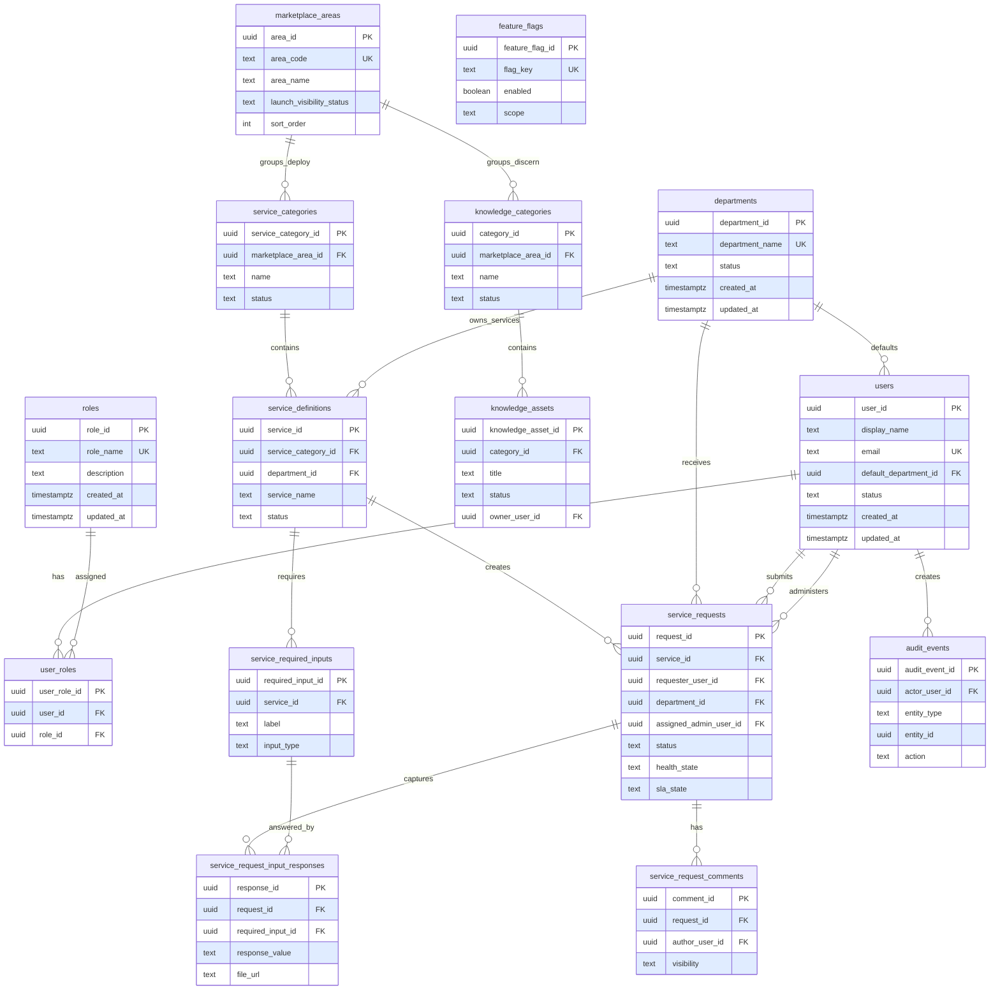
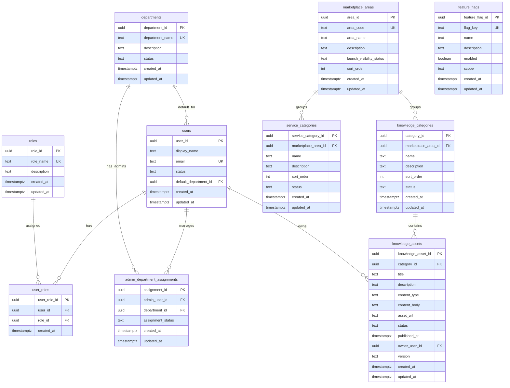
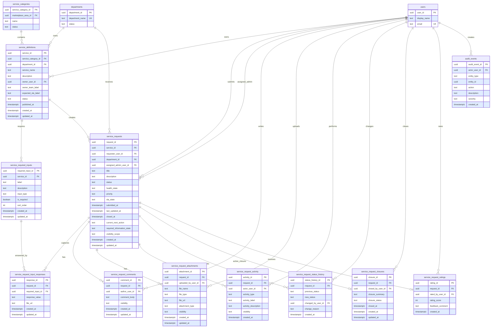

# DWS.01 MVP Services and Knowledge Database Design

## MVP Scope Statement

This database design supports the DWS.01 MVP launch scope for June 19, 2026 only. It covers two launch roles, the visible DWS Marketplace areas, knowledge content in Discern, service catalogue content in Deploy, service request submission, department-based request routing, Admin request handling, comments, attachments, activity timeline, status history, closure, rating, basic audit, and launch feature visibility.

The design is intentionally small enough for tomorrow's launch while preserving clean extension points for future DWS areas. It does not model Trackers, Tasks, Workflows, Analytics Marketplace, advanced Platform Admin, advanced Governance, advanced Reporting, or a complex permission matrix.

Design rules:

- Use lowercase snake_case table and column names.
- Use UUID primary keys consistently.
- Use `timestamptz` for time fields in implementation.
- Use text values plus check constraints for MVP statuses rather than hard database enums.
- Index every foreign key and every column used in launch access filters.
- Avoid arrays in persisted tables where a join table is more accurate.
- Use JSON only for future lightweight display metadata or simple form configuration; no JSON fields are required for the MVP tables below.

## Launch Sidebar Supported by the Schema

| Sidebar area | Launch item | Database support |
|---|---|---|
| ORIENTATION | Getting Started | `feature_flags` can gate launch visibility; no dedicated table needed for MVP. |
| ORIENTATION | Home | Uses `users`, `roles`, `user_roles`, and request summaries from `service_requests`. |
| MARKETPLACE | Catalogue | Uses active `marketplace_areas` records for Discern and Deploy. |
| MARKETPLACE | Discern | Uses `marketplace_areas`, `knowledge_categories`, and `knowledge_assets`. |
| MARKETPLACE | Deploy | Uses `marketplace_areas`, `service_categories`, `service_definitions`, and `service_required_inputs`. |
| SERVICES | Service Hub | Uses published `service_definitions` and `service_requests`. |
| SERVICES | My Requests | Filter `service_requests.requester_user_id` by current user. |
| SERVICES | Pending Actions | Filter current user's requests where `required_information_state` needs requester action. |
| Request Queues | Assigned Requests | Filter requests directly assigned to Admin or assigned to a department managed by Admin. |
| Request Queues | Pending Information | Filter Admin department scope where `status = Awaiting Information` or `required_information_state` is pending. |
| UTILITY | Help / Support | Can be represented as published service definitions in Deploy. |
| UTILITY | Logout | Authentication/session concern; no MVP table required here. |

## Role and Visibility Rules

MVP seed roles are only:

- `Associate`
- `Admin`

Associate visibility:

- Can view published `knowledge_assets` under active Discern.
- Can view published `service_definitions` under active Deploy.
- Can submit `service_requests` to any published service and therefore any service department.
- Can view every request where `service_requests.requester_user_id` is their own user id.
- Can add requester-visible comments and attachments to their own requests.
- Can provide missing information on their own requests.
- Can view requester-visible activity on their own requests.
- Can rate closed requests when allowed by request state.
- Can reopen requests when allowed by application rules.

Admin visibility:

- Can view requests where `assigned_admin_user_id` is their own user id.
- Can view requests where `department_id` belongs to an active `admin_department_assignments` row for their user id.
- Can update request status, health, assignment, comments, attachments, lifecycle records, closure, and reopen state for visible requests.
- Can view requester-visible and admin-internal comments/activity for their department/service area.
- Can view audit history for their department/service area through application-scoped queries.

Post-MVP note: add `permissions` and `role_permissions` only when the product needs fine-grained authorization beyond Associate/Admin.

## Entity / Table List

| Group | Tables |
|---|---|
| Identity and Access | `users`, `roles`, `user_roles` |
| Departments and Admin Assignment | `departments`, `admin_department_assignments` |
| Marketplace Areas | `marketplace_areas` |
| Knowledge Marketplace / Discern | `knowledge_categories`, `knowledge_assets` |
| Services Marketplace / Deploy | `service_categories`, `service_definitions`, `service_required_inputs` |
| Service Requests | `service_requests`, `service_request_input_responses` |
| Request Communication and Evidence | `service_request_comments`, `service_request_attachments` |
| Request Lifecycle and Closure | `service_request_activity`, `service_request_status_history`, `service_request_closures`, `service_request_ratings` |
| Audit | `audit_events` |
| Feature Flags / Launch Visibility | `feature_flags` |

## Table Responsibilities

| Table | Responsibility | Key access pattern |
|---|---|---|
| `users` | Canonical MVP user account profile. | Look up current user, default department, and display label. |
| `roles` | Launch role catalogue. | Seed Associate/Admin; future roles can be added without replacing `users`. |
| `user_roles` | Many-to-many user role assignment. | Resolve whether current user is Associate or Admin. |
| `departments` | Department/service area catalogue. | Route services and requests to fulfilment areas. |
| `admin_department_assignments` | Admin ownership of departments. | Resolve Admin request queue scope. |
| `marketplace_areas` | Lightweight DWS area records for Discern, Deploy, Design, Drive. | Show active marketplace areas and keep future areas inactive. |
| `knowledge_categories` | Discern category taxonomy. | Group published knowledge assets. |
| `knowledge_assets` | Published/draft knowledge content. | Associate reads published content; Admin can manage later. |
| `service_categories` | Deploy service category taxonomy. | Group published service cards. |
| `service_definitions` | Service catalogue cards and routing owner. | Associate submits requests; department is inherited by request. |
| `service_required_inputs` | Required fields shown before request submission. | Render intake form fields in service detail page. |
| `service_requests` | Core MVP work/request record. | My Requests, Assigned Requests, Pending Information, request detail. |
| `service_request_input_responses` | Requester's submitted answers for service intake fields. | Load request detail form answers and validate required input completion. |
| `service_request_comments` | Requester-visible and Admin-internal discussion. | Request detail comments panel. |
| `service_request_attachments` | Request files or mock file links. | Request evidence/attachment panel. |
| `service_request_activity` | Request activity timeline. | Request detail timeline with visibility filtering. |
| `service_request_status_history` | Request status transition audit trail. | Lifecycle tracking and Admin review. |
| `service_request_closures` | Closure summary for a completed request. | Closure panel; zero or one active closure for MVP. |
| `service_request_ratings` | Requester rating after closure. | Associate feedback and Admin visibility. |
| `feature_flags` | Launch visibility switches. | Keep Design, Drive, Trackers, Tasks, Workflows, Analytics hidden. |
| `audit_events` | Append-only audit record. | Important state, content, assignment, and feature flag changes. |

## Key Fields

### Identity and Access

| Table | Fields |
|---|---|
| `users` | `user_id` PK, `display_name`, `email` UK, `status`, `default_department_id` FK, `created_at`, `updated_at` |
| `roles` | `role_id` PK, `role_name` UK, `description`, `created_at`, `updated_at` |
| `user_roles` | `user_role_id` PK, `user_id` FK, `role_id` FK, `created_at` |

Recommended constraints:

- `users.status in ('Active', 'Inactive', 'Pending')`
- `roles.role_name in ('Associate', 'Admin')` for MVP seed data, but do not hard-code the schema to only these values.
- Unique `user_roles(user_id, role_id)`.

### Departments and Admin Assignment

| Table | Fields |
|---|---|
| `departments` | `department_id` PK, `department_name` UK, `description`, `status`, `created_at`, `updated_at` |
| `admin_department_assignments` | `assignment_id` PK, `admin_user_id` FK, `department_id` FK, `assignment_status`, `created_at`, `updated_at` |

Recommended constraints:

- `departments.status in ('Active', 'Inactive')`
- `admin_department_assignments.assignment_status in ('Active', 'Inactive')`
- Unique `admin_department_assignments(admin_user_id, department_id)` for active assignment management.

### Marketplace Areas

| Table | Fields |
|---|---|
| `marketplace_areas` | `area_id` PK, `area_code` UK, `area_name`, `description`, `launch_visibility_status`, `sort_order`, `created_at`, `updated_at` |

Recommended constraints:

- `area_code in ('discern', 'deploy', 'design', 'drive')` for launch seed data.
- `launch_visibility_status in ('active', 'hidden', 'post_mvp')`.

### Knowledge Marketplace / Discern

| Table | Fields |
|---|---|
| `knowledge_categories` | `category_id` PK, `marketplace_area_id` FK, `name`, `description`, `sort_order`, `status`, `created_at`, `updated_at` |
| `knowledge_assets` | `knowledge_asset_id` PK, `category_id` FK, `title`, `description`, `content_type`, `content_body`, `asset_url`, `status`, `published_at`, `owner_user_id` FK, `version`, `created_at`, `updated_at` |

Recommended constraints:

- `knowledge_categories.status in ('Active', 'Inactive')`
- `knowledge_assets.status in ('Draft', 'Published', 'Archived')`
- Associate catalogue query filters `knowledge_assets.status = 'Published'` and active Discern area.

### Services Marketplace / Deploy

| Table | Fields |
|---|---|
| `service_categories` | `service_category_id` PK, `marketplace_area_id` FK, `name`, `description`, `sort_order`, `status`, `created_at`, `updated_at` |
| `service_definitions` | `service_id` PK, `service_category_id` FK, `department_id` FK, `service_name`, `description`, `owner_user_id` FK, `owner_team_label`, `expected_sla_label`, `status`, `published_at`, `created_at`, `updated_at` |
| `service_required_inputs` | `required_input_id` PK, `service_id` FK, `label`, `description`, `input_type`, `is_required`, `sort_order`, `created_at`, `updated_at` |

Recommended constraints:

- `service_categories.status in ('Active', 'Inactive')`
- `service_definitions.status in ('Draft', 'Published', 'Archived')`
- `service_required_inputs.input_type in ('text', 'textarea', 'select', 'date', 'file', 'url', 'number')`
- Associate catalogue query filters `service_definitions.status = 'Published'` and active Deploy area.

### Service Requests

| Table | Fields |
|---|---|
| `service_requests` | `request_id` PK, `service_id` FK, `requester_user_id` FK, `department_id` FK, `assigned_admin_user_id` FK nullable, `title`, `description`, `status`, `health_state`, `priority`, `sla_state`, `submitted_at`, `last_updated_at`, `closed_at`, `current_next_action`, `required_information_state`, `visibility_scope`, `created_at`, `updated_at` |
| `service_request_input_responses` | `response_id` PK, `request_id` FK, `required_input_id` FK, `response_value`, `file_url`, `created_at`, `updated_at` |

Recommended constraints:

- `status in ('Draft', 'Submitted', 'In Review', 'Awaiting Information', 'In Progress', 'Resolved', 'Closed', 'Reopened', 'Cancelled')`
- `health_state in ('Healthy', 'Amber', 'At Risk', 'Blocked', 'Closed')`
- `priority in ('Low', 'Medium', 'High', 'Critical')`
- `sla_state in ('Not Started', 'On Track', 'At Risk', 'Breached', 'Paused', 'Resolved')`
- `required_information_state in ('Not Required', 'Requested', 'Provided', 'Accepted')`
- `visibility_scope in ('requester_and_department_admins', 'department_admins_only')`
- `service_request_input_responses.response_value` stores text, selected option labels, numbers as text, dates as text, or URLs according to the related `service_required_inputs.input_type`.
- `service_request_input_responses.file_url` stores a mock or real file URL when the required input is file-style.
- Unique `service_request_input_responses(request_id, required_input_id)` for MVP, assuming one submitted answer per required input.
- Reopened requests are tracked through `service_requests.status`, `service_request_status_history`, and `service_request_activity`. If a reopen reason is needed, store it in `service_request_status_history.change_reason`; do not add a reopen table for MVP.
- Request source/channel is not included for tomorrow because the approved MVP scope does not require channel reporting. Add `request_channels` and `service_requests.channel_id` post-MVP if source reporting becomes a launch requirement.

Launch queue filters:

```sql
-- Associate My Requests
where service_requests.requester_user_id = :current_user_id

-- Associate Pending Actions
where service_requests.requester_user_id = :current_user_id
  and service_requests.required_information_state = 'Requested'

-- Admin Assigned Requests
where service_requests.assigned_admin_user_id = :current_user_id
   or exists (
     select 1
     from admin_department_assignments ada
     where ada.admin_user_id = :current_user_id
       and ada.department_id = service_requests.department_id
       and ada.assignment_status = 'Active'
   )

-- Admin Pending Information
where service_requests.status = 'Awaiting Information'
  and service_requests.required_information_state = 'Requested'
  and exists (
     select 1
     from admin_department_assignments ada
     where ada.admin_user_id = :current_user_id
       and ada.department_id = service_requests.department_id
       and ada.assignment_status = 'Active'
  )
```

### Request Communication and Evidence

| Table | Fields |
|---|---|
| `service_request_comments` | `comment_id` PK, `request_id` FK, `author_user_id` FK, `comment_body`, `visibility`, `created_at`, `updated_at` |
| `service_request_attachments` | `attachment_id` PK, `request_id` FK, `uploaded_by_user_id` FK, `file_name`, `file_type`, `file_url`, `attachment_type`, `visibility`, `created_at`, `updated_at` |

Recommended constraints:

- `visibility in ('requester_visible', 'admin_internal')`
- Associates can only read/write `requester_visible` rows on their own requests.
- Admins can read/write both visibility values for requests in their department scope.

### Request Lifecycle and Closure

| Table | Fields |
|---|---|
| `service_request_activity` | `activity_id` PK, `request_id` FK, `actor_user_id` FK, `activity_type`, `activity_label`, `activity_description`, `visibility`, `created_at` |
| `service_request_status_history` | `status_history_id` PK, `request_id` FK, `previous_status`, `new_status`, `changed_by_user_id` FK, `change_reason`, `created_at` |
| `service_request_closures` | `closure_id` PK, `request_id` FK, `closed_by_user_id` FK, `closure_summary`, `closure_status`, `closed_at`, `created_at`, `updated_at` |
| `service_request_ratings` | `rating_id` PK, `request_id` FK, `rated_by_user_id` FK, `rating_score`, `feedback_comment`, `created_at` |

Recommended constraints:

- `service_request_activity.visibility in ('requester_visible', 'admin_internal')`
- `service_request_closures.closure_status in ('Resolved', 'Closed', 'Reopened')`
- `service_request_ratings.rating_score between 1 and 5`
- Unique closure per request for MVP. If full closure/reopen history is required later, add closure history fields such as `is_active` or `reopened_at` post-MVP.
- Unique rating per request for MVP.

### Feature Flags / Launch Visibility

| Table | Fields |
|---|---|
| `feature_flags` | `feature_flag_id` PK, `flag_key` UK, `name`, `description`, `enabled`, `scope`, `created_at`, `updated_at` |

Required launch flags are listed in the seed section below.

### Audit

| Table | Fields |
|---|---|
| `audit_events` | `audit_event_id` PK, `actor_user_id` FK, `entity_type`, `entity_id`, `action`, `description`, `severity`, `created_at` |

Recommended constraints:

- `severity in ('Info', 'Warning', 'Critical')`
- Audit is append-only. Normal users must not update or delete audit rows.
- `entity_type` and `entity_id` intentionally form a generic reference rather than a hard FK because audit covers multiple tables.

## Relationships

- `departments` has many `users` through `users.default_department_id`.
- `users` has many `roles` through `user_roles`.
- `roles` has many `users` through `user_roles`.
- `users` manages many `departments` through `admin_department_assignments`.
- `departments` has many Admins through `admin_department_assignments`.
- `marketplace_areas` has many `knowledge_categories`.
- `marketplace_areas` has many `service_categories`.
- `knowledge_categories` has many `knowledge_assets`.
- `users` owns many `knowledge_assets`.
- `service_categories` has many `service_definitions`.
- `departments` receives many `service_definitions`.
- `users` owns many `service_definitions`.
- `service_definitions` has many `service_required_inputs`.
- `service_definitions` creates many `service_requests`.
- `service_requests` has many `service_request_input_responses`.
- `service_required_inputs` has many `service_request_input_responses`.
- `departments` receives many `service_requests`.
- `users` submits many `service_requests`.
- Admin `users` can be assigned many `service_requests`.
- `service_requests` has many comments, attachments, activity records, and status history records.
- `service_requests` has zero or one closure record for MVP.
- `service_requests` has zero or one rating record for MVP.
- `users` creates many `audit_events`.
- `audit_events` references records through `entity_type` and `entity_id`.

## ERD Source

The design is split into three Mermaid ERDs to keep the launch model readable.

### MVP Overview ERD



### Identity and Marketplace ERD



### Services and Requests ERD



## Relationship Legend

| Notation | Meaning |
|---|---|
| `PK` | Primary key. |
| `FK` | Foreign key. |
| `UK` | Unique key or unique constrained field. |
| `||--o{` | One row relates to zero or many rows. |
| `||--o|` | One row relates to zero or one row. |
| `entity_type` + `entity_id` | Generic audit reference; intentionally not a hard FK to one table. |

## Implementation Notes

Recommended indexes:

- `users(email)`
- `users(default_department_id)`
- `user_roles(user_id)`, `user_roles(role_id)`, unique `user_roles(user_id, role_id)`
- `admin_department_assignments(admin_user_id, assignment_status)`
- `admin_department_assignments(department_id, assignment_status)`
- `knowledge_categories(marketplace_area_id, status)`
- `knowledge_assets(category_id, status, published_at)`
- `knowledge_assets(owner_user_id)`
- `service_categories(marketplace_area_id, status)`
- `service_definitions(service_category_id, status)`
- `service_definitions(department_id, status)`
- `service_definitions(owner_user_id)`
- `service_required_inputs(service_id, sort_order)`
- `service_request_input_responses(request_id)`
- `service_request_input_responses(required_input_id)`
- unique `service_request_input_responses(request_id, required_input_id)` for MVP
- `service_requests(requester_user_id, created_at)`
- `service_requests(assigned_admin_user_id, status)`
- `service_requests(department_id, status)`
- `service_requests(department_id, required_information_state)`
- `service_request_comments(request_id, created_at)`
- `service_request_attachments(request_id, created_at)`
- `service_request_activity(request_id, created_at)`
- `service_request_status_history(request_id, created_at)`
- unique `service_request_closures(request_id)` for MVP
- unique `service_request_ratings(request_id)` for MVP
- `audit_events(actor_user_id, created_at)`
- `audit_events(entity_type, entity_id, created_at)`
- unique `feature_flags(flag_key)`

RLS-friendly policy anchors:

- Associate request scope: `service_requests.requester_user_id`.
- Admin request scope: `service_requests.assigned_admin_user_id` and `service_requests.department_id`.
- Department management scope: `admin_department_assignments.admin_user_id`.
- Published marketplace scope: active `marketplace_areas`, active category, and published asset/service status.

Migration notes:

- Prefer idempotent migrations for constraints because PostgreSQL does not support `add constraint if not exists`.
- Keep status values as text check constraints for MVP flexibility.
- Do not add `deleted_at` unless soft delete becomes a project-wide pattern.
- Service request department should be copied from `service_definitions.department_id` at submission time so historical routing remains stable if the service catalogue changes later.
- Store service request intake answers in `service_request_input_responses`; do not put dynamic answers into `service_requests` or a generic JSON blob for MVP.
- Use `service_request_status_history.change_reason` for reopen reasons if the UI asks for a reason during reopen.
- Keep request channel/source reporting post-MVP unless the launch demo explicitly needs it.

## Seed Data Recommendations

### Roles

| role_name | description |
|---|---|
| Associate | Launch user who can browse Discern/Deploy and submit/view own service requests. |
| Admin | Launch operator who can manage assigned and department-scoped service requests. |

### Marketplace Areas

| area_code | area_name | launch_visibility_status | sort_order |
|---|---|---:|---:|
| `discern` | Discern | `active` | 10 |
| `deploy` | Deploy | `active` | 20 |
| `design` | Design | `hidden` | 30 |
| `drive` | Drive | `hidden` | 40 |

### Feature Flags

| flag_key | enabled | scope |
|---|---:|---|
| `marketplace.discern.enabled` | true | `global` |
| `marketplace.deploy.enabled` | true | `global` |
| `marketplace.design.enabled` | false | `global` |
| `marketplace.drive.enabled` | false | `global` |
| `services.serviceHub.enabled` | true | `global` |
| `services.requestQueues.enabled` | true | `global` |
| `trackers.enabled` | false | `global` |
| `tasks.enabled` | false | `global` |
| `workflows.enabled` | false | `global` |
| `analytics.enabled` | false | `global` |

### Departments

Seed from the service catalogue currently represented in `src/types/serviceLifecycle.ts` and `src/mocks/serviceLifecycle.mock.ts`:

- People Operations / HRA
- IT & Access
- Platform Support
- Knowledge / Content
- Workspace Administration
- Escalation / Review

### Service Categories and Services

Seed published Deploy records from the existing service lifecycle fixture where launch-relevant:

- HRA Requests
- IT & Access
- Platform Support
- Knowledge / Content
- Admin Requests
- Escalations

Avoid exposing Task / Workflow, Approval Queue, or analytics services for tomorrow unless explicitly enabled.

Seed `service_required_inputs` for each published service from the existing service fixture `requiredInputs` arrays. Do not seed `service_request_input_responses` globally; create response rows only when a requester submits a service request or when demo request fixtures need submitted answers.

### Knowledge Categories and Assets

Seed published Discern records from the existing knowledge fixtures where useful for launch:

- Workspace operating guidance
- Request fulfilment process
- Evidence attachment standard
- Closure evidence standard
- Service usage guides

Associates should only see `knowledge_assets.status = 'Published'`.

## Post-MVP Extension Notes

- Design and Drive can later become active by updating `marketplace_areas.launch_visibility_status` and the corresponding `feature_flags`.
- Trackers can later attach to `departments`, `users`, and `service_requests`, but no tracker tables are needed for tomorrow.
- Tasks can later attach to `service_requests` or future tracker records.
- Workflows can later attach to `service_requests` through a workflow instance table.
- Analytics can later read from `service_requests`, `service_request_activity`, `service_request_status_history`, and `audit_events`.
- Request source/channel reporting can later attach through `request_channels` and nullable `service_requests.channel_id` if reporting needs it.
- Advanced Platform Admin can later manage roles, permissions, feature flags, and content workflows.
- Advanced Governance can later add approvals, escalations, retention policies, and evidence review tables.
- `permissions` and `role_permissions` can be introduced post-MVP without changing the `users` / `roles` / `user_roles` foundation.

## Self-Check

| Check | Result | Notes |
|---|---|---|
| Launch scope only | PASS | The design supports Discern, Deploy, service requests, request queues, comments, attachments, closure, rating, audit, and feature flags only. |
| Two MVP roles | PASS | Seed roles are Associate and Admin; no complex permission matrix is included. |
| Department routing supported | PASS | `departments`, `admin_department_assignments`, and `service_requests.department_id` support Admin Assigned Requests and Pending Information. |
| Marketplace language preserved | PASS | `marketplace_areas` keeps Discern/Deploy active and Design/Drive hidden for future activation. |
| Knowledge Marketplace supported | PASS | `knowledge_categories` and `knowledge_assets` support published Associate visibility. |
| Services Marketplace supported | PASS | `service_categories`, `service_definitions`, and `service_required_inputs` support published service cards and request intake. |
| Service request input responses supported | PASS | `service_request_input_responses` stores submitted answers per request and required input without a complex dynamic form engine. |
| Request detail page supported | PASS | Comments, attachments, activity, status history, closure, and rating are modelled separately. |
| Reopen handling kept simple | PASS | Reopen state is represented through request status, status history, and activity; no separate reopen table is added. |
| Request channel not overbuilt | PASS | Request channel/source reporting remains post-MVP because it is not required for tomorrow's launch scope. |
| Audit supported | PASS | `audit_events` captures append-only actions with generic entity reference. |
| Future features not overbuilt | PASS | Trackers, Tasks, Workflows, Analytics, advanced Admin, advanced Governance, and advanced Reporting are notes only. |
| ERD readability | PASS | The ERD is split into overview, identity/marketplace, and services/requests diagrams. |
| No class methods | PASS | The design contains tables, fields, keys, constraints, relationships, and query patterns only. |
| Postgres implementation readiness | PASS | Key constraints, indexes, RLS anchors, and seed records are identified. |
