# DWS.01 MVP Services and Knowledge ERD

## MVP Scope Statement

This ERD models the reduced DWS.01 MVP database scope for the June 19, 2026 launch. It covers Associate and Admin access, Knowledge Marketplace content, Services Marketplace content, service request submission, request tracking, request administration, request details, requester-visible and internal comments, attachments, activity timeline, status history, closure, rating, simple service queues, lightweight feature flags, and basic append-only audit.

This is a database entity relationship diagram. It intentionally shows tables, fields, primary keys, foreign keys, and relationships only. It does not model object-oriented classes, methods, future workflow engines, trackers, analytics marketplace, complex approvals, or a generic marketplace engine.

Source inputs:

- `docs/architecture/llad-data-architecture-v1.0-draft.md`
- `docs/architecture/diagrams/llad-data-architecture-c4-l3.md`
- `src/types/platform.ts`
- `src/types/serviceLifecycle.ts`
- `src/mocks/platform.mock.ts`
- `src/mocks/serviceLifecycle.mock.ts`
- `src/types/knowledgeDiscovery.ts`
- `src/mocks/knowledgeDiscovery.mock.ts`

`DWS01_Database_Design_Spec.md` was not found in the repository root during generation.

## Entity / Table List

| Area | Tables | MVP purpose |
|---|---|---|
| Identity and access | `users`, `roles`, `user_roles` | Supports Associate/Admin identities and simple role assignment. |
| Knowledge Marketplace | `knowledge_categories`, `knowledge_assets` | Publishes guidance, standards, playbooks, templates, and references. |
| Services Marketplace | `service_categories`, `service_definitions`, `service_required_inputs` | Publishes service catalogue entries and required intake fields. |
| Request administration | `service_queues`, `service_requests` | Supports Admin request grouping, ownership, SLA state, and lifecycle state. |
| Request details | `service_request_comments`, `service_request_attachments`, `service_request_activity`, `service_request_status_history` | Supports the request detail page, timeline, comments, files, and lifecycle tracking. |
| Request completion | `service_request_closures`, `service_request_ratings` | Supports closure summary and Associate rating after closure. |
| Launch controls | `feature_flags` | Allows non-MVP areas to stay hidden for launch. |
| Audit | `audit_events` | Records append-only user and Admin actions by entity reference. |

MVP role seed values:

- `roles.role_name = Associate`
- `roles.role_name = Admin`

MVP request status values:

- `Draft`
- `Submitted`
- `In Review`
- `Awaiting Information`
- `In Progress`
- `Resolved`
- `Closed`
- `Reopened`
- `Cancelled`

MVP SLA state values:

- `Not Started`
- `On Track`
- `At Risk`
- `Breached`
- `Paused`
- `Resolved`

## ERD Source

```mermaid
%%{init: {'theme':'default', 'themeVariables': { 'primaryColor':'#dbe9ff', 'primaryTextColor':'#0d1117', 'primaryBorderColor':'#3b6ea5', 'lineColor':'#555555', 'fontSize':'14px'}}}%%
erDiagram
    users {
        uuid user_id PK
        string display_name
        string email UK
        string role_context
        string status
        datetime created_at
        datetime updated_at
    }

    roles {
        uuid role_id PK
        string role_name UK
        string description
        datetime created_at
        datetime updated_at
    }

    user_roles {
        uuid user_role_id PK
        uuid user_id FK
        uuid role_id FK
        datetime created_at
    }

    knowledge_categories {
        uuid category_id PK
        string name
        string description
        int sort_order
        string status
        datetime created_at
        datetime updated_at
    }

    knowledge_assets {
        uuid knowledge_asset_id PK
        uuid category_id FK
        string title
        string description
        string content_type
        string asset_url
        text content_body
        string status
        datetime published_at
        uuid owner_user_id FK
        string version
        datetime created_at
        datetime updated_at
    }

    service_categories {
        uuid service_category_id PK
        string name
        string description
        int sort_order
        string status
        datetime created_at
        datetime updated_at
    }

    service_definitions {
        uuid service_id PK
        uuid service_category_id FK
        string service_name
        string description
        uuid owner_user_id FK
        string owner_team_label
        string expected_sla_label
        string status
        datetime published_at
        datetime created_at
        datetime updated_at
    }

    service_required_inputs {
        uuid required_input_id PK
        uuid service_id FK
        string label
        string description
        string input_type
        boolean is_required
        int sort_order
        datetime created_at
        datetime updated_at
    }

    service_queues {
        uuid queue_id PK
        string queue_name
        string description
        uuid owner_admin_user_id FK
        string status
        datetime created_at
        datetime updated_at
    }

    service_requests {
        uuid request_id PK
        uuid service_id FK
        uuid requester_user_id FK
        uuid assigned_admin_user_id FK
        uuid queue_id FK
        string title
        string description
        string status
        string priority
        string sla_state
        datetime submitted_at
        datetime last_updated_at
        datetime closed_at
        string current_next_action
        string required_information_state
        datetime created_at
        datetime updated_at
    }

    service_request_comments {
        uuid comment_id PK
        uuid request_id FK
        uuid author_user_id FK
        text comment_body
        string visibility
        datetime created_at
        datetime updated_at
    }

    service_request_attachments {
        uuid attachment_id PK
        uuid request_id FK
        uuid uploaded_by_user_id FK
        string file_name
        string file_type
        string file_url
        string attachment_type
        datetime created_at
        datetime updated_at
    }

    service_request_activity {
        uuid activity_id PK
        uuid request_id FK
        uuid actor_user_id FK
        string activity_type
        string activity_label
        string activity_description
        string visibility
        datetime created_at
    }

    service_request_status_history {
        uuid status_history_id PK
        uuid request_id FK
        string previous_status
        string new_status
        uuid changed_by_user_id FK
        string change_reason
        datetime created_at
    }

    service_request_closures {
        uuid closure_id PK
        uuid request_id FK
        uuid closed_by_user_id FK
        string closure_summary
        string closure_status
        datetime closed_at
        datetime created_at
        datetime updated_at
    }

    service_request_ratings {
        uuid rating_id PK
        uuid request_id FK
        uuid rated_by_user_id FK
        int rating_score
        text feedback_comment
        datetime created_at
    }

    feature_flags {
        uuid feature_flag_id PK
        string flag_key UK
        string description
        boolean is_enabled
        string scope_label
        uuid created_by_user_id FK
        datetime created_at
        datetime updated_at
    }

    audit_events {
        uuid audit_event_id PK
        uuid actor_user_id FK
        string entity_type
        uuid entity_id
        string action
        string description
        string severity
        datetime created_at
    }

    users ||--o{ user_roles : has
    roles ||--o{ user_roles : assigned

    knowledge_categories ||--o{ knowledge_assets : contains
    users ||--o{ knowledge_assets : owns

    service_categories ||--o{ service_definitions : contains
    users ||--o{ service_definitions : owns
    service_definitions ||--o{ service_required_inputs : requires
    service_definitions ||--o{ service_requests : creates

    service_queues ||--o{ service_requests : groups
    users ||--o{ service_queues : owns
    users ||--o{ service_requests : submits
    users ||--o{ service_requests : administers

    service_requests ||--o{ service_request_comments : has
    users ||--o{ service_request_comments : writes
    service_requests ||--o{ service_request_attachments : has
    users ||--o{ service_request_attachments : uploads
    service_requests ||--o{ service_request_activity : logs
    users ||--o{ service_request_activity : performs
    service_requests ||--o{ service_request_status_history : tracks
    users ||--o{ service_request_status_history : changes

    service_requests ||--o| service_request_closures : closes
    users ||--o{ service_request_closures : closes
    service_requests ||--o| service_request_ratings : receives
    users ||--o{ service_request_ratings : rates

    users ||--o{ feature_flags : configures
    users ||--o{ audit_events : creates
```

## Relationship Legend

| Notation | Meaning |
|---|---|
| `PK` | Primary key. |
| `FK` | Foreign key. |
| `UK` | Unique key or unique constrained field. |
| `||--o{` | One parent row can relate to zero or many child rows. |
| `||--o|` | One parent row can relate to zero or one child row. |
| `entity_type` + `entity_id` | Generic entity reference used by `audit_events`; not a strict foreign key to one table. |

## Access and Visibility Notes

- Associates can view published `knowledge_assets` and published `service_definitions`.
- Associates can submit `service_requests`, view their own requests, add requester-visible `service_request_comments`, add `service_request_attachments`, view requester-visible `service_request_activity`, and rate closed requests.
- Admins can view all service requests, assign owners, update status, request more information, add requester-visible or internal comments, close requests, reopen requests, manage knowledge/service catalogue content, and view audit/activity history.
- `service_request_comments.visibility` supports `requester_visible` and `admin_internal`.
- `service_request_activity.visibility` supports `requester_visible` and `admin_internal`.
- `audit_events` are append-only. Normal users must not delete audit rows.
- `feature_flags` are limited to launch visibility controls and should not become a replacement for authorization.

## Post-MVP Exclusions

The following areas are deliberately excluded from this MVP ERD and should remain outside the launch database scope unless separately approved:

- Trackers and tracker records
- Tasks
- Workflows
- Analytics Marketplace
- Advanced governance
- Full KPI reporting
- Complex approvals
- Full generic marketplace engine
- Persona-based access model
- Complex role/permission matrix

## Self-Check

| Check | Result | Notes |
|---|---|---|
| Reduced MVP scope only | PASS | The ERD focuses on Associate/Admin, knowledge, services, requests, request detail records, launch flags, and audit. |
| Renderer selected | PASS | Mermaid `erDiagram` was selected because the standards map supports Crow's Foot ERD for relational data models. |
| Required tables included | PASS | All required identity, knowledge, service, request, closure, rating, and audit tables are present. |
| Optional tables constrained | PASS | `service_queues` and `feature_flags` are included as lightweight launch controls only. |
| Excluded areas omitted | PASS | Trackers, tasks, workflows, analytics marketplace, KPI reporting, complex approvals, personas, and permission matrices are not modelled. |
| Database ERD, not class model | PASS | The ERD contains tables, fields, PK/FK markers, and relationships only. |
| No class-style operations | PASS | No entity contains operation signatures. |
| Request comments separated by visibility | PASS | `service_request_comments.visibility` separates requester-visible and Admin-internal comments. |
| Activity timeline supported | PASS | `service_request_activity` supports the request timeline with visibility controls. |
| Status history supported | PASS | `service_request_status_history` records previous/new status and actor. |
| Closure and rating constrained | PASS | Each request has zero or one closure and zero or one rating in the MVP model. |
| Audit append-only rule captured | PASS | `audit_events` uses actor, generic entity reference, action, severity, and created timestamp with append-only notes. |
