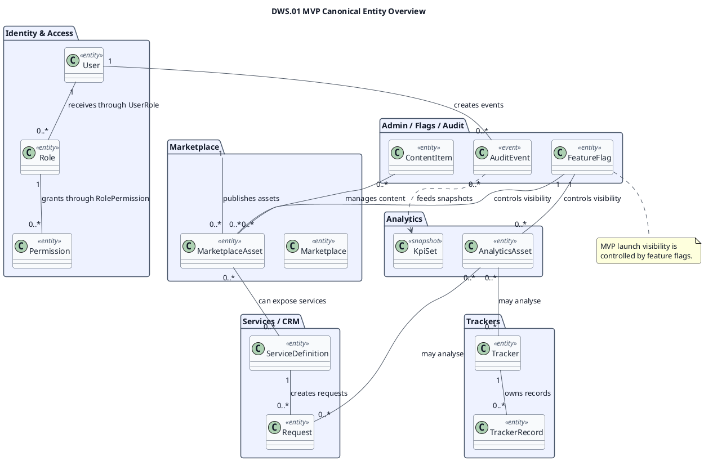
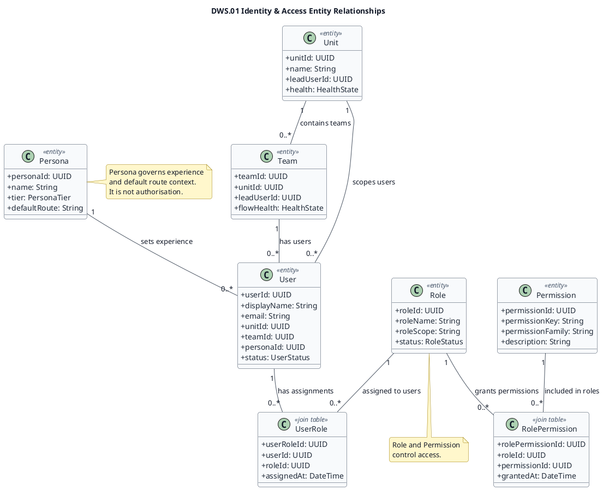
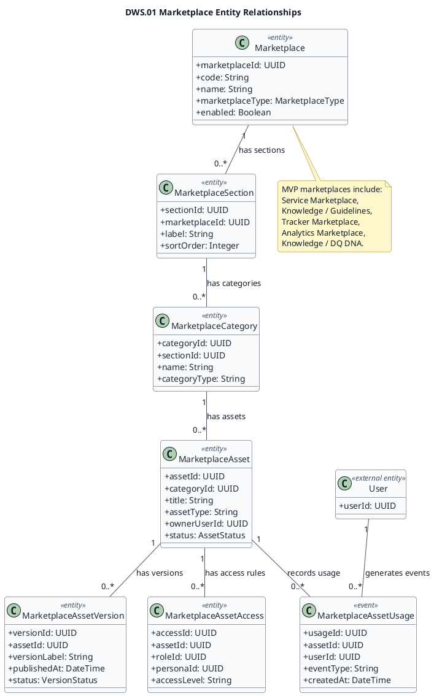
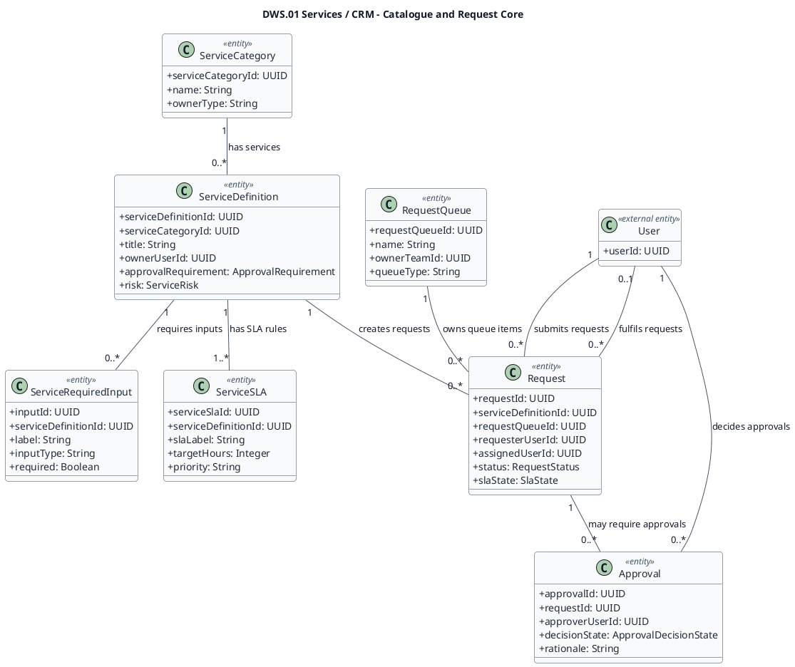
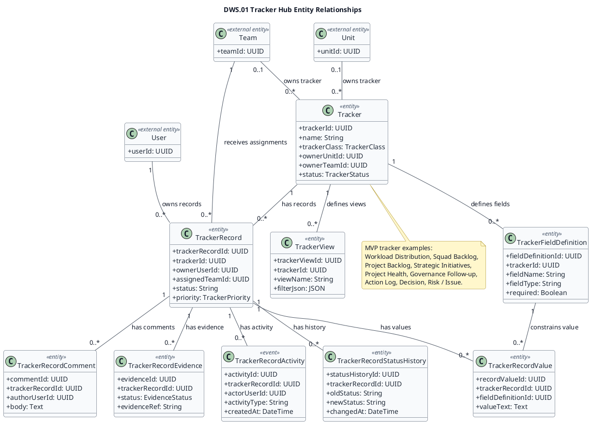
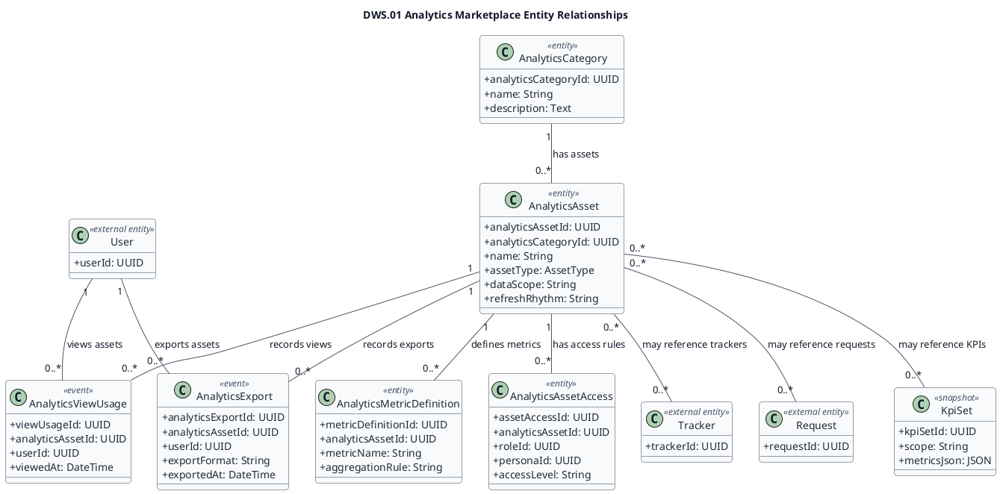
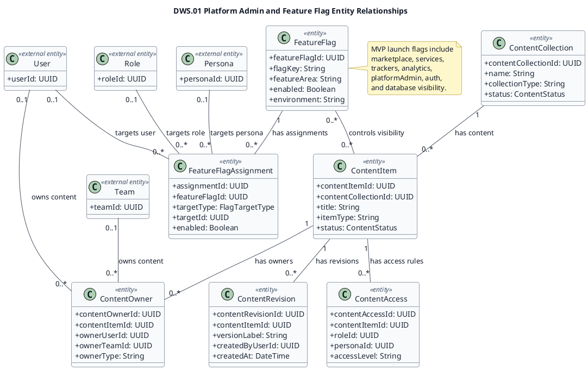
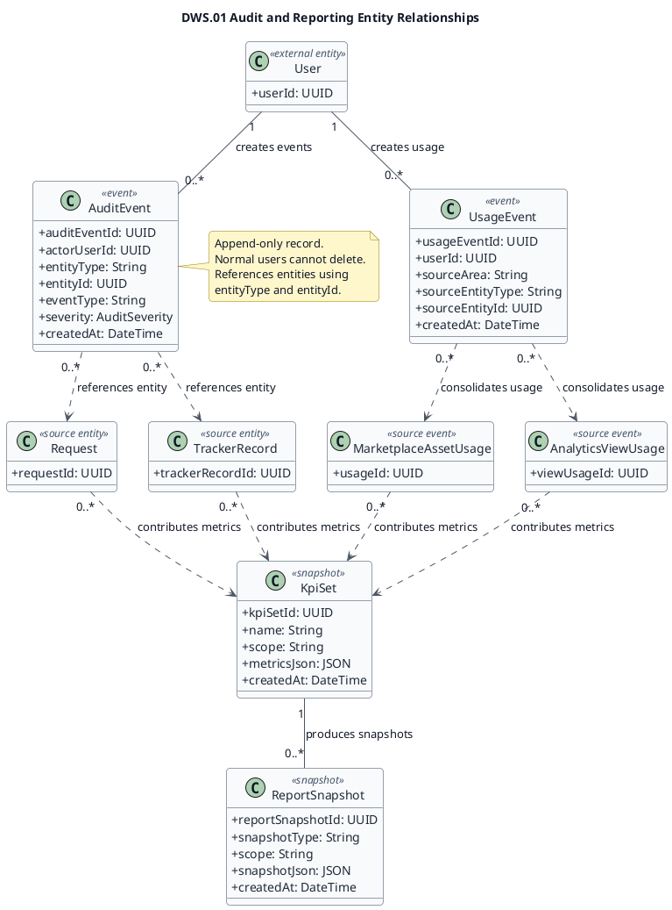

# DWS.01 MVP Canonical Database Entity Relationships

This diagram set defines the MVP launch database/entity relationship scope for DWS.01. It is a database/entity model, not an object-oriented class model: entities show table-oriented fields and relationships only, with no methods. The diagrams are split by product area so the MVP launch scope remains readable while covering identity, marketplace content, service request handling, tracker management, analytics, platform administration, feature flags, audit, and reporting snapshots.

Source inputs:

- `docs/architecture/llad-data-architecture-v1.0-draft.md`
- `docs/architecture/diagrams/llad-data-architecture-c4-l3.md`
- `src/types/platform.ts`
- `src/types/serviceLifecycle.ts`
- `src/mocks/platform.mock.ts`
- Additional inspected MVP sources: `src/config/launchFlags.ts`, `src/types/tracker.ts`, `src/data/trackerAreaData.ts`, `src/types/analyticsMarketplace.ts`, `src/types/knowledgeDiscovery.ts`, `src/config/permissions.ts`

## Shared PlantUML Style

Each PlantUML block is standalone and includes the same light theme so rendered PNG/SVG output remains readable.

## MVP Canonical Entity Overview

## Identity & Access

`AccessPolicy` is not shown as a separate table because no `AccessPolicy` source type was present in the inspected files. MVP authorization is represented through `UserRole`, `RolePermission`, and `FeatureFlagAssignment`; `Persona` remains an experience/default route context.

## Marketplace

## Services / CRM - Catalogue and Request Core

## Services / CRM - Request Detail Records

```plantuml
@startuml DWS01_Services_CRM_Request_Details
skinparam backgroundColor #ffffff
skinparam defaultFontColor #111827
skinparam ArrowColor #4b5563
skinparam shadowing false
skinparam roundCorner 8
skinparam classAttributeIconSize 0
skinparam class {
  BackgroundColor #f8fafc
  BorderColor #334155
  FontColor #111827
  StereotypeFontColor #475569
  AttributeFontColor #1f2937
}
skinparam note {
  BackgroundColor #fff7cc
  BorderColor #9a7b00
  FontColor #111827
}

title DWS.01 Services / CRM - Request Detail Records

class Request <<entity>> {
  +requestId: UUID
  +status: RequestStatus
  +slaState: SlaState
  +urgency: Urgency
}

class RequestComment <<entity>> {
  +commentId: UUID
  +requestId: UUID
  +authorUserId: UUID
  +body: Text
  +createdAt: DateTime
}

class RequestInternalNote <<entity>> {
  +internalNoteId: UUID
  +requestId: UUID
  +authorUserId: UUID
  +body: Text
  +visibility: InternalOnly
}

class RequestAttachment <<entity>> {
  +attachmentId: UUID
  +requestId: UUID
  +fileRef: String
  +uploadedByUserId: UUID
}

class RequestEvidence <<entity>> {
  +evidenceId: UUID
  +requestId: UUID
  +evidenceType: String
  +status: EvidenceStatus
}

class RequestActivity <<event>> {
  +activityId: UUID
  +requestId: UUID
  +actorUserId: UUID
  +activityType: String
  +createdAt: DateTime
}

class RequestStatusHistory <<entity>> {
  +statusHistoryId: UUID
  +requestId: UUID
  +oldStatus: RequestStatus
  +newStatus: RequestStatus
  +changedAt: DateTime
}

class RequestSLAEvent <<event>> {
  +slaEventId: UUID
  +requestId: UUID
  +eventType: String
  +slaState: SlaState
  +createdAt: DateTime
}

class RequestEscalation <<entity>> {
  +escalationId: UUID
  +requestId: UUID
  +severity: String
  +ownerUserId: UUID
  +status: String
}

class RequestClosure <<entity>> {
  +closureId: UUID
  +requestId: UUID
  +closedByUserId: UUID
  +closureOutcome: Text
  +closedAt: DateTime
}

class RequestRating <<entity>> {
  +ratingId: UUID
  +requestId: UUID
  +submittedByUserId: UUID
  +score: Integer
}

class RequestReopen <<entity>> {
  +reopenId: UUID
  +requestId: UUID
  +requestedByUserId: UUID
  +reason: Text
  +createdAt: DateTime
}

Request "1" -- "0..*" RequestComment : has requester comments
Request "1" -- "0..*" RequestInternalNote : has internal notes
Request "1" -- "0..*" RequestAttachment : has attachments
Request "1" -- "0..*" RequestEvidence : has evidence
Request "1" -- "0..*" RequestActivity : has activity
Request "1" -- "0..*" RequestStatusHistory : has status history
Request "1" -- "0..*" RequestSLAEvent : has SLA events
Request "1" -- "0..*" RequestEscalation : has escalations
Request "1" -- "0..1" RequestClosure : has closure
Request "1" -- "0..1" RequestRating : has rating
Request "1" -- "0..*" RequestReopen : has reopen records

note right of RequestInternalNote
  Internal notes are not
  requester-facing comments.
end note

@enduml
```

## Trackers

## Analytics

## Platform Admin / Feature Flags

## Audit / Reporting

## Post-MVP Entities

Task and WorkflowItem are intentionally excluded from the MVP diagrams because `src/config/launchFlags.ts` marks `tasks.enabled`, `workflows.enabled`, `performance.enabled`, and `governance.enabled` as false for the sidebar launch scope. They remain future foundation entities for later LLAD expansion. Approval is retained only in the Services / CRM diagram because service requests may require approval in the MVP request-handling flow.

## Legend

| Notation | Meaning |
|---|---|
| `<<entity>>` | Canonical database-backed table or record type. |
| `<<join table>>` | Relationship table used to model many-to-many access or assignment. |
| `<<event>>` | Append-only event or usage record. |
| `<<snapshot>>` | Derived reporting or KPI snapshot. |
| `<<external entity>>` | Entity defined in another diagram and referenced here for relationship clarity. |
| `1` | Exactly one related row. |
| `0..1` | Optional one related row. |
| `0..*` | Zero or many related rows. |
| `--` | Persistent relationship, normally a foreign key or join relationship. |
| `..>` | Derived dependency, generic entity reference, or reporting derivation. |

## Self-Check

| Check | Result | Notes |
|---|---|---|
| Renderer is PlantUML | PASS | All diagrams are PlantUML UML class diagrams. |
| Methods removed | PASS | No entity contains class-style operations from the earlier diagram. |
| MVP scope covered | PASS | Identity, marketplace, services/CRM, trackers, analytics, admin, feature flags, audit, and reporting are present. |
| Split for readability | PASS | Dense product areas are split into focused diagrams instead of one unreadable diagram. |
| Array relationship fields removed | PASS | Relationships such as queue ownership, request membership, and permissions are represented by references or join tables. |
| Request comments vs internal notes separated | PASS | RequestComment and RequestInternalNote are separate entities. |
| Post-MVP task/workflow dominance avoided | PASS | Task and WorkflowItem are excluded from MVP diagrams and documented as post-MVP. |
| Audit append-only rule captured | PASS | AuditEvent includes append-only and normal-user deletion notes. |
| Feature flags captured | PASS | FeatureFlag and FeatureFlagAssignment model MVP launch visibility control. |
