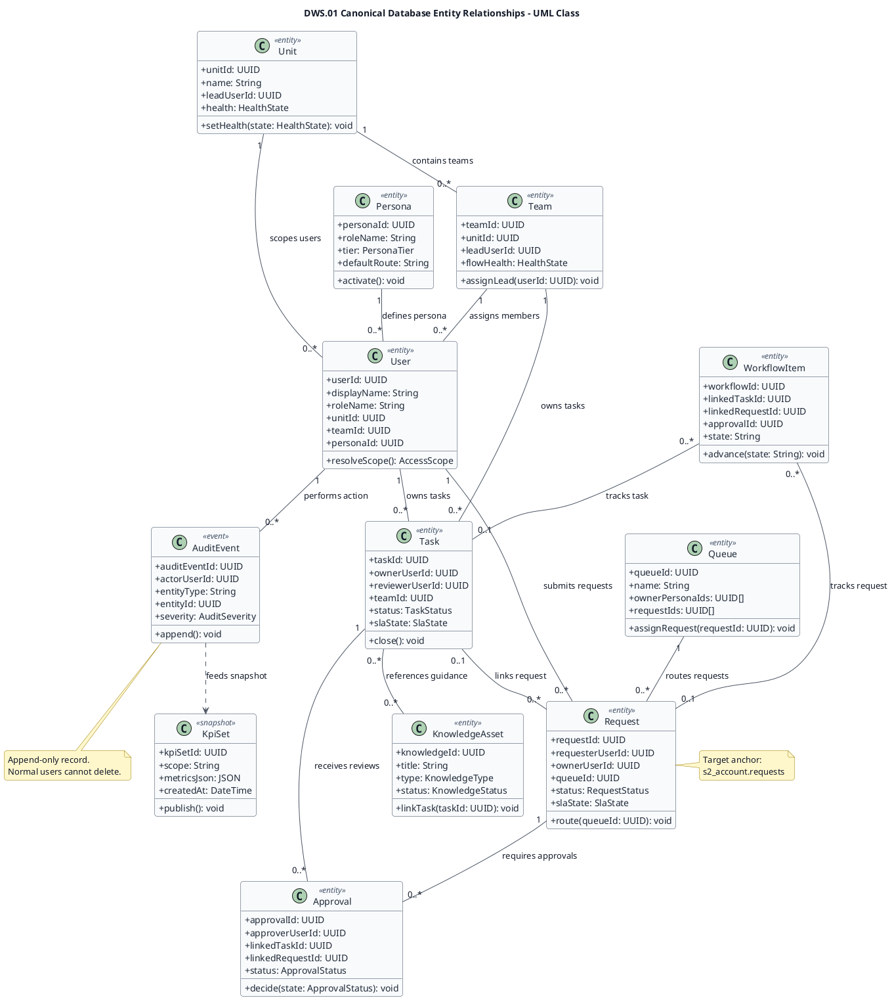

# DWS.01 Canonical Database Entity Relationships - UML Class

Legend:

| Relationship | UML notation | Meaning |
|---|---|---|
| Association | `--` | Persistent foreign-key or join relationship between canonical records. |
| Dependency | `..>` | Derived or downstream usage without ownership of the source record. |
| Multiplicity | `1`, `0..1`, `0..*` | Cardinality at each relationship end. |
| `<<entity>>` | Stereotype | Canonical database-backed business entity. |
| `<<event>>` | Stereotype | Append-only event record. |
| `<<snapshot>>` | Stereotype | Reporting snapshot derived from governed records. |

Readability notes:

- Light theme is used to keep class text readable in exported PNG/SVG renders.
- Class, stereotype, attribute, note, and arrow colours are set explicitly to avoid low-contrast PlantUML defaults.
- The diagram intentionally keeps the audit-to-reporting dependency so the governance reporting path remains visible.
