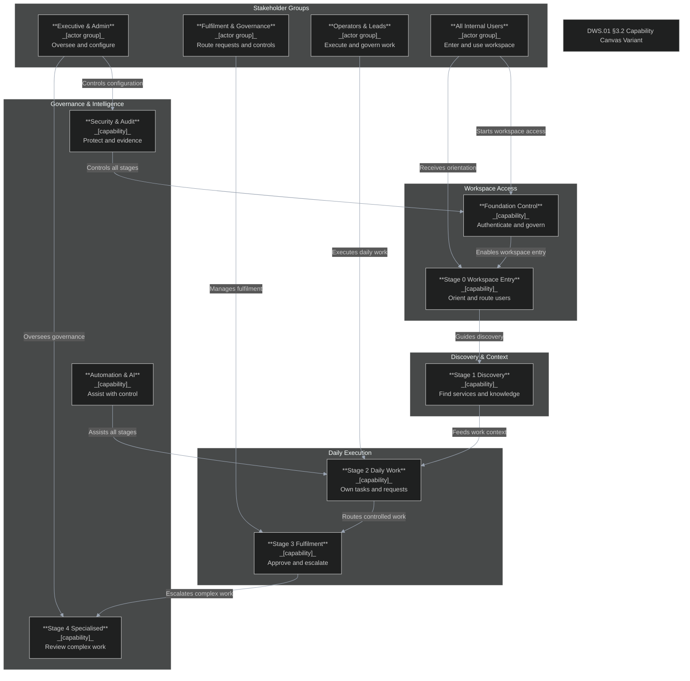
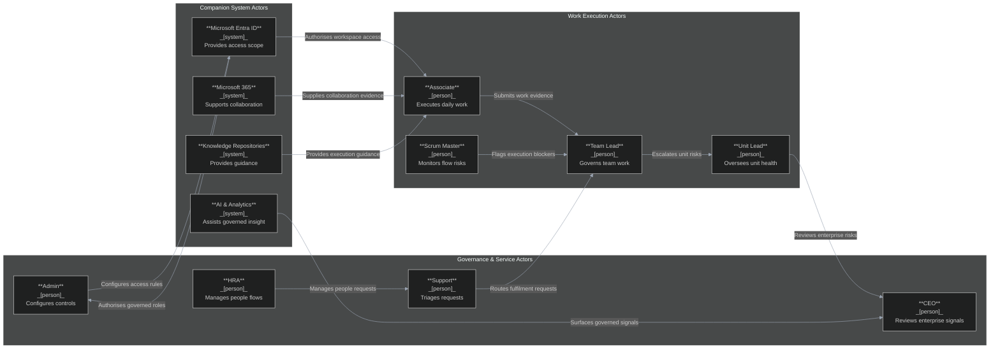
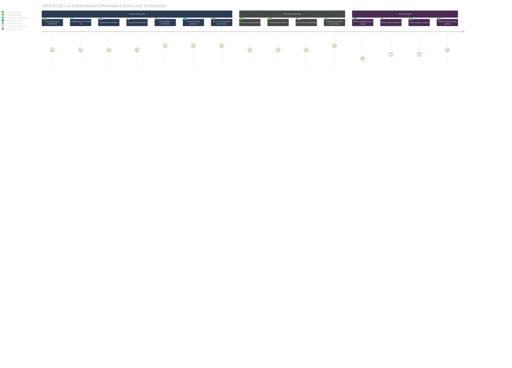
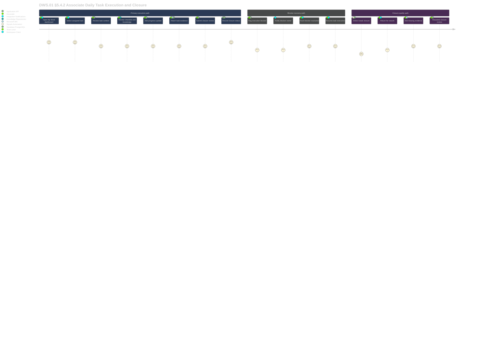
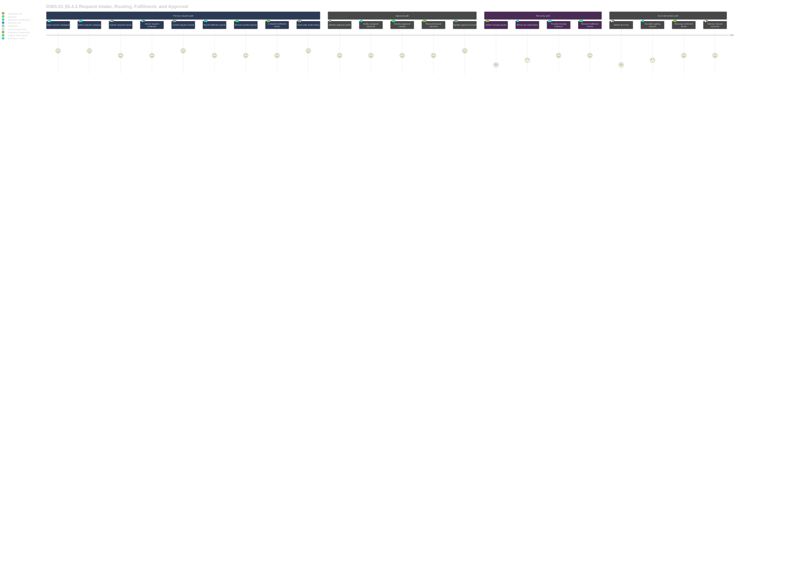
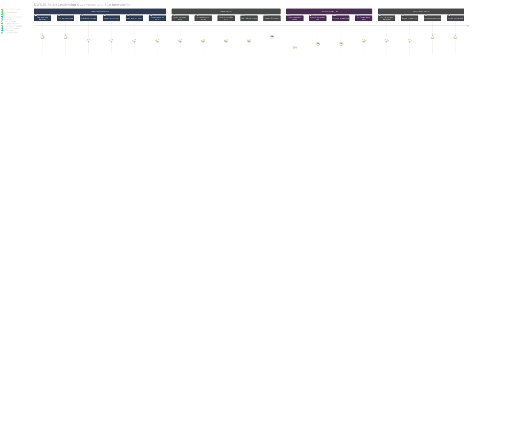

# DWS.01 Work.Space4.0 - High Level Architecture Design

**Version:** 2.0  
**Date:** 2026-06-16  
**Status:** Review  
**System:** DWS.01 Work.Space4.0  
**Document type:** High Level Architecture Design  
**Classification:** Internal DQ use only

---

# 1. Introduction

This High Level Architecture Design documents the DWS.01 Work.Space4.0 platform for DigitalQatalyst. DWS.01 is DQ's internal agile enterprise execution platform and the workspace layer of the wider Digital Workspace Solution, serving internal users including Associates, Scrum Masters, Team / Squad Leads, Unit Leads, HRA, Admins, Support, and the CEO. The section establishes the business rationale, target platform vision, and architecture principles that govern subsequent design sections.

## 1.1 Business Context

The business context for DWS.01 is anchored in DQ's need for governed internal execution, measurable ownership, and consistent operating discipline across roles, teams, units, and leadership forums.

DWS.01 Work.Space4.0 is DigitalQatalyst's internal agile enterprise execution platform and the workspace layer of the wider DWS parent platform. It addresses fragmented task tracking, informal follow-up, disconnected approvals, weak evidence discipline, and limited leadership visibility by converting DQ strategy, operating decisions, service requests, knowledge, governance, and collaboration into structured daily work.

| # | Title | Description |
|---|---|---|
| 01 | Strategic Objectives | DWS.01 supports strategy-to-work traceability, task governance completeness, request and approval accountability, leadership visibility, and execution quality improvement. These objectives provide the business outcomes against which platform design, workflow behaviour, reporting, and adoption will be validated. |
| 02 | Market Dynamics | DQ requires stronger internal operating discipline, faster transformation execution, and repeatable governance patterns as its transformation and platform delivery work expands. DWS.01 responds to this need by making execution, evidence, approval, and performance data visible through governed platform records rather than fragmented coordination channels. |
| 03 | Stakeholder Segments | The platform serves Associates, Scrum Masters, Team / Squad Leads, Unit Leads, HRA, Admins, Support, and CEO users through role-based workspace experiences. Each segment receives controlled access to the work, request, governance, service, knowledge, and reporting surfaces required for its operating responsibility. |
| 04 | Current Challenges | Current work control depends on separate communication, task, document, meeting, and manual follow-up patterns. These patterns create gaps in ownership, status truth, approval history, evidence linkage, reporting consistency, escalation control, and closure quality across teams and units. |

## 1.2 Platform Vision

The platform vision establishes DWS.01 as the governed workspace where DQ work is structured, owned, routed, evidenced, reviewed, measured, and improved.

DWS.01 is the governed digital operating layer for DQ's GHC-aligned execution model. It is intended to become the source of truth for work records, ownership, SLA state, workflow state, approval decisions, evidence links, audit trails, and reporting truth while Microsoft Teams, SharePoint / OneDrive, Outlook, Planner, and other tools remain companion channels.

| # | Title | Description |
|---|---|---|
| 01 | Platform Objective | DWS.01 translates strategy, priorities, operating decisions, services, knowledge, learning, governance, and collaboration into structured, governed, measurable daily work. It gives DQ a single internal execution platform for task ownership, requests, workflows, approvals, evidence, knowledge linkage, auditability, and performance visibility. |
| 02 | Platform Strategy | The platform uses a staged delivery model covering Foundation, Stage 0 orientation, Stage 1 discovery, Stage 2 daily execution, Stage 3 fulfilment and governance, and Stage 4 specialised internal execution. This staged model allows core platform controls to be established before deeper operational and intelligence capabilities expand. |
| 03 | Platform Technology | The target technology model uses React / Next.js / React Native for client experiences, Express / BFF for application logic, Supabase-backed PostgreSQL database operations, and Redis patterns where cache or session state is required. The current prototype repository implements a React 18, TypeScript, Vite, Tailwind, React Router, lucide-react client shell with local state and mock data. |
| 04 | Platform Architecture | The architecture separates client rendering, application-owned business logic, and governed data access. DWS.01 preserves shared canonical task, request, approval, SLA, audit, knowledge, user, role, unit, team, and performance records so operating truth is not fragmented across modules or companion tools. |
| 05 | Platform Implementation | Delivery follows a prototype-first model. The current repository implements a broad client prototype shell with role-aware routing, permission configuration, local contexts, and surfaces for Stage 0 orientation, marketplaces, tasks, requests, workflows, HRA, support, administration, analytics, and executive visibility. |
| 06 | Platform Deployment | Deployment timing remains TBC in the BRS. Current repository scripts support Vite development, build, and preview workflows, while production hosting, backend services, data services, environment topology, and CI/CD design remain architecture items requiring confirmation in later sections. |

## 1.3 Architecture Principles

The architecture principles governing DWS.01 establish the design constraints every delivery workstream must observe when extending the current prototype into a production platform.

| # | ID | Principle | Description |
|---|---|---|---|
| 01 | AP-01 | Governed Work Source of Truth | DWS.01 owns the official task, request, approval, workflow, SLA, evidence, audit, and reporting records. Companion tools remain communication, storage, notification, or productivity channels and do not become authorities for work control. |
| 02 | AP-02 | Three-Tier Responsibility Separation | Client experiences render UI only; application services own orchestration, validation, workflow behaviour, and business rules; data access occurs through governed APIs and data-layer controls. |
| 03 | AP-03 | Canonical Object Model | Shared entities such as users, roles, tasks, requests, approvals, SLAs, audit events, knowledge references, units, teams, and performance records remain consistent and reusable across platform modules. |
| 04 | AP-04 | Role-Based Access and Visibility | Platform views, performance data, governance controls, administration actions, and user-level information are permission-controlled and auditable by role, unit, team, and responsibility. |
| 05 | AP-05 | Embedded Auditability | Task, request, approval, workflow, permission, performance, knowledge, and configuration changes produce non-deletable audit evidence suitable for governance review and operational assurance. |
| 06 | AP-06 | Native Workflow and Approval Control | DWS.01 executes approvals, escalations, handoffs, routing, decision rationale, delegation, and evidence capture natively rather than depending on external workflow tools for core governance. |
| 07 | AP-07 | Knowledge-to-Execution Linkage | GHC, 6xD, policies, playbooks, templates, standards, learning resources, and knowledge assets are discoverable and applicable inside daily work, onboarding, requests, and task closure. |
| 08 | AP-08 | Automation with Human Accountability | Automation and AI may support routing, reminders, triage, recommendations, SLA risk detection, and closure-quality review, but must preserve permissions, explanation, human override, and audit logging. |

# 2. Solution Architecture

DWS.01 uses a platform-level architecture model that separates the user experience, business orchestration, and system-of-record responsibilities into distinct technology layers. The organising structure is the Client Tier, the Data & Intelligence Layer, and the Application & Integration Layer. The remaining sections elaborate how this model supports the DWS.01 programme and its staged delivery scope.

## 2.1 Platform Context

The platform context positions DWS.01 as a governed internal execution system whose three layers work together through explicit responsibility boundaries.

DWS.01 Work.Space4.0 is a Solution of Applications within the DWS parent platform, centralising governed internal execution across orientation, discovery, task ownership, request handling, approvals, escalations, knowledge linkage, reporting, administration, and governance. The architecture separates user-facing interaction, business orchestration, and system-of-record responsibilities into the Client Tier, Data & Intelligence Layer, and Application & Integration Layer. The current repository confirms a React-based prototype shell with routed pages, protected routes, role-aware navigation, permissions, local contexts, and mock data. Production IAM, backend services, Supabase-backed database operations, audit pipeline, analytics pipeline, and integration services remain target architecture capabilities rather than confirmed implemented components.

| # | Layer | Role |
|---|---|---|
| 01 | Client Tier | The Client Tier provides the user-facing DWS.01 workspace through React-based web experiences, routed pages, role-aware navigation, forms, dashboards, marketplace views, task views, request views, and governance surfaces. It renders UI and calls governed services without owning business rules or direct database access. |
| 02 | Data & Intelligence Layer | The Data & Intelligence Layer provides the target system-of-record and analytics backbone for users, roles, tasks, requests, approvals, SLAs, audit events, knowledge references, units, teams, performance records, and outcome signals. It uses Supabase-backed PostgreSQL database operations and enforces permission-aware data handling through governed application and data-layer controls. |
| 03 | Application & Integration Layer | The Application & Integration Layer provides workflow orchestration, validation, routing, approval execution, SLA control, notification logic, Microsoft ecosystem integration, analytics event processing, and AI guardrails. It owns business logic and keeps companion tools from becoming work-control authorities. |

## 2.2 Client Tier

The Client Tier governs the authenticated user experience for DWS.01 and acts as the controlled interaction boundary for web, workspace, marketplace, governance, and reporting surfaces.

The Client Tier governs the authenticated DWS.01 user experience across Stage 0 orientation, marketplace discovery, personal work, tasks, requests, workflows, trackers, governance, analytics, administration, support, HRA, and executive views. In the repository, this tier is implemented with React 18, TypeScript, Vite, Tailwind, React Router, lucide-react, sonner, providers, protected routes, role guards, and mock data services. The client remains a rendering and interaction layer, with business rules retained in governed application services.

| # | Feature | Description |
|---|---|---|
| 01 | Authenticated Workspace Shell | Session-based prototype authentication, protected routes, layout switching, role context, and route guards control entry into the workspace. |
| 02 | Role-Aware Navigation | Navigation and permission configuration expose workspace areas by Associate, Scrum Master, Team / Squad Lead, Unit Lead, HRA, Admin, Support, and CEO roles. |
| 03 | Stage 0 Orientation Experience | Landing, onboarding, operating guide, platform updates, action pages, new-joiner flow, and returning-user routing support orientation-first access. |
| 04 | Execution Workspaces | Pages support My Work, tasks, requests, working sessions, blockers, evidence, closure quality, team execution, unit visibility, and executive execution. |
| 05 | Marketplace and Discovery Views | The client exposes services, task templates, knowledge, work directory, analytics marketplace, marketplace feedback, and feature-area navigation surfaces. |
| 06 | Administration and Governance Views | Admin, users and roles, organisation setup, task model, request categories, workflow rules, SLA notifications, integrations, audit log, and governance pages are represented. |

## 2.3 Data & Intelligence Layer

The Data & Intelligence Layer governs operational truth, reporting signals, audit evidence, and permission-aware visibility for the platform.

The Data & Intelligence Layer governs operational truth, reporting signals, audit evidence, analytics events, and permission-aware visibility. The BRS and RSR require shared canonical records so users, roles, tasks, requests, approvals, SLAs, audit events, knowledge references, units, teams, and performance data do not fragment across modules or stages. Supabase is confirmed as the database operations service for this layer. The current prototype uses mock data and local state, so schema, RLS policies, migrations, retention controls, and production environment configuration remain target production design items.

| # | Feature | Description |
|---|---|---|
| 01 | Canonical Task Records | Task records hold owner, purpose, output, checklist, due date or SLA, status, blockers, evidence, comments, quality checks, and closure state. |
| 02 | Canonical Request Records | Request records capture category, requester, owner, SLA, fulfilment queue, status, evidence, audit trail, and closure outcome. |
| 03 | Canonical Approval Records | Approval records support approver, decision, rationale, delegation, timestamp, linked task or request context, and audit history. |
| 04 | Immutable Audit Events | Task, request, approval, workflow, access, performance, knowledge, and configuration changes are logged and non-deletable by normal users. |
| 05 | Analytics and Performance Signals | Structured events support SLA, task quality, closure, workload, blocker, governance, knowledge reuse, outcome, and value-delivery reporting. |
| 06 | Permission-Aware Data Access | Data visibility enforces role, unit, team, record, dashboard, sensitivity, retention, hosting, and data-handling controls. |

## 2.4 Application & Integration Layer

The Application & Integration Layer governs the production services that apply DWS.01 operating rules between the client experience and the data boundary.

The Application & Integration Layer governs production services that apply DWS.01 operating rules between the client and data boundary. It owns workflow orchestration, validation, routing, access control, approval execution, SLA control, notifications, integration boundaries, AI guardrails, and automation triggers. The BRS identifies Express / BFF as the target pattern, while the repository does not yet confirm an implemented backend service.

| # | Feature | Description |
|---|---|---|
| 01 | Workflow and State Engine | Configurable states, transitions, handoffs, approval routing, escalation rules, exception handling, SLA timers, and lifecycle controls support tasks and requests. |
| 02 | Native Approval and Escalation Services | Approvals, returns, rejections, delegations, escalations, rationale capture, decision logging, and audit linkage execute natively. |
| 03 | Notification and Reminder Engine | Assignments, overdue work, missing updates, pending approvals, escalations, mentions, and SLA risks are handled through controlled notification logic. |
| 04 | Companion Tool Integrations | Teams, Outlook, SharePoint / OneDrive, Planner, identity services, notification channels, analytics services, and future AI services integrate through governed boundaries. |
| 05 | Search and Indexing Services | Permission-aware discovery covers services, templates, knowledge, tasks, requests, decisions, dashboards, work-directory records, and workflow guidance. |
| 06 | AI and Automation Controls | AI supports routing, reminders, triage, recommendations, SLA risk detection, update quality checks, and closure review with permission filtering, rationale, override, and audit logging. |

# 3. Architecture Spec - Context

This section establishes the DWS.01 capability architecture at context level. It presents both the general platform capability canvas and the DWS.01-specific variant, showing how the programme converts internal execution needs into governed platform capabilities. These capabilities provide the basis for the architecture views and software decomposition in later sections.

## 3.1 Capability Canvas

The capability canvas represents the full set of DWS.01 platform capabilities organised by delivery component and responsibility boundary.

The DWS.01 capability canvas organises the platform around the major business and technology capabilities required to govern internal workspace execution. The canvas consolidates the BRS domain model, RSR requirement architecture, and platform guardrails into capability areas that can be traced into software modules and architecture views.

| # | Capability Area | Description | Responsible Component |
|---|---|---|---|
| 01 | Workspace Entry & Operating Context | Provides authenticated workspace entry, role-based home views, operating guidance, priority snapshots, onboarding, quick launch, and orientation-first navigation. | Client Tier workspace shell, IAM foundation, role and navigation services |
| 02 | Structured Work & Task Ownership | Defines, owns, executes, evidences, reviews, and closes work through canonical task records, ownership assignment, checklists, due dates, blocker updates, evidence, history, and closure-quality controls. | Task domain services, canonical task model, workflow/state engine |
| 03 | Workflow Routing, Approvals & Escalations | Controls how work moves through review, approval, escalation, handoff, delegation, exception handling, SLA state, decision capture, and audit linkage. | Application & Integration Layer workflow services, approval services, escalation services |
| 04 | Knowledge, Learning & Reference Reuse | Connects GHC, 6xD, policies, playbooks, templates, learning references, and guidance to tasks, requests, onboarding, support, and closure decisions. | Knowledge catalogue, search/indexing services, task-linked reference services |
| 05 | Collaboration & Working Sessions | Keeps comments, discussions, working sessions, decisions, meeting actions, mentions, and follow-ups attached to governed work records instead of disconnected chat threads. | Collaboration services, Teams integration boundary, task discussion components |
| 06 | Service & Request Intake | Captures, categorises, assigns, tracks, fulfils, and closes internal requests across HRA, IT/access, platform support, knowledge/content, task/workflow support, approvals, escalations, and admin requests. | Request catalogue, request lifecycle services, fulfilment queues |
| 07 | Performance Visibility & Execution Intelligence | Provides personal, team, unit, leadership, SLA, closure-quality, blocker, governance, knowledge-reuse, and outcome reporting from governed platform records. | Analytics event pipeline, dashboards, reporting services, Data & Intelligence Layer |
| 08 | Workspace Administration & Change Governance | Governs roles, permissions, organisation structures, taxonomies, templates, SLA rules, notifications, workflows, content settings, release controls, and configuration audit. | Administration services, configuration services, audit services |
| 09 | Security, Audit & Compliance Control | Protects workspace records, personal data, performance data, evidence, access state, admin activity, retention, exception logging, and compliance evidence through role-based controls and immutable audit. | IAM foundation, audit event log, permission model, Data & Intelligence Layer controls |
| 10 | Automation & AI Assistance | Supports routing, reminders, triage, task drafting, update summaries, knowledge recommendations, risk flagging, human override, and AI auditability without bypassing permissions or human accountability. | AI assistance services, automation rules, notification engine, audit trail |

## 3.2 Capability Canvas - DWS.01 Variant

The DWS.01 variant focuses on the programme's priority delivery areas within the broader capability canvas.

The DWS.01 variant focuses the capability canvas on the delivery priorities of Work.Space4.0 as an internal execution platform. It emphasises the capabilities that convert strategy, tasks, requests, approvals, evidence, knowledge, governance, and performance signals into governed daily work.

| # | Capability Area | Description | Responsible Component |
|---|---|---|---|
| 01 | Foundation Control | Establishes IAM, credential login, session management, role model, canonical task/request/approval objects, workflow engine, notification engine, audit log, analytics event pipeline, design system, integration layer, and AI infrastructure. | Platform Foundation services |
| 02 | Stage 0 Workspace Entry | Provides authenticated landing, orientation, role-based entry, associate onboarding, operating guidance, updates, and quick resume before users enter deeper work areas. | Client Tier workspace shell and role routing components |
| 03 | Stage 1 Discovery & Marketplace | Enables internal discovery of service categories, knowledge assets, task templates, request types, work directory entries, global search, and marketplace navigation. | Marketplace, knowledge, service catalogue, and search components |
| 04 | Stage 2 Daily Work Execution | Supports My Work, My Tasks, My Requests, task updates, blockers, evidence, collaboration, notifications, working-session actions, and knowledge in work context. | Task, request, collaboration, notification, and knowledge services |
| 05 | Stage 3 Fulfilment & Governance | Provides all-tasks views, workflow centre, native approvals, central support queue, fulfilment-owner queues, SLA dashboard, execution dashboard, admin configuration, and audit log. | Workflow, approval, request fulfilment, SLA, dashboard, and admin services |
| 06 | Stage 4 Specialised Internal Execution | Supports governance review workspace, complex escalation workspace, operating discipline review, enterprise operating control, and advanced outcome attribution. | Governance, escalation, executive visibility, and analytics services |
| 07 | Cross-Stage Security & Audit | Applies role-based visibility, permission-aware data access, immutable audit, data handling, admin action monitoring, and compliance evidence across all stages. | IAM, audit, permission, and Data & Intelligence Layer controls |
| 08 | Cross-Stage Automation & AI | Applies rule-based routing, reminders, recommendations, delay detection, update quality review, closure-quality signals, human override, and AI audit logging across platform workflows. | Automation and AI assistance services |



Legend:

| Arrow label | Protocol | Mode | Notes |
|---|---|---|---|
| Starts workspace access | N/A | business interaction | Actor initiates authenticated platform use |
| Receives orientation | N/A | business interaction | Actor receives role-based entry context |
| Executes daily work | N/A | business interaction | Actor performs tasks and requests |
| Manages fulfilment | N/A | business interaction | Actor governs approvals and escalations |
| Oversees governance | N/A | business interaction | Actor reviews enterprise execution |
| Controls configuration | N/A | business interaction | Actor manages controls and access |
| Enables workspace entry | N/A | capability dependency | Foundation enables Stage 0 entry |
| Guides discovery | N/A | capability dependency | Orientation routes users to discovery |
| Feeds work context | N/A | capability dependency | Discovery informs daily execution |
| Routes controlled work | N/A | capability dependency | Daily work enters fulfilment governance |
| Escalates complex work | N/A | capability dependency | Stage 3 escalates to specialised execution |
| Controls all stages | N/A | governance overlay | Security and audit apply cross-stage |
| Assists all stages | N/A | governance overlay | Automation supports governed execution |

# 4. Architecture Spec - Software

This section defines the technology stack, module decomposition, and deployment topology that implement the DWS.01 capabilities at high level. It distinguishes the confirmed prototype implementation from the production target architecture so design intent is clear without overstating the current repository state. Component internals, API contracts, database schema, and operational runbooks remain detail-design artefacts.

## 4.1 Technology Stack

The technology stack defines the platform's technology choices by layer while preserving the DQ three-tier responsibility model.

The DWS.01 software architecture uses the DQ three-tier platform model as the production target while recognising that the current repository is a client-side prototype. Confirmed implementation evidence covers the React/Vite workspace shell, role and permission configuration, route guards, local contexts, and mock data services; backend, Supabase database operations integration, IAM, audit, analytics, and integration services remain target architecture capabilities.

| # | Layer | Technology | Purpose | Notes |
|---|---|---|---|---|
| 01 | Frontend | React 18 / TypeScript | Implements the current routed workspace prototype and user-facing DWS.01 shell. | Confirmed in package.json and src/App.tsx. |
| 02 | Frontend | Vite 5 | Provides local development, production bundle generation, and preview workflow for the client prototype. | Confirmed scripts: dev, build, preview. |
| 03 | Frontend | Tailwind CSS | Provides utility styling for the prototype UI. | Confirmed in package.json and Tailwind configuration. |
| 04 | Frontend | React Router | Provides route definitions, protected routes, redirects, and page-level navigation. | Confirmed in package.json and App.tsx. |
| 05 | Frontend | lucide-react / sonner / Emotion | Supports icons, toast notifications, and styling utilities. | Confirmed dependencies. |
| 06 | Backend | Express.js / BFF APIs | Provides the target layer for business logic, validation, workflow rules, routing, access control, approval execution, and orchestration. | Required by BRS and RSR; not implemented in repo. |
| 07 | Data | Supabase service / PostgreSQL | Provides the confirmed database operations service and system-of-record pattern for tasks, requests, approvals, audit, users, roles, and performance records. | Supabase is confirmed for database operations; schema, RLS policies, migrations, storage usage, and environment configuration are not implemented in repo. |
| 08 | Data | Redis | Provides the target cache and session-state store aligned to platform guardrail G-05. | Platform target; not implemented in repo. |
| 09 | Integration | Microsoft ecosystem connectors | Provide target integrations for Teams, Outlook, SharePoint / OneDrive, Planner, identity, notifications, analytics, and future AI services. | Required by BRS and RSR; no production connectors confirmed. |
| 10 | Identity | IAM / credential login / role model | Provides authentication, authorisation, session, role, unit, team, and permission boundaries. | Prototype has AuthContext, local session, and config permissions only. |
| 11 | DevOps | TypeScript / ESLint / npm scripts | Provides static type checking, lint command, and repeatable client build workflow. | Confirmed in package.json. |
| 12 | Infrastructure | Hosting/runtime target TBC | Provides production hosting, environment topology, data residency, backups, monitoring, and CI/CD deployment target when confirmed. | No root deployment manifest or CI config found. |

## 4.2 Modules & Functions

The modules and functions view identifies the logical decomposition of DWS.01 software responsibilities across prototype modules and target production services.

The module structure combines confirmed prototype modules with target production service responsibilities. The current repository implements the Client Tier as a broad React shell with pages, layouts, components, contexts, config registries, mock datasets, and async mock service accessors; production modules move business rules and persistence into application and data services.

| # | Module | Function | Description | Responsible Actor |
|---|---|---|---|---|
| 01 | Workspace Shell | User experience | Provides routed pages, layouts, protected route handling, default routing, role-aware entry, and Stage 0 orientation surfaces. | Client delivery team |
| 02 | Navigation & Permission Configuration | Access visibility | Defines route metadata, role visibility, segment permissions, default destinations, and route access checks. | Product/admin configuration owner |
| 03 | Persona, Auth & Workspace Contexts | Session and role context | Maintains prototype authentication state, active persona, workspace role, viewing mode, and lifecycle contexts in the client. | Client delivery team |
| 04 | Task & Work Execution Module | Work lifecycle | Provides My Work, task pages, task templates, task updates, blockers, closure review, evidence, and task history surfaces. | Task domain owner |
| 05 | Request & Service Lifecycle Module | Request lifecycle | Provides service marketplace, request intake, request status, fulfilment queues, support operations, and service detail surfaces. | Service operations owner |
| 06 | Workflow, Approval & Escalation Module | Governance lifecycle | Provides approval queues, workflow centre surfaces, escalation pages, SLA risk views, decision logs, and governance controls. | Governance/workflow owner |
| 07 | Knowledge & Learning Module | Knowledge reuse | Provides knowledge marketplace, knowledge detail, reference pages, review queues, taxonomy, feedback, and work-context knowledge surfaces. | Knowledge owner |
| 08 | Analytics & Executive Visibility Module | Intelligence | Provides dashboards, execution signals, SLA dashboards, performance views, unit/team visibility, governance health, and executive reporting surfaces. | Leadership/governance owner |
| 09 | Administration & Configuration Module | Platform control | Provides users/roles, organisation setup, permissions, task model, request categories, workflow rules, SLA rules, integrations, audit log, and change governance. | Platform admin owner |
| 10 | Mock Platform Data Service | Prototype data abstraction | Exposes async accessors over mock personas, users, units, teams, tasks, requests, approvals, workflows, queues, knowledge assets, audit events, and KPI sets. | Prototype delivery team |
| 11 | Target Application Services | Business logic | Own production orchestration, validation, workflow execution, approval execution, automation triggers, access control, and integration boundaries. | Application service owner, TBC |
| 12 | Target Data Services | System of record | Own production persistence through Supabase-backed database operations, RLS/database roles, canonical object storage, analytics events, audit trail, and retention controls. | Data platform owner, TBC |

## 4.3 Deployment Stack

The deployment stack maps confirmed and target DWS.01 components to their environment and hosting responsibilities.

The confirmed deployment evidence is limited to client build scripts and a generated dist folder. The HLAD therefore treats local development and static prototype preview as confirmed, while staging, UAT, and production topology remain target states that require environment, hosting, identity, data, observability, and CI/CD confirmation.

| # | Environment | Component | Deployment Target | Notes |
|---|---|---|---|---|
| 01 | Development | React/Vite client prototype | Local workstation via npm run dev | Confirmed script uses npx vite. |
| 02 | Build | TypeScript and Vite bundle | Local or CI runner, target not confirmed | Confirmed script runs tsc --noEmit and npx vite build. |
| 03 | Preview | Built static client bundle | Local preview server via npm run preview | Confirmed script uses npx vite preview. |
| 04 | Prototype/UAT | Static client shell | Hosting target TBC | No environment-specific deployment manifest found. |
| 05 | Production Client Tier | React / Next.js / React Native target client experiences | Hosting target TBC | Current repo is Vite/React; production target requires confirmation. |
| 06 | Production Application & Integration Layer | Express.js / BFF APIs and domain services | Runtime target TBC | No backend service implementation or runtime manifest found. |
| 07 | Production Data & Intelligence Layer | Supabase database operations service, Redis, analytics infrastructure | Supabase project/environment target TBC | Supabase is confirmed for database operations; database schema, RLS policies, migrations, Redis, and analytics deployment config are not found in repo. |
| 08 | CI/CD | Type check, lint, build, deploy, promote | CI/CD platform TBC | No root workflow, pipeline config, Dockerfile, vercel.json, or equivalent deployment config found. |

# 5. Architecture Views

This section presents the architecture views that specify DWS.01 from business, technology, and delivery perspectives. The views cover system context, actors, interfaces, journeys, conceptual and logical structure, implementation, integration, data, security, deployment, source control, and CI/CD. Each diagram-bearing view is produced through the HLAD diagram handoff process so diagram content remains traceable to the same requirements and architecture baseline as the prose.

## 5.1 System Context

The System Context view positions DWS.01 Work.Space4.0 as the governed internal execution system within the wider DWS parent platform and DQ operating environment. It shows why the system exists, the boundary it owns, and the external companion tools and user communities that interact with it.

The following architecture principles from §1.3 govern this view:

- AP-01 - DWS.01 is the governed work source of truth for tasks, requests, approvals, workflow state, SLA state, evidence, audit, and reporting records.
- AP-02 - DWS.01 preserves three-tier responsibility separation and prevents the client experience from owning business rules or direct database access.
- AP-04 - DWS.01 exposes role-based visibility and actions to internal users according to role, unit, team, and governance responsibility.
- AP-06 - DWS.01 executes workflow, approvals, escalations, handoffs, and evidence capture natively.
- AP-07 - DWS.01 links GHC, 6xD, policies, playbooks, templates, learning resources, and knowledge assets into governed work.
- AP-08 - DWS.01 uses automation and AI only as controlled assistance with permission filtering, human override, and audit logging.

```plantuml
@startuml
skinparam backgroundColor #0d1117
skinparam defaultFontColor #e6edf3
skinparam ArrowColor #9aa4b2
skinparam shadowing false
skinparam roundCorner 8

!include https://raw.githubusercontent.com/plantuml-stdlib/C4-PlantUML/master/C4_Context.puml

title System Context - DWS.01 Work.Space4.0

Person(associate, "Associate", "Executes assigned work [Internal DQ]")
Person(scrumMaster, "Scrum Master", "Supports flow and blockers [Internal DQ]")
Person(teamLead, "Team / Squad Lead", "Governs team execution [Internal DQ]")
Person(unitLead, "Unit Lead", "Oversees unit delivery [Internal DQ]")
Person(hra, "HRA", "Manages people workflows [Internal DQ]")
Person(admins, "Admins", "Configures platform controls [Internal DQ]")
Person(support, "Support", "Triage and fulfil requests [Internal DQ]")
Person(ceo, "CEO", "Reviews enterprise execution [Internal DQ]")

System(dws01, "DWS.01 Work.Space4.0", "Governed internal execution platform for tasks, requests, approvals, evidence, knowledge, audit, and performance visibility")

System_Ext(m365, "Microsoft 365 Collaboration", "Teams, Outlook, SharePoint / OneDrive, Planner [Microsoft SaaS]")
System_Ext(identity, "Microsoft Entra ID", "Credential login, sessions, roles, and access scope [Microsoft SaaS]")
System_Ext(knowledge, "Knowledge Repositories", "GHC, 6xD, policies, playbooks, templates, and learning references [DQ internal]")
System_Ext(aiAnalytics, "AI and Analytics Services", "Future AI assistance and reporting services [Provider TBC]")

Rel(associate, dws01, "Executes daily work")
Rel(scrumMaster, dws01, "Monitors team flow")
Rel(teamLead, dws01, "Governs team work")
Rel(unitLead, dws01, "Reviews unit performance")
Rel(hra, dws01, "Manages people requests")
Rel(admins, dws01, "Configures platform rules")
Rel(support, dws01, "Triages support requests")
Rel(ceo, dws01, "Reviews enterprise signals")

Rel(dws01, m365, "Links collaboration evidence")
Rel(dws01, identity, "Validates user access")
Rel(dws01, knowledge, "Retrieves execution guidance")
Rel(dws01, aiAnalytics, "Feeds governed signals")

@enduml
```

Legend:

| Arrow label | Protocol | Mode | Notes |
|---|---|---|---|
| Executes daily work | HTTPS / browser UI | sync | Internal authenticated user interaction |
| Monitors team flow | HTTPS / browser UI | sync | Role-controlled team visibility |
| Governs team work | HTTPS / browser UI | sync | Team task and approval oversight |
| Reviews unit performance | HTTPS / browser UI | sync | Unit-level reporting and governance |
| Manages people requests | HTTPS / browser UI | sync | HRA workflow and request handling |
| Configures platform rules | HTTPS / browser UI | sync | Admin-controlled configuration |
| Triages support requests | HTTPS / browser UI | sync | Support queue operation |
| Reviews enterprise signals | HTTPS / browser UI | sync | Executive dashboard access |
| Links collaboration evidence | Integration TBC | sync / async TBC | Teams, Outlook, SharePoint / OneDrive, Planner remain companion tools |
| Validates user access | OIDC / OAuth2 | sync | Entra ID confirmed; claim mapping TBC |
| Retrieves execution guidance | Integration TBC | sync | Internal knowledge sources require confirmation |
| Feeds governed signals | Integration TBC | sync / async TBC | AI and analytics providers require confirmation |

The system context rows define the purpose, scope, and key outputs that the C4 L1 context diagram must preserve.

| # | Title | Description |
|---|---|---|
| 01 | Purpose | DWS.01 converts DQ strategy, priorities, operating decisions, service requests, knowledge, governance, collaboration, and learning into structured, governed, measurable daily work. |
| 02 | Scope | DWS.01 covers internal workspace execution, role-based entry, tasks, requests, approvals, escalations, service fulfilment, knowledge linkage, performance visibility, administration, auditability, automation, and AI assistance under guardrails. |
| 03 | Key Outputs | The platform produces structured tasks, request records, approval records, decision logs, SLA records, escalation records, evidence links, knowledge links, working-session actions, execution dashboards, audit logs, governance review outputs, and closure-quality records. |

The following architectural decisions constrain the System Context view.

| # | AD-ID | Decision Area | Decision Statement | Status |
|---|---|---|---|---|
| 01 | AD-01 | System Boundary | DWS.01 is scoped as an internal DQ execution platform and does not replace the wider DWS parent platform or public customer-facing DXP experiences. | Accepted |
| 02 | AD-02 | Companion Tool Boundary | Microsoft Teams and SharePoint / OneDrive remain companion collaboration and evidence channels, while DWS.01 governs work records, ownership, status, SLA, evidence linkage, and closure. | Accepted |
| 03 | AD-03 | Native Governance | DWS.01 owns approvals, escalations, workflow state, decision rationale, delegation, and audit linkage natively. | Accepted |

The decision rationale and impact are recorded separately to preserve the HLAD five-column table limit.

| AD-ID | Rationale | Impact |
|---|---|---|
| AD-01 | The BRS scopes DWS.01 as Work.Space4.0, a Solution of Applications under the wider DWS parent platform. | The context diagram must show DWS.01 as the system in scope and keep wider DWS and external customer platforms outside the system boundary. |
| AD-02 | The BRS explicitly states that Teams and SharePoint / OneDrive are not replaced by DWS.01. | Companion tools appear as external systems that support collaboration and evidence storage without owning governed work control. |
| AD-03 | Native approvals and workflow governance are core to the DWS.01 operating model. | Approval, escalation, workflow state, and decision evidence remain inside the DWS.01 boundary rather than delegated to external workflow tools. |

## 5.2 System Actors

The System Actors view identifies the people and system actors that interact with DWS.01 and the role each actor plays in governed execution. It clarifies how internal personas, role families, and companion systems relate to task ownership, request fulfilment, workflow governance, administration, evidence, knowledge, analytics, and automation.

The following architecture principles from §1.3 govern this view:

- AP-01 - Actors use DWS.01 as the governed source of truth for work records and status.
- AP-04 - Actor access is role-controlled by persona, role family, unit, team, and responsibility.
- AP-05 - Actor actions that change task, request, approval, workflow, permission, performance, knowledge, or configuration state must be auditable.
- AP-06 - Workflow, approval, escalation, handoff, and decision actors operate through native DWS.01 governance.
- AP-07 - Actors discover and apply knowledge assets inside work, onboarding, request, and closure contexts.
- AP-08 - Automation and AI actors assist users while preserving permission filtering, human override, and audit logging.



Legend:

| Arrow label | Protocol | Mode | Notes |
|---|---|---|---|
| Authorises workspace access | OIDC / OAuth2 | sync | Establishes user role and access scope |
| Authorises governed roles | OIDC / OAuth2 | sync | Supports admin-controlled permission model |
| Submits work evidence | DWS.01 UI | sync | Evidence remains tied to work record |
| Flags execution blockers | DWS.01 UI | sync | Supports flow and blocker visibility |
| Escalates unit risks | DWS.01 UI | sync | Role-controlled escalation path |
| Reviews enterprise risks | DWS.01 dashboard | sync | Executive oversight of signals |
| Manages people requests | DWS.01 workflow | sync | HRA request and people workflow control |
| Routes fulfilment requests | DWS.01 workflow | sync | Support routes request ownership |
| Configures access rules | Admin configuration | sync | Governed platform control |
| Supplies collaboration evidence | Integration TBC | sync / async TBC | Microsoft 365 remains companion tooling |
| Provides execution guidance | Integration TBC | sync | Knowledge assets reused in work context |
| Surfaces governed signals | Integration TBC | sync / async TBC | AI and analytics remain controlled services |

The actor inventory defines the primary user communities, companion systems, and support actors that must be represented in the actor map.

| # | Title | Description |
|---|---|---|
| 01 | Associate | Internal user who performs daily work through assigned tasks, requests, collaboration, knowledge access, structured updates, evidence submission, and closure actions. |
| 02 | Scrum Master | Agile execution steward who monitors flow, blockers, update quality, task discipline, working-session follow-up, and closure risk across teams or squads. |
| 03 | Team / Squad Lead | Team execution owner who assigns work, monitors progress, manages blockers, approves or redirects work, governs outputs, and tracks team performance. |
| 04 | Unit Lead | Unit oversight actor who monitors workload, governance health, delivery risks, outcome trends, SLA exposure, and authorised unit-level performance. |
| 05 | HRA | People-workflow actor who manages onboarding, role-transition journeys, workforce readiness, people requests, employee records, policy alignment, and HRA queues. |
| 06 | Admin | Platform-control actor who configures settings, roles, permissions, task/request/approval rules, workflow rules, SLA rules, taxonomies, integrations, audit controls, and change governance. |
| 07 | Support | Service-operations actor who triages requests, routes fulfilment work, resolves support issues, updates request status, provides knowledge assistance, escalates blocked items, and closes support requests. |
| 08 | CEO | Executive oversight actor who reviews strategic initiative progress, organisational performance, governance health, value delivery, SLA exposure, blockers, and enterprise execution signals. |
| 09 | Microsoft Entra ID / IAM | External identity provider that authenticates users, establishes session context, and provides role, unit, team, and permission scope for DWS.01 access. |
| 10 | Microsoft 365 Collaboration | Companion system actor covering Teams, Outlook, SharePoint / OneDrive, and Planner; it supports communication, evidence storage, and collaboration without owning governed work control. |
| 11 | Knowledge Repositories | Companion content actor that provides GHC, 6xD, policies, playbooks, templates, learning references, workspace guides, and execution standards for work-context reuse. |
| 12 | AI and Analytics Services | Future system actor that supports recommendations, summaries, risk detection, performance analytics, and executive signals under DWS.01 permission and audit guardrails. |

The role model in the current prototype supports the BRS persona set while also introducing broader implementation role families.

| # | Role Model Note | Detail |
|---|---|---|
| 01 | BRS personas | The BRS and RSR identify eight user-facing personas: Associate, Scrum Master, Team / Squad Lead, Unit Lead, HRA, Admins, Support, and CEO. |
| 02 | Prototype workspace roles | The prototype segment configuration confirms the same eight workspace roles for user-facing role selection and routing. |
| 03 | Implementation role families | The prototype role type system normalises named workspace roles into broader platform role families: Associate, Lead, GovernanceLead, Leadership, PlatformAdmin, and ServiceOwner. |
| 04 | ServiceOwner treatment | ServiceOwner appears in the code role model but is not listed as a named BRS segment; it is treated as a fulfilment/service ownership role family unless confirmed as a separate persona later. |

## 5.3 System Interfaces

The System Interfaces view identifies the interface boundaries DWS.01 exposes and consumes at system level. It separates confirmed prototype interfaces from target production integration boundaries so client access, identity, data, companion tooling, knowledge, analytics, notifications, and AI automation remain governed through explicit contracts.

The following architecture principles from §1.3 govern this view:

- AP-01 - Interfaces preserve DWS.01 as the governed source of truth for work records and reporting truth.
- AP-02 - Interfaces preserve three-tier separation, with no direct client database access and no business logic in the Client Tier.
- AP-04 - Interfaces that expose records, dashboards, actions, or performance data are role-controlled.
- AP-05 - Interfaces that change governed state create audit evidence.
- AP-07 - Knowledge interfaces bring GHC, 6xD, policies, playbooks, templates, and learning assets into work context.
- AP-08 - AI and automation interfaces preserve permission filtering, explanation, human override, and audit logging.

Figure `system-interfaces-v1` shows the DWS.01 container-level interface boundaries for user access, identity, application orchestration, Supabase-backed database operations, companion channels, knowledge, reporting, and governed AI assistance.

```plantuml
@startuml DWS01_Interfaces_L2
skinparam backgroundColor #0d1117
skinparam defaultFontColor #e6edf3
skinparam ArrowColor #9aa4b2
skinparam shadowing false
skinparam roundCorner 8

!include https://raw.githubusercontent.com/plantuml-stdlib/C4-PlantUML/master/C4_Container.puml

LAYOUT_LEFT_RIGHT()
LAYOUT_WITH_LEGEND()

title C4 L2 Container - DWS.01 Work.Space4.0 Interface Boundaries

Person(users, "DQ Internal Users", "Associates, leads, HRA, support, admins, CEO")

System_Ext(entra, "Microsoft Entra ID", "Microsoft IAM; authenticates users and provides claims")
System_Ext(m365, "Microsoft 365", "Teams, Outlook, SharePoint / OneDrive, Planner")
System_Ext(knowledge, "Knowledge Repositories", "GHC, 6xD, policies, playbooks, templates")
System_Ext(aiAnalytics, "AI and Analytics Services", "Future governed AI and reporting providers")

System_Boundary(dws01, "DWS.01 Work.Space4.0") {
    Container(web, "Workspace Client", "React / Vite", "Renders governed workspace")
    Container(mock, "Mock Data Service", "TypeScript", "Prototype async data")
    Container(api, "Application API", "Express / BFF", "Owns orchestration rules")
    Container(integration, "Integration & Notifications", "Domain services", "Connects companion channels")
    Container(signals, "Signals & Automation", "Analytics / AI controls", "Processes governed signals")
    ContainerDb(supabase, "Supabase PostgreSQL", "Supabase Data API", "Canonical work records")
    ContainerDb(redis, "Redis State Store", "Redis", "Caches session state")
}

Rel(users, web, "1. Opens workspace access", "HTTPS")
Rel(web, entra, "2. Authenticates session", "OIDC / OAuth2")
Rel(web, api, "3. Calls governed APIs", "HTTPS / REST")
Rel(web, mock, "Uses prototype data", "In-process async")
Rel(api, entra, "Validates identity claims", "OIDC / JWKS")
Rel(api, supabase, "4. Reads writes records", "Supabase Data API")
Rel(api, redis, "Maintains session state", "Redis protocol")
Rel(api, integration, "Routes integration work", "Internal API")
Rel(integration, m365, "Links evidence channels", "Microsoft Graph / TBC")
Rel(integration, knowledge, "Retrieves execution guidance", "Integration TBC")
Rel(api, signals, "5. Feeds reporting signals", "Internal API")
Rel(signals, aiAnalytics, "6. Requests governed assistance", "Provider API TBC")
Rel(signals, supabase, "Reads event records", "Supabase Data API")

@enduml
```

Legend:

| Element / Arrow | Type | Protocol | Mode | Notes |
|---|---|---|---|---|
| DQ Internal Users | Person | HTTPS browser access | sync | Covers the §5.2 actor groups |
| DWS.01 boundary | System boundary | N/A | N/A | Containers inside are DWS.01 responsibilities |
| Workspace Client | Container | React / Vite | sync UI | Current prototype client shell |
| Application API | Container | Express / BFF target | sync | Owns business logic, validation, workflow, access control |
| Supabase PostgreSQL | Data store | Supabase Data API | sync | Confirmed database operations service |
| Redis State Store | Data store | Redis protocol | sync | Target cache/session state per guardrail G-05 |
| Microsoft Entra ID | External system | OIDC / OAuth2 / JWKS | sync | Confirmed IAM provider |
| Microsoft 365 | External system | Microsoft Graph / TBC | sync TBC | Companion channels only; not work-control authority |
| Knowledge Repositories | External system | Integration TBC | sync TBC | Source for GHC, 6xD, policies, templates |
| AI and Analytics Services | External system | Provider API TBC | sync TBC | Governed assistance only |
| Numbered arrows | Runtime scenario | See row protocol | sync unless noted | Primary access-to-data-and-signals path |

The interface inventory defines the major access, service, data, companion, signal, and control boundaries that must be represented in the interface diagram.

| # | Title | Description |
|---|---|---|
| 01 | Authenticated User Interface | Browser-based UI through the React/Vite prototype shell; production target remains React / Next.js / React Native client access. This interface is confirmed through App.tsx, routing, contexts, and package.json. |
| 02 | Session and Role Context Interface | Prototype local session, persona, workspace role, route guard, and permission configuration interface; production target uses Microsoft Entra ID-backed authentication, session establishment, and role-source integration. |
| 03 | Microsoft Entra ID / IAM Interface | Production identity interface for credential login, authentication, session context, user identity, role, unit, team, and permission scope used before DWS.01 workspace access is granted. |
| 04 | Application API Interface | Target Express.js / BFF API boundary for business logic, validation, workflow rules, routing, access control, approval execution, and automation triggers. This interface is required by the BRS and RSR but is not implemented in the repo. |
| 05 | Supabase Database Operations Interface | Target governed database operations interface using Supabase-backed PostgreSQL for canonical DWS.01 records, with Redis retained only where cache or session-state patterns are required. This interface is required by the BRS and RSR but is not implemented in the repo. |
| 06 | Mock Data Service Interface | Confirmed prototype async accessor interface over mock personas, users, units, teams, tasks, requests, approvals, workflows, queues, knowledge assets, audit events, and KPI sets. |
| 07 | Microsoft Ecosystem Interface | Target companion integration boundary for Teams, Outlook, SharePoint / OneDrive, and Planner; supports collaboration, evidence links, notifications, and companion workflows without owning work control. |
| 08 | Knowledge Repository Interface | Target interface for GHC, 6xD, policies, playbooks, templates, learning references, workspace guides, and execution standards used in task, request, onboarding, and support contexts. |
| 09 | Notification Interface | Target notification and reminder interface for assignments, overdue work, missing updates, approvals, escalations, mentions, SLA risks, and digests. |
| 10 | Analytics and Reporting Interface | Target analytics event and dashboard interface for SLA, task quality, closure, workload, blocker, governance, knowledge reuse, outcome, and value-delivery signals. |
| 11 | AI and Automation Interface | Target governed AI interface for task drafting, request triage, SLA risk detection, update-quality checks, knowledge recommendations, action extraction, closure scoring, and workload signals. |
| 12 | Administration and Configuration Interface | UI and target service boundary for roles, permissions, task templates, request categories, workflow rules, SLA rules, notification rules, knowledge taxonomy, AI settings, integrations, and audit controls. |

The interfaces group into access, platform, companion, signal, and control boundaries for diagramming and later detail design.

| # | Interface Group | Interfaces |
|---|---|---|
| 01 | User Access | Authenticated User Interface; Session and Role Context Interface; Microsoft Entra ID / IAM Interface |
| 02 | Core Platform | Application API Interface; Supabase Database Operations Interface; Mock Data Service Interface |
| 03 | Companion Systems | Microsoft Ecosystem Interface; Knowledge Repository Interface |
| 04 | Operating Signals | Notification Interface; Analytics and Reporting Interface; AI and Automation Interface |
| 05 | Platform Control | Administration and Configuration Interface |

The following interface gaps require confirmation before the interface view can be converted into detailed contracts.

| # | Gap | Confirmation Required |
|---|---|---|
| 01 | API contract | Production API routes, endpoint catalogue, and OpenAPI contract are not confirmed. |
| 02 | Entra ID configuration | Microsoft Entra ID is confirmed as the IAM provider; detailed authentication protocol configuration, role-source mapping, group claims, and session-store design remain to be confirmed. |
| 03 | Supabase configuration | Supabase project/environment, PostgreSQL schema, RLS policy model, migrations, storage usage, Redis usage, and retention controls remain to be confirmed. |
| 04 | Companion integrations | Microsoft ecosystem, knowledge repository, notification, analytics, and AI integration protocols are not confirmed. |

## 5.4 System Journeys

The System Journeys view validates the DWS.01 architecture through end-to-end user flows that cross the Client Tier, Application & Integration Layer, Data & Intelligence Layer, identity services, companion systems, and governance controls. These journeys show how role-based users move from authenticated entry into governed work, task closure, request handling, approval routing, leadership intervention, and audit-backed operating control.

The following architecture principles from §1.3 govern this view:

- AP-01 - Journeys preserve DWS.01 as the governed source of truth for work records, ownership, SLA state, evidence, audit, and reporting truth.
- AP-02 - Journeys preserve three-tier separation, with users acting through the Client Tier and governed service APIs rather than direct database access.
- AP-04 - Journey steps expose records, dashboards, actions, and performance data only through role-controlled views.
- AP-05 - Journey steps that change task, request, approval, workflow, permission, performance, knowledge, or configuration state create audit evidence.
- AP-06 - Approval, escalation, handoff, routing, and workflow steps remain native to DWS.01.
- AP-07 - Knowledge references are brought into onboarding, task, request, support, and closure contexts.
- AP-08 - Automation and AI assist journeys only with permission filtering, explanation, human override, and audit logging.

The journey set focuses on four flows that validate the highest-priority DWS.01 operating behaviours.

| # | Journey | Flow Summary |
|---|---|---|
| 01 | Authenticated Workspace Entry and Orientation | Authenticate through Microsoft Entra ID, establish role/session context, show Stage 0 orientation, display priority and guidance cards, and route to the permitted workspace destination. |
| 02 | Associate Daily Task Execution and Closure | Open My Work, inspect assigned task, review checklist and knowledge, update progress or blocker, attach evidence, and submit closure review. |
| 03 | Request Intake, Routing, Fulfilment, and Approval | Select request category, submit required inputs and evidence, route to fulfilment queue, process request or approval, capture decision/evidence, and close with audit history. |
| 04 | Leadership Governance and SLA Intervention | Open execution dashboard, filter by unit/team/SLA/blocker, inspect risk item, assign intervention or escalation, record decision and follow-up, and monitor outcome. |

### 5.4.1 Authenticated Workspace Entry and Orientation

This journey validates that every internal user starts from secure authentication and receives a role-aware Stage 0 entry path before entering deeper workspace areas. It confirms the architecture dependency between Microsoft Entra ID, session context, role-based navigation, orientation content, notification cues, and permitted workspace destinations.

Figure `system-journeys-authenticated-entry-v1` shows the authenticated entry, first-time setup, and access recovery path for DWS.01 users.



Legend:

| Element / Participant | Type | Protocol | Mode | Notes |
|---|---|---|---|---|
| DQ Internal User | Actor | HTTPS browser access | sync | Any authenticated DWS.01 persona |
| Workspace Client | Client Tier | React / Vite UI | sync | Renders login, orientation, cards, routing |
| Microsoft Entra ID | External IAM | OIDC / OAuth2 | sync | Confirmed identity provider |
| Application API | Application & Integration Layer | HTTPS / REST | sync | Establishes role/session and routing rules |
| Redis State Store | Data & Intelligence Layer | Redis protocol | sync | Target session/cache state |
| Supabase PostgreSQL | Data & Intelligence Layer | Supabase Data API | sync | Confirmed database operations service |
| Integration Notifications | Application & Integration Layer | Integration TBC | sync / async TBC | Notification/support handoff boundary |
| Score 5 | Journey score | N/A | N/A | Smooth target experience |
| Score 3 | Journey score | N/A | N/A | Acceptable recovery or guided handling |
| Score 1-2 | Journey score | N/A | N/A | Friction or unresolved dependency |

### 5.4.2 Associate Daily Task Execution and Closure

This journey validates the daily execution path for an Associate using the governed task model. It confirms that task context, checklist discipline, knowledge references, blocker reporting, evidence linkage, closure quality, and audit history remain tied to the canonical DWS.01 task record.

Figure `system-journeys-associate-task-closure-v1` shows the Associate task execution, blocker recovery, and closure-quality rework path.



Legend:

| Element / Participant | Type | Protocol | Mode | Notes |
|---|---|---|---|---|
| Associate | Actor | HTTPS browser access | sync | Performs assigned daily work |
| Team Lead | Actor | HTTPS browser access | sync | Reviews output and closure quality |
| Workspace Client | Client Tier | React / Vite UI | sync | Renders My Work, task detail, closure flow |
| Application API | Application & Integration Layer | HTTPS / REST | sync | Owns task lifecycle and validation rules |
| Supabase PostgreSQL | Data & Intelligence Layer | Supabase Data API | sync | Stores canonical task and audit records |
| Knowledge Repositories | Companion system | Integration TBC | sync TBC | Provides GHC, 6xD, playbooks, templates |
| Microsoft 365 | Companion system | Microsoft Graph / TBC | sync / async TBC | Evidence links and collaboration artifacts |
| Integration Notifications | Application & Integration Layer | Notification TBC | sync / async TBC | Alerts blocker owners and reviewers |
| Signals Automation | Application & Integration Layer | Internal API / AI TBC | sync TBC | Assists closure-quality detection |
| Score 5 | Journey score | N/A | N/A | Smooth target experience |
| Score 3 | Journey score | N/A | N/A | Guided recovery or rework |
| Score 1-2 | Journey score | N/A | N/A | Friction or quality issue |

### 5.4.3 Request Intake, Routing, Fulfilment, and Approval

This journey validates the structured request and approval lifecycle across requesters, fulfilment owners, support actors, HRA actors, and approvers. It confirms that request categories, routing, SLA ownership, native approval decisions, evidence capture, and closure history remain governed inside DWS.01.

Figure `system-journeys-request-approval-v1` shows the request intake, fulfilment, native approval, missing-information recovery, and SLA intervention path.



Legend:

| Element / Participant | Type | Protocol | Mode | Notes |
|---|---|---|---|---|
| Requester | Actor | HTTPS browser access | sync | Internal user submitting a governed request |
| Support HRA Owner | Actor | HTTPS browser access | sync | Fulfilment owner for support or HRA flows |
| Approver | Actor | HTTPS browser access | sync | Native DWS.01 approval decision actor |
| Workspace Client | Client Tier | React / Vite UI | sync | Renders catalogue, request, approval, and status views |
| Application API | Application & Integration Layer | HTTPS / REST | sync | Owns routing, validation, approval, SLA rules |
| Supabase PostgreSQL | Data & Intelligence Layer | Supabase Data API | sync | Stores canonical request, approval, SLA, audit records |
| Microsoft 365 | Companion system | Microsoft Graph / TBC | sync / async TBC | Evidence links and supporting artefacts |
| Integration Notifications | Application & Integration Layer | Notification TBC | sync / async TBC | Sends assignment, clarification, approval, escalation notices |
| Signals Automation | Application & Integration Layer | Internal API / AI TBC | sync TBC | Detects SLA and routing risks under guardrails |
| Score 5 | Journey score | N/A | N/A | Smooth target experience |
| Score 3 | Journey score | N/A | N/A | Guided recovery or escalation |
| Score 1-2 | Journey score | N/A | N/A | Friction, missing input, or SLA risk |

### 5.4.4 Leadership Governance and SLA Intervention

This journey validates how Scrum Masters, Team / Squad Leads, Unit Leads, and the CEO use governed dashboards and workflow controls to detect risk, intervene on blockers, review SLA exposure, and preserve decision evidence. It confirms that leadership visibility remains role-controlled and that interventions are recorded against canonical task, request, approval, SLA, and audit records.

Figure `system-journeys-leadership-governance-v1` shows the leadership governance review, SLA intervention, escalation recovery, and outcome monitoring path.



| Element | Type | Protocol / Mode | Notes |
|---|---|---|---|
| Workspace Client | Client Tier | Browser UI / sync | Role-controlled dashboard, workflow, and intervention surfaces |
| Application API | Application & Integration Layer | HTTPS / REST | Owns workflow, SLA, intervention, decision, and audit logic |
| Supabase PostgreSQL | Data & Intelligence Layer | Supabase Data API | Stores canonical task, request, SLA, escalation, and audit records |
| Signals Automation | Application & Integration Layer | Internal API / AI TBC | Detects blocker, SLA, workload, and governance risk signals |
| Integration Notifications | Application & Integration Layer | Notification TBC | Sends accountable-owner reminders and escalation notices |
| Microsoft 365 | Companion system | Microsoft integration TBC | Provides linked evidence and collaboration context, not work-control authority |
| AI Analytics Services | Governed automation | AI / analytics TBC | Summarises trends under permission, rationale, override, and audit controls |
| Score 1-2 | Journey score | N/A | Friction, unresolved blocker, SLA risk, or escalation pressure |
| Score 3 | Journey score | N/A | Intervention underway or recovery action needed |
| Score 4-5 | Journey score | N/A | Governed visibility, recorded decision, and controlled outcome monitoring |

## 5.5 Conceptual Architecture

The Conceptual Architecture view groups DWS.01 into business-facing architecture components without committing to detailed runtime deployment. It shows how workspace experiences, orchestration services, canonical records, companion integrations, analytics, AI assistance, and governance controls work together while preserving DWS.01 as the source of truth for governed internal execution.

The following architecture principles from §1.3 govern this view:

AP-01 — DWS.01 owns governed work, request, approval, SLA, evidence, audit, and reporting records.

AP-02 — Client, application, and data responsibilities remain separated.

AP-03 — Canonical entities remain shared across platform modules.

AP-04 — Role-based visibility controls access to sensitive workspace and performance data.

AP-07 — Knowledge assets must be available inside daily work, onboarding, requests, and closure paths.

AP-08 — Automation and AI remain assistive, explainable, permission-filtered, and auditable.

Figure `conceptual-architecture-v1` shows the conceptual C4 container grouping for Work.Space4.0 component groups.

```plantuml
@startuml
!include https://raw.githubusercontent.com/plantuml-stdlib/C4-PlantUML/master/C4_Container.puml

skinparam backgroundColor #0d1117
skinparam defaultFontColor #e6edf3
skinparam ArrowColor #9aa4b2
skinparam shadowing false
skinparam roundCorner 8

title DWS.01 §5.5 Conceptual Architecture - Work.Space4.0 Component Groups

Person(users, "DQ Internal Users", "Associates, leads, HRA, support, admins, CEO")

System_Ext(entra, "Microsoft Entra ID", "Microsoft IAM provider")
System_Ext(ms365, "Microsoft 365", "Companion collaboration and evidence tools")

System_Boundary(dws, "DWS.01 Work.Space4.0") {
    Container(workspace, "Workspace Client", "React / Vite", "Renders role-based workspaces")
    Container(api, "Application API / BFF", "Express / BFF", "Owns governed API contracts")
    Container(workGov, "Work & Governance Services", "Domain services", "Controls tasks requests workflows")
    Container(knowledge, "Knowledge Context Services", "Domain services", "Links guidance to work")
    Container(analytics, "Analytics & Automation Services", "Analytics / AI guardrails", "Surfaces governed signals")
    ContainerDb(data, "Canonical Data & Audit", "Supabase PostgreSQL", "Stores governed records")
}

Rel(users, workspace, "Uses workspace", "HTTPS")
Rel(workspace, entra, "Authenticates users", "OIDC / OAuth2")
Rel(workspace, api, "Calls platform APIs", "HTTPS / REST")
Rel(api, workGov, "Routes governed actions", "Internal API")
Rel(api, knowledge, "Resolves work guidance", "Internal API")
Rel(api, analytics, "Requests execution signals", "Internal API")
Rel(workGov, data, "Writes canonical records", "Supabase Data API")
Rel(knowledge, data, "Reads knowledge references", "Supabase Data API")
Rel(analytics, data, "Reads audit events", "Supabase Data API")
Rel(workGov, ms365, "Links evidence context", "Microsoft Graph / TBC")
Rel(analytics, workGov, "Flags intervention risks", "Internal API")
@enduml
```

| Element / Arrow | Type | Protocol | Mode | Notes |
|---|---|---|---|---|
| DQ Internal Users | Person | HTTPS browser access | sync | Internal role groups using DWS.01 |
| DWS.01 Work.Space4.0 | System boundary | N/A | N/A | Conceptual boundary for the SoA |
| Workspace Client | Container | React / Vite | sync UI | Client Tier; renders UI only |
| Application API / BFF | Container | Express / BFF | sync API | Application & Integration Layer API boundary |
| Work & Governance Services | Container | Domain services | sync | Task, request, workflow, approval, escalation, admin governance |
| Knowledge Context Services | Container | Domain services | sync | GHC, 6xD, policies, playbooks, templates, learning linkage |
| Analytics & Automation Services | Container | Analytics / AI guardrails | sync / async TBC | SLA risk, blocker, governance, workload, and outcome signals |
| Canonical Data & Audit | ContainerDb | Supabase Data API | sync | Supabase-backed database operations and immutable audit records |
| Microsoft Entra ID | External system | OIDC / OAuth2 | sync | Confirmed IAM provider |
| Microsoft 365 | External system | Microsoft Graph / TBC | sync / async TBC | Companion evidence and collaboration context |
| Uses workspace | User interaction | HTTPS | sync | Role-aware browser access |
| Authenticates users | Identity call | OIDC / OAuth2 | sync | Entra-backed authentication and claims |
| Calls platform APIs | API call | HTTPS / REST | sync | No direct database access from client |
| Routes governed actions | Internal API | Internal API | sync | Application-owned business orchestration |
| Resolves work guidance | Internal API | Internal API | sync | Knowledge in work context |
| Requests execution signals | Internal API | Internal API | sync | Dashboard and governance signals |
| Writes canonical records | Data operation | Supabase Data API | sync | Task, request, approval, SLA, audit records |
| Reads knowledge references | Data operation | Supabase Data API | sync | Permission-aware knowledge references |
| Reads audit events | Data operation | Supabase Data API | sync | Analytics and governance reporting |
| Links evidence context | Integration | Microsoft Graph / TBC | sync / async TBC | Evidence remains linked to DWS.01 record |
| Flags intervention risks | Internal API | Internal API | sync / async TBC | Assistive automation, human-controlled |

| # | Component Group | Purpose |
|---|---|---|
| 01 | Role-Based Workspace Experience | Provides authenticated workspace entry, orientation, navigation, personal work, requests, dashboards, governance views, and executive surfaces according to user role and permission scope. |
| 02 | Work and Task Execution | Owns structured task creation, assignment, updates, blocker handling, evidence linkage, checklist progress, closure review, and task history through the canonical task model. |
| 03 | Request, Fulfilment and Service Operations | Supports request discovery, intake, routing, fulfilment ownership, support and HRA queues, SLA tracking, missing-information recovery, closure, and request-to-task linkage. |
| 04 | Workflow, Approval and Escalation Governance | Controls workflow state, native approvals, handoffs, delegations, escalation rules, decision rationale, SLA intervention, and governed exception handling. |
| 05 | Knowledge and Learning Context | Links GHC, 6xD, policies, playbooks, templates, learning resources, and operating guidance to tasks, requests, onboarding, support, and closure quality. |
| 06 | Analytics, Dashboards and Outcome Intelligence | Produces personal, team, unit, leadership, SLA, blocker, closure-quality, governance, knowledge-reuse, outcome, and value-delivery signals from governed platform events. |
| 07 | Administration and Change Governance | Manages roles, permissions, organisation structures, task templates, request categories, workflow rules, SLA rules, notification rules, taxonomy, integrations, AI settings, audit controls, and release governance. |
| 08 | Canonical Data and Audit Foundation | Maintains users, roles, units, teams, tasks, requests, approvals, SLAs, evidence links, knowledge references, performance signals, analytics events, and immutable audit records through Supabase-backed database operations. |
| 09 | Companion Integration and Assistive Automation | Connects Microsoft Entra ID, Microsoft 365 companion channels, notifications, analytics services, and governed AI assistance without allowing external tools or automation to become the work-control authority. |

## 5.6 Logical Architecture

The Logical Architecture view organises DWS.01 into responsibility layers and bounded component groups, independent of physical deployment. It clarifies which parts render workspace experiences, which parts own business orchestration, which parts preserve canonical records, and which cross-cutting services apply governance, knowledge, analytics, and integration controls.

The following architecture principles from §1.3 govern this view:

AP-02 — Client, application, and data responsibilities remain separated.

AP-03 — Shared entities remain canonical across modules and stages.

AP-04 — Role-based visibility constrains every workspace, dashboard, record, and action.

AP-05 — Task, request, approval, workflow, performance, and configuration changes produce auditable evidence.

AP-06 — Workflow, approval, escalation, routing, handoff, and decision controls remain native to DWS.01.

AP-07 — Knowledge assets are connected to execution rather than treated as disconnected content.

AP-08 — Automation and AI assist governed execution without bypassing human accountability.

Figure `logical-architecture-v1` shows the logical C4 container grouping for Work.Space4.0 responsibility layers and bounded component groups.

```plantuml
@startuml
!include https://raw.githubusercontent.com/plantuml-stdlib/C4-PlantUML/master/C4_Container.puml

skinparam backgroundColor #0d1117
skinparam defaultFontColor #e6edf3
skinparam ArrowColor #9aa4b2
skinparam shadowing false
skinparam roundCorner 8

title DWS.01 §5.6 Logical Architecture - Work.Space4.0 Layers

Person(users, "DQ Internal Users", "Use governed workspace views")

System_Ext(entra, "Microsoft Entra ID", "Identity and claims provider")
System_Ext(ms365, "Microsoft 365", "Companion evidence and collaboration")

System_Boundary(dws, "DWS.01 Work.Space4.0") {
    Boundary(clientTier, "Client Tier") {
        Container(workspace, "Workspace Experience", "React / Vite", "Renders role-based UI")
    }

    Boundary(appTier, "Application & Integration Layer") {
        Container(apiAccess, "API & Access Boundary", "Express / BFF", "Validates and routes requests")
        Container(workDomain, "Work Execution Domain", "Domain services", "Controls task lifecycle")
        Container(requestDomain, "Request Fulfilment Domain", "Domain services", "Controls request lifecycle")
        Container(workflowDomain, "Workflow Governance Domain", "Domain services", "Controls approvals escalations")
        Container(knowledgeDomain, "Knowledge Learning Domain", "Domain services", "Links guidance to work")
        Container(analyticsDomain, "Analytics Automation Domain", "Analytics / AI guardrails", "Produces governed signals")
        Container(integration, "Companion Integration Boundary", "Integration adapters", "Links companion context")
    }

    Boundary(dataTier, "Data & Intelligence Layer") {
        ContainerDb(dataAudit, "Canonical Data & Audit", "Supabase PostgreSQL", "Stores governed records")
    }
}

Rel(users, workspace, "Uses workspace", "HTTPS")
Rel(workspace, entra, "Authenticates identity", "OIDC / OAuth2")
Rel(workspace, apiAccess, "Calls platform APIs", "HTTPS / REST")
Rel(apiAccess, workDomain, "Routes work commands", "Internal API")
Rel(apiAccess, requestDomain, "Routes service requests", "Internal API")
Rel(apiAccess, workflowDomain, "Routes workflow actions", "Internal API")
Rel(apiAccess, knowledgeDomain, "Requests work guidance", "Internal API")
Rel(apiAccess, analyticsDomain, "Requests governed signals", "Internal API")
Rel(workDomain, dataAudit, "Writes task records", "Supabase Data API")
Rel(requestDomain, dataAudit, "Writes request records", "Supabase Data API")
Rel(workflowDomain, dataAudit, "Writes decision records", "Supabase Data API")
Rel(knowledgeDomain, dataAudit, "Reads knowledge references", "Supabase Data API")
Rel(analyticsDomain, dataAudit, "Reads audit events", "Supabase Data API")
Rel(integration, ms365, "Links evidence context", "Microsoft Graph / TBC")
Rel(analyticsDomain, workflowDomain, "Flags intervention risks", "Internal API")
@enduml
```

| Element / Arrow | Type | Protocol | Mode | Notes |
|---|---|---|---|---|
| DQ Internal Users | Person | HTTPS browser access | sync | Internal DWS.01 roles |
| Client Tier | Logical boundary | N/A | N/A | Rendering and interaction only |
| Application & Integration Layer | Logical boundary | N/A | N/A | Business logic, orchestration, integrations |
| Data & Intelligence Layer | Logical boundary | N/A | N/A | System of record and analytics backbone |
| Workspace Experience | Container | React / Vite | sync UI | No business logic or direct database access |
| API & Access Boundary | Container | Express / BFF | sync API | Validates requests and enforces contracts |
| Work Execution Domain | Container | Internal API | sync | Task lifecycle and closure governance |
| Request Fulfilment Domain | Container | Internal API | sync | Request intake, routing, SLA and fulfilment |
| Workflow Governance Domain | Container | Internal API | sync | Native approvals, escalations, decisions |
| Knowledge Learning Domain | Container | Internal API | sync | GHC, 6xD, templates, policy linkage |
| Analytics Automation Domain | Container | Internal API / AI TBC | sync / async TBC | Signals, dashboards, assistive AI |
| Companion Integration Boundary | Container | Integration adapters | sync / async TBC | Companion context without work authority |
| Canonical Data & Audit | ContainerDb | Supabase Data API | sync | Canonical records, RLS, audit evidence |
| Microsoft Entra ID | External system | OIDC / OAuth2 | sync | Confirmed IAM provider |
| Microsoft 365 | External system | Microsoft Graph / TBC | sync / async TBC | Companion evidence/collaboration tools |
| Uses workspace | User interaction | HTTPS | sync | Role-aware browser interaction |
| Authenticates identity | Identity flow | OIDC / OAuth2 | sync | Entra-backed credential and claims flow |
| Calls platform APIs | API call | HTTPS / REST | sync | Client calls only governed APIs |
| Routes work commands | Internal dependency | Internal API | sync | API boundary delegates to work domain |
| Routes service requests | Internal dependency | Internal API | sync | API boundary delegates to request domain |
| Routes workflow actions | Internal dependency | Internal API | sync | API boundary delegates to workflow domain |
| Requests work guidance | Internal dependency | Internal API | sync | API boundary queries knowledge context |
| Requests governed signals | Internal dependency | Internal API | sync | API boundary queries reporting signals |
| Writes task records | Data operation | Supabase Data API | sync | Canonical task and audit persistence |
| Writes request records | Data operation | Supabase Data API | sync | Canonical request and SLA persistence |
| Writes decision records | Data operation | Supabase Data API | sync | Approval, escalation, and decision evidence |
| Reads knowledge references | Data operation | Supabase Data API | sync | Permission-aware knowledge data |
| Reads audit events | Data operation | Supabase Data API | sync | Reporting and governance analytics |
| Links evidence context | Companion integration | Microsoft Graph / TBC | sync / async TBC | Evidence linked back to DWS.01 records |
| Flags intervention risks | Internal dependency | Internal API | sync / async TBC | Assistive signal, human-controlled action |

| # | Component Group | Purpose |
|---|---|---|
| 01 | Workspace Experience Layer | Contains role-based workspace entry, Stage 0 orientation, navigation, My Work, requests, dashboards, governance views, and executive views. It renders user interaction only and calls governed APIs for rules, state, and data. |
| 02 | Access and Session Context | Establishes authenticated identity, role, unit, team, permission, and session context using Microsoft Entra ID as the IAM provider and target Redis patterns where session or cache state is required. |
| 03 | Platform API Boundary | Provides the Express / BFF-style API boundary that validates requests, enforces service contracts, routes commands and queries, and prevents direct client access to Supabase-backed records. |
| 04 | Work Execution Domain | Owns task lifecycle behaviour including task creation, assignment, update discipline, blocker handling, evidence linkage, checklist progress, closure review, task history, and task-to-request linkage. |
| 05 | Request and Fulfilment Domain | Owns request catalogue, intake, routing, fulfilment-owner queues, support and HRA request handling, missing-information recovery, SLA tracking, and closure outcome management. |
| 06 | Workflow, Approval and Escalation Domain | Owns native approvals, workflow states, handoffs, delegations, escalation rules, decision rationale, SLA intervention, exception handling, and governance intervention records. |
| 07 | Knowledge and Learning Domain | Provides permission-aware access to GHC, 6xD, playbooks, templates, policies, learning resources, operating guides, and work-context recommendations. |
| 08 | Analytics, Reporting and Automation Domain | Converts governed task, request, SLA, audit, blocker, closure, workload, governance, and outcome events into dashboards, risk signals, summaries, and AI-assisted recommendations under guardrails. |
| 09 | Canonical Data and Audit Layer | Maintains users, roles, units, teams, tasks, requests, approvals, SLAs, evidence links, knowledge references, performance signals, analytics events, and immutable audit records through Supabase-backed PostgreSQL operations. |
| 10 | Companion Integration Boundary | Connects Microsoft 365 evidence and collaboration context, notifications, and future AI / analytics services while keeping DWS.01 as the authority for work state, decision records, SLA state, and governance reporting. |

## 5.7 Implementation Architecture

The Implementation Architecture view maps the logical design onto the target implementation layers that will carry the production DWS.01 runtime. It distinguishes the confirmed React prototype shell from the target application, data, foundation, and integration services that must be implemented or configured before production operation.

The following architecture principles from §1.3 govern this view:

AP-01 — DWS.01 remains the governed source of truth for work, request, approval, SLA, audit, and reporting records.

AP-02 — Client, application, and data responsibilities remain separated.

AP-03 — Shared entities remain canonical across modules and stages.

AP-04 — Role, unit, team, record, dashboard, and action visibility is permission-controlled.

AP-05 — Implementation services must produce non-deletable audit evidence for governed changes.

AP-06 — Workflow, approval, escalation, handoff, and decision execution remain native to DWS.01.

AP-08 — Automation and AI are implemented as controlled assistance with permission filtering, rationale, human override, and audit logging.

Figure `implementation-architecture-v1` shows the target runtime containers for the DWS.01 implementation architecture.

```plantuml
@startuml
!include https://raw.githubusercontent.com/plantuml-stdlib/C4-PlantUML/master/C4_Container.puml

skinparam backgroundColor #0d1117
skinparam defaultFontColor #e6edf3
skinparam ArrowColor #9aa4b2
skinparam shadowing false
skinparam roundCorner 8

LAYOUT_LEFT_RIGHT()

title DWS.01 §5.7 Implementation Architecture - Target Runtime Containers

Person(users, "DQ Internal Users", "Use DWS.01 workspace")

System_Ext(entra, "Microsoft Entra ID", "Confirmed IAM provider")
System_Ext(ms365, "Microsoft 365", "Companion collaboration tools")
System_Ext(aiProvider, "AI / Analytics Provider", "Future governed assistance")

System_Boundary(dws, "DWS.01 Work.Space4.0") {
    Boundary(foundation, "Platform Foundation") {
        Container(foundationSvc, "Foundation Services", "IAM / audit / notifications", "Provides shared controls")
    }

    Boundary(client, "Client Tier") {
        Container(web, "Workspace Client", "React / Vite", "Renders protected workspace")
    }

    Boundary(app, "Application & Integration Layer") {
        Container(api, "Application API / BFF", "Express / BFF", "Routes validates orchestrates")
        Container(domain, "Domain Services", "Node.js domain services", "Executes governed work")
        Container(integration, "Integration Adapters", "Microsoft Graph / APIs", "Connects companion tools")
        Container(automation, "Automation Jobs", "Workers / AI controls", "Processes governed signals")
    }

    Boundary(data, "Data & Intelligence Layer") {
        ContainerDb(supabase, "Supabase PostgreSQL", "Supabase Data API", "Stores canonical records")
        ContainerDb(redis, "Redis State Store", "Redis", "Stores session cache")
    }
}

Rel(users, web, "Uses protected workspace", "HTTPS")
Rel(web, entra, "Authenticates with Entra", "OIDC / OAuth2")
Rel(web, api, "Calls platform APIs", "HTTPS / REST")
Rel(api, foundationSvc, "Applies foundation controls", "Internal API")
Rel(api, domain, "Routes governed commands", "Internal API")
Rel(api, redis, "Maintains session state", "Redis protocol")
Rel(domain, supabase, "Writes canonical records", "Supabase Data API")
Rel(domain, integration, "Requests companion action", "Internal API")
Rel(integration, ms365, "Links evidence context", "Microsoft Graph / TBC")
Rel(automation, supabase, "Reads audit events", "Supabase Data API")
Rel(automation, aiProvider, "Requests governed assistance", "Provider API TBC")
Rel(automation, domain, "Flags intervention risks", "Internal API")
Rel(foundationSvc, supabase, "Records audit evidence", "Supabase Data API")
@enduml
```

| Element / Arrow | Type | Protocol | Mode | Notes |
|---|---|---|---|---|
| DQ Internal Users | Person | HTTPS browser access | sync | Internal DWS.01 roles |
| Platform Foundation | Boundary | N/A | N/A | Shared controls consumed by DWS.01 |
| Client Tier | Boundary | N/A | N/A | UI rendering only; no business logic |
| Application & Integration Layer | Boundary | N/A | N/A | Business logic, orchestration, integrations |
| Data & Intelligence Layer | Boundary | N/A | N/A | System-of-record and cache/session state |
| Workspace Client | Container | React / Vite | sync UI | Current prototype shell; target client pattern TBC |
| Application API / BFF | Container | Express / BFF | sync API | Target production API boundary |
| Domain Services | Container | Node.js domain services | sync | Task, request, workflow, approval, governance logic |
| Integration Adapters | Container | Microsoft Graph / APIs | sync / async TBC | Companion integration boundary |
| Automation Jobs | Container | Workers / AI controls | sync / async TBC | SLA, blocker, workload, and governance signals |
| Supabase PostgreSQL | ContainerDb | Supabase Data API | sync | Confirmed database operations service |
| Redis State Store | ContainerDb | Redis protocol | sync | Target cache/session state per G-05 |
| Microsoft Entra ID | External system | OIDC / OAuth2 | sync | Confirmed IAM provider |
| Microsoft 365 | External system | Microsoft Graph / TBC | sync / async TBC | Companion collaboration and evidence tools |
| AI / Analytics Provider | External system | Provider API TBC | sync TBC | Future governed assistance only |
| Uses protected workspace | User interaction | HTTPS | sync | Role-aware browser access |
| Authenticates with Entra | Identity call | OIDC / OAuth2 | sync | Entra-backed authentication |
| Calls platform APIs | API call | HTTPS / REST | sync | No direct client database access |
| Applies foundation controls | Internal dependency | Internal API | sync | Permission, audit, notification controls |
| Routes governed commands | Internal dependency | Internal API | sync | Application-owned orchestration |
| Maintains session state | Cache/session operation | Redis protocol | sync | Session/cache outside app memory |
| Writes canonical records | Data operation | Supabase Data API | sync | Task, request, approval, SLA, audit persistence |
| Requests companion action | Internal dependency | Internal API | sync | Domain services request integration work |
| Links evidence context | Companion integration | Microsoft Graph / TBC | sync / async TBC | Evidence remains linked to DWS.01 record |
| Reads audit events | Data operation | Supabase Data API | sync | Signals and reporting from governed events |
| Requests governed assistance | External provider call | Provider API TBC | sync TBC | Permission-filtered AI assistance |
| Flags intervention risks | Internal dependency | Internal API | sync / async TBC | Human-controlled risk intervention |
| Records audit evidence | Data operation | Supabase Data API | sync | Non-deletable audit trail target |

| # | Layer | Purpose |
|---|---|---|
| 01 | Client Tier | Provides the implemented DWS.01 workspace experiences through the current React / Vite prototype shell and target React / Next.js / React Native patterns where approved. It renders protected routes, role-aware navigation, forms, dashboards, task/request/workflow/governance surfaces, and calls governed APIs without owning business logic or direct database access. |
| 02 | Application & Integration Layer | Provides the target Express / BFF API boundary, route/controller/service/repository structure, domain services, workflow/state engine, approval and escalation services, request routing, SLA control, notification orchestration, Microsoft 365 integration adapters, analytics event processing, and AI guardrail services. |
| 03 | Data & Intelligence Layer | Provides Supabase-backed PostgreSQL database operations for canonical users, roles, units, teams, tasks, requests, approvals, SLAs, evidence links, knowledge references, performance signals, analytics events, and immutable audit records, with Redis retained for target cache or session-state patterns where required. |
| 04 | Platform Foundation | Provides shared IAM, role and permission model, audit foundation, notification foundation, file/evidence storage patterns, configuration governance, design system, observability, CI/CD, environment management, and operational monitoring consumed by DWS.01 rather than reimplemented inside individual feature domains. |
| 05 | Companion Systems and External Services | Provides controlled integration with Microsoft Entra ID, Microsoft Teams, SharePoint / OneDrive, Outlook, notification channels, and future AI / analytics providers while keeping companion systems outside the DWS.01 work-control authority. |

## 5.8 Integration Architecture

The Integration Architecture view identifies the explicit contracts through which DWS.01 connects its client, application, data, foundation, Microsoft ecosystem, notification, analytics, and AI-assisted services. It preserves DWS.01 as the work-control authority while allowing companion systems to support identity, evidence, collaboration, notifications, and governed assistance.

The following architecture principles from §1.3 govern this view:

AP-01 — DWS.01 owns governed work, request, approval, SLA, evidence, audit, and reporting records.

AP-02 — Integration paths preserve client, application, and data responsibility separation.

AP-04 — Integrated views and actions remain role, unit, team, record, and dashboard controlled.

AP-05 — Integrated actions that change governed state produce audit evidence.

AP-06 — Approvals, escalations, handoffs, and decisions remain native to DWS.01 rather than external workflow authorities.

AP-08 — Automation and AI integrations remain permission-filtered, explainable, human-controlled, and auditable.

Figure `integration-architecture-v1` shows the DWS.01 C4 L2 container integration boundaries for internal tier contracts and external companion systems. Numbered arrows map to integration inventory rows 01–12 below.

```plantuml
@startuml DWS01_Integration_L2
skinparam backgroundColor #0d1117
skinparam defaultFontColor #e6edf3
skinparam ArrowColor #9aa4b2
skinparam shadowing false
skinparam roundCorner 8

!include https://raw.githubusercontent.com/plantuml-stdlib/C4-PlantUML/master/C4_Container.puml

LAYOUT_LEFT_RIGHT()
LAYOUT_WITH_LEGEND()

title DWS.01 §5.8 Integration Architecture — Internal and External Boundaries

System_Ext(entra, "Microsoft Entra ID", "Confirmed IAM provider [Microsoft SaaS]")
System_Ext(ms365, "Microsoft 365", "Teams, Outlook, SharePoint, Planner [Microsoft SaaS]")
System_Ext(knowledgeRepos, "Knowledge Repositories", "GHC, 6xD, policies, playbooks [DQ internal]")
System_Ext(aiProvider, "AI / Analytics Provider", "Future governed assistance [Provider TBC]")

System_Boundary(dws, "DWS.01 Work.Space4.0") {
    Boundary(foundation, "Platform Foundation") {
        Container(foundationSvc, "Foundation Services", "IAM / audit / notifications", "Provides shared platform controls")
    }

    Boundary(client, "Client Tier") {
        Container(web, "Workspace Client", "React / Vite", "Renders protected workspace and admin surfaces")
    }

    Boundary(app, "Application & Integration Layer") {
        Container(api, "Application API / BFF", "Express / BFF", "Routes validates orchestrates")
        Container(domain, "Domain Services", "Node.js domain services", "Executes governed work logic")
        Container(integration, "Integration & Companion Services", "Graph / APIs / channels", "Links M365, knowledge, notifications")
        Container(automation, "Automation Jobs", "Workers / AI controls", "Processes governed signals")
    }

    Boundary(data, "Data & Intelligence Layer") {
        ContainerDb(supabase, "Supabase PostgreSQL", "Supabase Data API", "Stores canonical records")
        ContainerDb(redis, "Redis State Store", "Redis", "Stores session cache state")
    }
}

Rel(web, entra, "1. Authenticates users", "OIDC / OAuth2")
Rel(web, api, "2. Calls platform APIs", "HTTPS / REST")
Rel(api, domain, "3. Routes governed commands", "Internal API")
Rel(api, redis, "4. Maintains session state", "Redis protocol")
Rel(domain, supabase, "5. Writes canonical records", "Supabase Data API")
Rel(foundationSvc, supabase, "6. Records audit evidence", "Supabase Data API")
Rel(domain, integration, "7. Requests companion action", "Internal API")
Rel(integration, ms365, "Links evidence context", "Microsoft Graph / TBC")
Rel(integration, knowledgeRepos, "9. Surfaces execution guidance", "Repository API TBC")
Rel(automation, supabase, "10. Reads governed events", "Supabase Data API")
Rel(automation, aiProvider, "11. Requests governed assistance", "Provider API TBC")
Rel(web, api, "12. Configures integration settings", "HTTPS / REST")

@enduml
```

Legend:

| # | Arrow label | Protocol | Mode | Owner / SLA | Auth | Notes |
|---|---|---|---|---|---|---|
| 01 | Authenticates users | OIDC / OAuth2 / JWKS | sync | Microsoft Entra ID; SLA TBC | OAuth2 | Claim mapping and group-source TBC |
| 02 | Calls platform APIs | HTTPS / REST | sync | DWS.01 Application API; SLA TBC | Bearer / session TBC | Client must not call Supabase or Redis directly |
| 03 | Routes governed commands | Internal API | sync | DWS.01 Domain Services; SLA TBC | Service auth TBC | Service contracts TBC during LLAD |
| 04 | Maintains session state | Redis protocol | sync | DWS.01 Redis; SLA TBC | Redis ACL TBC | Session state outside application instance memory |
| 05 | Writes canonical records | Supabase Data API | sync | DWS.01 Data Layer; SLA TBC | RLS + DB roles | Schema, RLS, migrations, retention TBC |
| 06 | Records audit evidence | Supabase Data API | sync | Platform Foundation; SLA TBC | RLS + service role | Non-deletable audit; normal users cannot delete |
| 07 | Requests companion action / Links evidence context | Internal API / Microsoft Graph | sync / async TBC | DWS.01 Integration Services / Microsoft 365 | Graph OAuth TBC | Evidence links anchored to DWS.01 records; M365 is not work-control authority |
| 08 | Sends governed notices | Channel protocols TBC | sync / async TBC | Notification channels TBC; SLA TBC | Channel auth TBC | Executed within Integration & Companion Services; rules via admin configuration |
| 09 | Surfaces execution guidance | Repository / search API TBC | sync | DQ Knowledge Repositories; SLA TBC | Permission-aware search TBC | GHC, 6xD, playbooks, templates, policies |
| 10 | Reads governed events | Supabase Data API | sync / batch TBC | DWS.01 Data Layer; SLA TBC | RLS + service role | No autonomous closure, approval, or ownership change |
| 11 | Requests governed assistance | Provider API TBC | sync / async TBC | AI / Analytics Provider TBC; SLA TBC | Provider auth TBC | Permission filtering, rationale, human override, AI audit trail |
| 12 | Configures integration settings | HTTPS / REST | sync | DWS.01 Administration via Application API; SLA TBC | Admin role + audit | Governance review and audit logging required |

| # | Source | Target | Purpose | Interface Details |
|---|---|---|---|---|
| 01 | Workspace Client | Microsoft Entra ID | Authenticate users and obtain identity, role, unit, team, and permission claims before workspace access. | OIDC / OAuth2 / JWKS; sync; production claim mapping and group-source configuration TBC. |
| 02 | Workspace Client | Application API / BFF | Submit user actions, fetch permitted workspace data, and render role-aware tasks, requests, dashboards, workflows, and governance views. | HTTPS / REST; sync; client must not call Supabase or Redis directly. |
| 03 | Application API / BFF | Domain Services | Route validated commands and queries to task, request, workflow, approval, escalation, knowledge, analytics, and administration services. | Internal API; sync; service contracts TBC during LLAD/API design. |
| 04 | Application API / BFF | Redis State Store | Maintain target cache and session-state patterns outside application instance memory. | Redis protocol; sync; key model, TTL, and session ownership TBC. |
| 05 | Domain Services | Supabase PostgreSQL | Persist canonical DWS.01 records for tasks, requests, approvals, SLAs, evidence links, knowledge references, analytics events, and audit history. | Supabase Data API / PostgreSQL; sync; schema, RLS, migrations, retention, and environment configuration TBC. |
| 06 | Foundation Services | Supabase PostgreSQL | Record non-deletable audit evidence and platform configuration state for governed actions. | Supabase Data API; sync; audit immutability and normal-user delete prevention required. |
| 07 | Integration Adapters | Microsoft 365 | Link Teams, Outlook, SharePoint / OneDrive, and Planner context to DWS.01 work records without transferring work-control authority. | Microsoft Graph / connector APIs TBC; sync / async TBC; evidence links remain anchored to DWS.01 records. |
| 08 | Notification Engine | Notification Channels | Send assignments, reminders, overdue alerts, approval notices, escalation notices, mentions, SLA risks, and digests. | Channel protocols TBC; sync / async TBC; rules governed through admin configuration. |
| 09 | Knowledge Services | Knowledge Repositories | Surface GHC, 6xD, playbooks, templates, policies, learning resources, and operating guidance in task/request context. | Repository/search API TBC; sync; permission-aware search and content ownership rules required. |
| 10 | Automation Jobs | Supabase PostgreSQL | Read governed events and audit history for SLA, blocker, workload, closure-quality, governance, and outcome signals. | Supabase Data API; sync / batch TBC; no autonomous closure, approval, ownership change, or governance modification. |
| 11 | Automation Jobs | AI / Analytics Provider | Request summaries, recommendations, risk signals, or quality checks under DWS.01 guardrails. | Provider API TBC; sync / async TBC; permission filtering, source traceability, rationale, human override, and AI audit trail required. |
| 12 | Administration Console | Integration Settings | Configure Microsoft ecosystem links, notification rules, SLA rules, AI settings, and integration health controls. | HTTPS / REST via Application API; sync; configuration changes require governance review and audit logging. |
